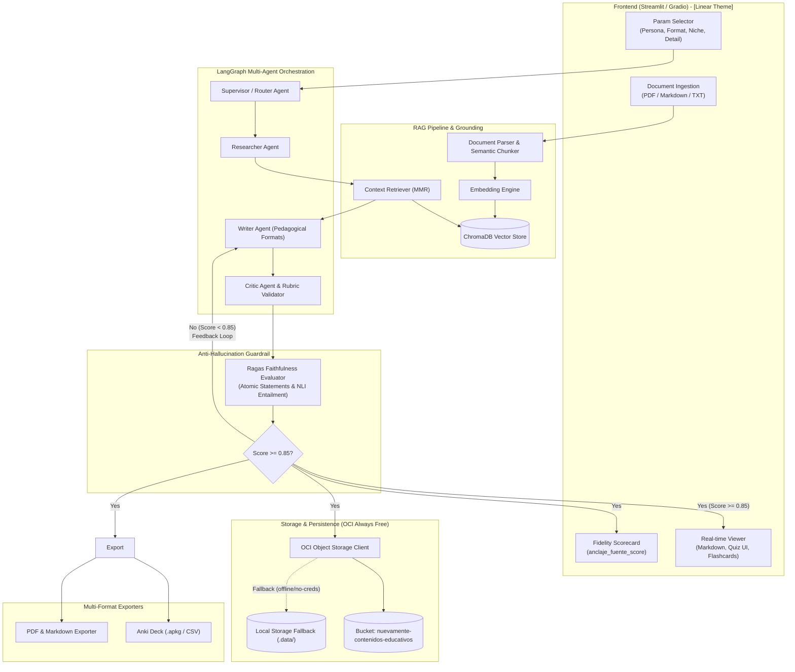

# Archify System Design

## Overview

A disciplined architectural modeling and visualization framework adapted from Archify ("The Evidence Console"). It replaces vague box-and-arrow diagrams with precise, verifiable system maps. Every architectural component is explicitly categorized and anchored with **Evidence Beacons** (direct references to code modules, file paths, or interfaces).

In **NuevaMente**, this skill governs how architecture diagrams, LangGraph multi-agent topologies, RAG retrieval flows, and OCI cloud integration maps are documented in `README.md` and project specifications.

## When to Use

- When authoring or updating system diagrams in `README.md` (mandatory hackathon requirement).
- When defining multi-agent communication topologies in LangGraph (Router, Researcher, Writer, Critic).
- When documenting the end-to-end data flow from PDF ingestion to OCI Object Storage.
- When reviewing architectural alignment between proposed design and actual code.

---

## 1. Architectural Color & Taxonomy Standards

Archify establishes a fixed semantic vocabulary for architecture components:

| Category | Color Hex | Role in NuevaMente | Example Code Evidence |
|---|---|---|---|
| **Frontend** | `#22D3EE` | Streamlit / Gradio UI, interactive widgets | `app/ui/` |
| **Backend** | `#34D399` | LangGraph multi-agent orchestrator, pipelines | `app/agents/`, `app/orchestrator/` |
| **Vector Store** | `#A78BFA` | ChromaDB, embeddings index, chunk storage | `app/rag/vectorstore.py` |
| **Cloud Storage** | `#FBBF24` | OCI Object Storage (Always Free tier) | `app/storage/oci_client.py` |
| **Security & Guardrails** | `#FB7185` | Ragas faithfulness verifier, schema validators | `app/rag/faithfulness.py` |
| **External Service** | `#94A3B8` | LLM providers (Gemini / OpenAI / Claude) | `langchain_google_genai` |

---

## 2. Canonical Architecture Map: NuevaMente

Use this standard Mermaid diagram in `README.md` and system documentation:



---

## 3. Evidence Beacons Protocol

In Archify, an architecture diagram without code evidence is considered unverified. Every box in the system design must correspond to an explicit artifact in the codebase:

```markdown
### Architecture Verification Matrix

| Component | Code Artifact | Verification Test |
|---|---|---|
| Ingestion & Chunking | `app/rag/ingestion.py` | `tests/test_ingestion.py` |
| Vector Store | `app/rag/vectorstore.py` | `tests/test_vectorstore.py` |
| Faithfulness (Ragas) | `app/rag/faithfulness.py` | `tests/test_faithfulness.py` |
| LangGraph Orchestrator | `app/agents/orchestrator.py` | `tests/test_agents.py` |
| OCI Object Storage | `app/storage/oci_storage.py` | `tests/test_oci_storage.py` |
| UI & Linear System | `app/ui/app.py` | Manual UI run & test_ui.py |
| Exporters (Anki/PDF) | `app/exporters/anki_exporter.py` | `tests/test_exporters.py` |
```

---

## 4. Diagramming Guidelines for Contributors and Agents

1. **Deterministic Notation**: Always specify exact data schemas crossing boundaries (e.g. `PedagogicalOutput`, `Flashcard`, `QuizQuestion`).
2. **Failure & Feedback Loops**: Never omit error or retry loops (e.g. the Critic loop back to Writer when `anclaje_fuente_score < 0.85`).
3. **Cloud Tier Truth**: Explicitly mark OCI resources as Always Free ($0.00 cost) and document local fallback behavior.
4. **Mermaid Formatting**: Keep Mermaid syntax compatible with GitHub standard markdown rendering.
