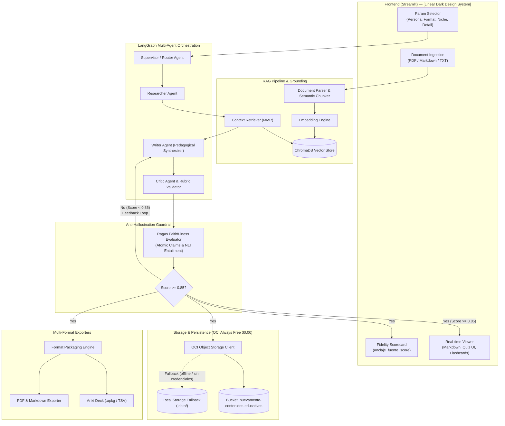

# 🎓 NuevaMente — Sistema Inteligente de Adaptación y Generación de Contenido Educativo

[](https://github.com/No-Country-simulation/G10-Equipo38-NuevaMente/actions/workflows/ci.yml?query=branch%3Adevelop)

> **Hackathon Oracle Next Education (ONE) — Alura Latam**  
> **Grupo 10 · Equipo 38**  
> **Sector Empresarial**: EdTech / Capacitación Corporativa / Plataformas de Educación Técnica  
> **Infraestructura**: Oracle Cloud Infrastructure (OCI) Always Free ($0.00 Costo Garantizado)

---

## 🌟 Visión del Proyecto

**NuevaMente** es una solución inteligente de ingeniería pedagógica que ingiere documentaciones técnicas densas (manuales de software, especificaciones de arquitectura, artículos científicos o bases de conocimiento) y las transforma automáticamente en contenidos educativos altamente personalizados, estructurados y adaptados a las necesidades cognitivas del destinatario, su industria de aplicación y el formato formativo elegido.

### Mapeo de Formaciones ONE
- **Formaciones Indispensables**: Inteligencia de Datos y RAG Avanzado + Oracle Cloud Infrastructure (OCI).
- **Formaciones de Refuerzo**: Ingeniería de Agentes y Automatización con IA + Desarrollo y Orquestación con IA Generativa.
- **Núcleo Técnico**: Pipeline de RAG (Retrieval-Augmented Generation) con segmentación semántica (*chunking*), embeddings, almacenamiento en Vector Store (ChromaDB / FAISS) y anclaje fáctico garantizado con el algoritmo de fidelidad de Ragas, integrado a OCI Object Storage en la capa Always Free.

---

## 🏗️ Arquitectura del Sistema y Diagrama de Flujo

El sistema sigue un diseño de precisión modelado bajo el estándar de **Archify** con balizas de evidencia enlazadas al código fuente:



---

## 🎯 Parámetros de Adaptación Pedagógica

| Parámetro | Opciones Soportadas | Enfoque Pedagógico |
|---|---|---|
| **Perfil del Destinatario** | 1. `Principiante / Transición de Carrera`<br/>2. `Desarrollador Junior / Semi Senior`<br/>3. `Líder Técnico / Arquitecto`<br/>4. `Gestor / Ejecutivo (No Técnico)` | Desde analogías didácticas y sin asunciones previas hasta análisis de trade-offs, SLAs, código funcional y valor de negocio. |
| **Formato de Salida** | 1. `Guía Práctica Paso a Paso (Tutorial)`<br/>2. `Flashcards de Memorización`<br/>3. `Quiz Interactivo con Justificaciones`<br/>4. `Resumen Ejecutivo (TL;DR)`<br/>5. `Guion de Clase / Video` | Modelados formalmente mediante contratos tipados con Pydantic v2 y exportación a Anki (`.apkg` y TSV). |
| **Nicho de Aplicación** | 1. `Fintech`<br/>2. `Salud`<br/>3. `E-commerce`<br/>4. `General` | Terminología situada, ejemplos contextuales y casos de uso realistas por industria. |
| **Nivel de Detalle** | 1. `Didáctico / Conceptual`<br/>2. `Práctico / Orientado a Código`<br/>3. `Técnico Profundo / Arquitectura` | Graduación de profundidad técnica según el objetivo formativo. |

---

## 🛡️ Mecanismo Anti-Alucinación: Ragas Faithfulness (`anclaje_fuente_score`)

Para eliminar de raíz las alucinaciones de los LLMs en contextos educativos sensibles:
1. **Descomposición Atómica**: El contenido generado se descompone en proposiciones fácticas atómicas e independientes.
2. **Inferencia de Lenguaje Natural (NLI)**: Cada afirmación se contrasta contra los fragmentos originales recuperados del documento fuente mediante MMR.
3. **Métrica Cuantitativa**:
   $$\text{anclaje\_fuente\_score} = \frac{\sum \text{veredictos fácticos válidos}}{\text{total de afirmaciones generadas}}$$
4. **Umbral de Calidad**:
   - `0.85 – 1.00`: **Aprobado**. Contenido fáctico verificado, renderizado en UI y persistido en OCI.
   - `< 0.85`: **Rechazado**. Se activa el ciclo de retroalimentación en LangGraph hacia el agente *Writer*.

---

## ☁️ Integración OCI Object Storage Always Free ($0.00 Costo)

- **Bucket**: `nuevamente-contenidos-educativos`.
- **SDK**: `oci-sdk` para Python con `oci.object_storage.ObjectStorageClient`.
- **Garantía $0.00**: Operación dentro de los límites perpetuos de OCI Always Free (hasta 10 GB de Object Storage estándar y 50,000 peticiones mensuales sin costo).
- **Fallback Mock Transparente**: Si las credenciales de OCI no están presentes, el sistema activa automáticamente `LocalMockStorageProvider` en `.data/oci_mock_storage/` permitiendo ejecutar, evaluar y probar el sistema localmente sin tarjeta de crédito ni configuración de red.

---

## 🎨 Frontend Craft: Linear Dark Design System

Inspirado en la interfaz de Linear (`awesome-design-md`):
- **Paleta**: Canvas ultra oscuro (`#010102`), tarjetas carbón (`#0f1011`), bordes milimétricos hairline (`#23252a`) y acento lavanda (`#5e6ad2`).
- **Interactividad**:
  - Evaluación de quizzes en tiempo real con feedback inmediato y justificaciones didácticas.
  - Visor interactivo de Flashcards con reverso/flip.
  - Indicador dinámico de fidelidad (`anclaje_fuente_score`).
  - Badges tecnológicos de `devicon` para visualización limpia del stack técnico.

---

## 🚀 Demostración Práctica: 3 Escenarios de Evaluación

1. **Escenario A — Técnico / Fintech**:
   - *Doc*: Manual de integración de Webhooks y APIs de pagos.
   - *Perfil*: Desarrollador Junior / Semi Senior.
   - *Formato*: Guía Práctica Paso a Paso (Tutorial).
   - *Verificación*: `anclaje_fuente_score >= 0.88`, subida a OCI Object Storage.
2. **Escenario B — Memorización / E-commerce**:
   - *Doc*: Especificación de checkout con microservicios.
   - *Perfil*: Principiante / Transición de Carrera.
   - *Formato*: Flashcards de Memorización con exportación a mazo Anki (`.apkg`/TSV).
3. **Escenario C — Ejecutivo / Salud**:
   - *Doc*: Directrices de gobernanza de historias clínicas electrónicas.
   - *Perfil*: Gestor / Ejecutivo (No Técnico).
   - *Formato*: Resumen Ejecutivo (TL;DR) + Quiz de comprensión gerencial.

---

## ⚙️ Estructura del Repositorio y Ejecución

Monorepo con dos servicios esqueleto (sección 15 de `decisiones_proyecto.md`): `backend/` (FastAPI, paquete `app`) y `frontend/` (Streamlit). Flujo Git: `main` protegida (solo PRs) ← `develop` (integración) ← `feature/<nombre>`.

```bash
# 1. Clonar y crear entorno virtual (Python 3.11)
git clone https://github.com/No-Country-simulation/G10-Equipo38-NuevaMente.git
cd G10-Equipo38-NuevaMente
python -m venv .venv
source .venv/bin/activate        # Windows: .venv\Scripts\activate

# 2. Instalar dependencias fijadas (desde la raíz): servicios + herramientas de desarrollo
pip install -r backend/requirements.txt -r frontend/requirements.txt -r requirements-dev.txt

# 3. Verificar el esqueleto del backend (paquete importable)
cd backend && python -c "import app" && cd ..

# 4. Variables de entorno: copiar template y completar placeholders (Apéndice A)
cp .env.example .env

# 5. Los mismos chequeos que corre la CI en cada PR (ruff + pytest, ambos desde la raíz)
ruff check .
ruff format --check .
pytest

# 6. Compose preliminar (esqueleto; endurecimiento con el issue #26)
docker compose build
```

---

## 🤖 Catálogo de Skills para Agentes de IA

El repositorio cuenta con 13 skills especializadas y armonizadas en `.agents/skills/`, gobernadas por el orquestador maestro [`AGENTS.md`](./AGENTS.md) y registradas en [`.agents/skills.json`](./.agents/skills.json):

1. [`spec-driven-development`](.agents/skills/spec-driven-development/SKILL.md): Especificación previa estructurada y mapa de capacidades.
2. [`domain-modeling`](.agents/skills/domain-modeling/SKILL.md): Lenguaje ubicuo en `CONTEXT.md` y registro de ADRs en `docs/adr/`.
3. [`grill-with-docs`](.agents/skills/grill-with-docs/SKILL.md): Entrevista socrática de diseño para estresar supuestos.
4. [`archify-system-design`](.agents/skills/archify-system-design/SKILL.md): Diagramas C4/Mermaid con balizas de evidencia.
5. [`api-and-interface-design`](.agents/skills/api-and-interface-design/SKILL.md): Contratos de datos tipados y fronteras limpias.
6. [`rag-and-grounding`](.agents/skills/rag-and-grounding/SKILL.md): Ingestión PDF/MD, ChromaDB y algoritmo Ragas de fidelidad.
7. [`pedagogical-orchestrator`](.agents/skills/pedagogical-orchestrator/SKILL.md): Grafo LangGraph (Supervisor, Researcher, Writer, Critic), 5 formatos y Anki.
8. [`oci-always-free-storage`](.agents/skills/oci-always-free-storage/SKILL.md): Conector OCI SDK Always Free y fallback mock local.
9. [`linear-design-system`](.agents/skills/linear-design-system/SKILL.md): Tokens oscuros Linear, cards, gauges y CSS Streamlit.
10. [`frontend-ui-engineering`](.agents/skills/frontend-ui-engineering/SKILL.md): Accesibilidad WCAG, estados vacíos/carga y ergonomía UX.
11. [`security-and-hardening`](.agents/skills/security-and-hardening/SKILL.md): Sanitización de inputs, defensas contra prompt injection y secretos.
12. [`debugging-and-error-recovery`](.agents/skills/debugging-and-error-recovery/SKILL.md): Protocolo Stop-the-Line y triaje reproducible.
13. [`git-workflow-and-versioning`](.agents/skills/git-workflow-and-versioning/SKILL.md): Git Flow, conventional commits y changelog.

---

## 📋 Reglas de Supremacía Anti-Contradicción
1. **Fidelidad sobre Fluidez**: El score Ragas (`anclaje_fuente_score >= 0.85`) prevalece sobre cualquier elocuencia estilística.
2. **Pydantic es Soberano**: Todo intercambio estructurado de datos debe validarse contra los esquemas oficiales Pydantic v2.
3. **Costo Cero & Fallback Mock**: Si no hay credenciales OCI, el sistema opera transparente en modo mock local (`.data/oci_mock_storage/`).
4. **Cohesión Linear**: La interfaz adopta estrictamente la paleta y estética Linear (`#010102`, `#5e6ad2`).
5. **Spec-First**: Ningún componente se desarrolla sin especificación y validación de dominio previa.