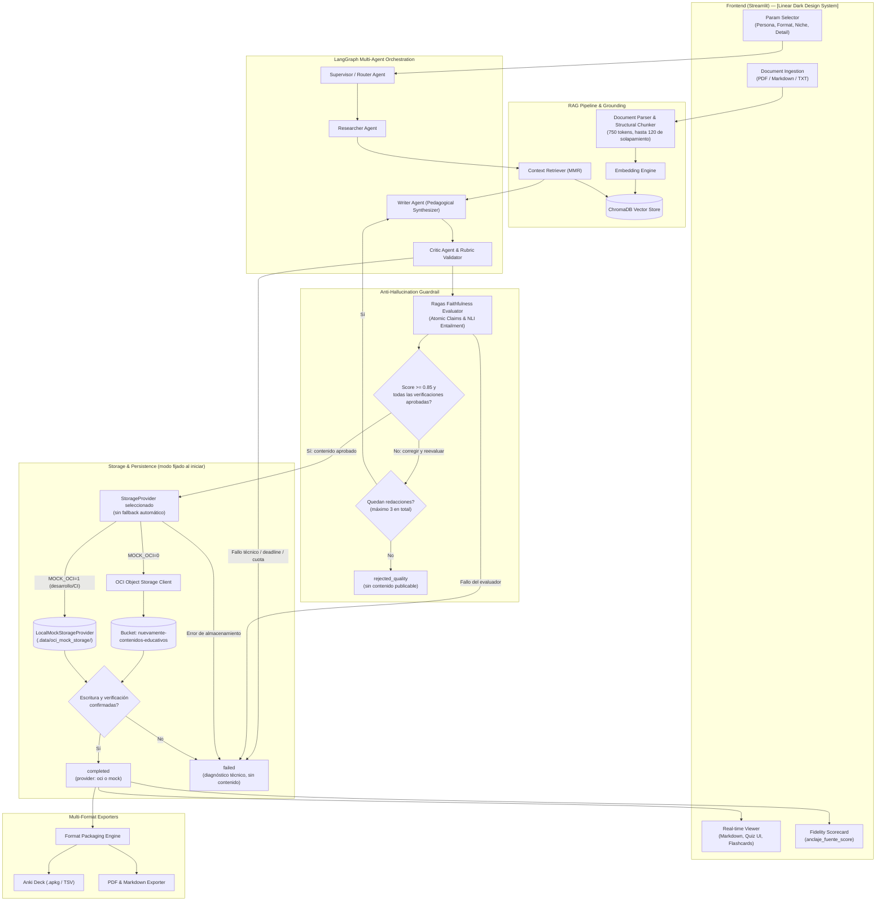

# 🎓 NuevaMente — Sistema Inteligente de Adaptación y Generación de Contenido Educativo

[](https://github.com/No-Country-simulation/G10-Equipo38-NuevaMente/actions/workflows/ci.yml?query=branch%3Adevelop)

> **Hackathon Oracle Next Education (ONE) — Alura Latam**  
> **Grupo 10 · Equipo 38**  
> **Sector Empresarial**: EdTech / Capacitación Corporativa / Plataformas de Educación Técnica  
> **Infraestructura**: Oracle Cloud Infrastructure (OCI), exclusivamente recursos Always Free verificados para la cuenta

---

## 🌟 Visión del Proyecto

**NuevaMente** es una solución inteligente de ingeniería pedagógica que ingiere documentaciones técnicas densas (manuales de software, especificaciones de arquitectura, artículos científicos o bases de conocimiento) y las transforma automáticamente en contenidos educativos altamente personalizados, estructurados y adaptados a las necesidades cognitivas del destinatario, su industria de aplicación y el formato formativo elegido.

### Mapeo de Formaciones ONE
- **Formaciones Indispensables**: Inteligencia de Datos y RAG Avanzado + Oracle Cloud Infrastructure (OCI).
- **Formaciones de Refuerzo**: Ingeniería de Agentes y Automatización con IA + Desarrollo y Orquestación con IA Generativa.
- **Núcleo Técnico**: Pipeline de RAG (Retrieval-Augmented Generation) con segmentación estructural recursiva (*chunking*), embeddings, almacenamiento en ChromaDB y verificación de fidelidad inspirada en Ragas, integrado a OCI Object Storage en la capa Always Free. Los embeddings se usan para indexación y recuperación; no determinan los cortes del documento.

---

## 🏗️ Arquitectura del Sistema y Diagrama de Flujo

El diagrama representa la arquitectura objetivo, definida en [las decisiones](decisiones_proyecto.md) y [los contratos de API](docs/contratos-api.md); no acredita que todos los componentes estén implementados. El avance se sigue en [el plan](docs/plan-implementacion.md). La segmentación está en [chunker.py](backend/app/core/rag/chunker.py), la evaluación en [faithfulness.py](backend/app/core/faithfulness/faithfulness.py) y la selección del proveedor de almacenamiento en [oci_storage.py](backend/app/storage/oci_storage.py).


```mermaid
flowchart TB
    subgraph UI ["Frontend (Streamlit) — [Linear Dark Design System]"]
        DocInput["Document Ingestion<br/>(PDF / Markdown / TXT)"]
        Params["Param Selector<br/>(Persona, Format, Niche, Detail)"]
        Display["Real-time Viewer<br/>(Markdown, Quiz UI, Flashcards)"]
        ScoreWidget["Fidelity Scorecard<br/>(anclaje_fuente_score)"]
    end

    subgraph RAG ["RAG Pipeline & Grounding"]
        Parser["Document Parser & Structural Chunker<br/>(750 tokens, hasta 120 de solapamiento)"]
        Embedder["Embedding Engine"]
        Chroma[("ChromaDB Vector Store")]
        Retriever["Context Retriever (MMR)"]
    end

    subgraph AGENTS ["LangGraph Multi-Agent Orchestration"]
        Supervisor["Supervisor / Router Agent"]
        Researcher["Researcher Agent"]
        Writer["Writer Agent (Pedagogical Synthesizer)"]
        Critic["Critic Agent & Rubric Validator"]
    end

    subgraph VERIFICATION ["Anti-Hallucination Guardrail"]
        RagasFaithfulness["Ragas Faithfulness Evaluator<br/>(Atomic Claims & NLI Entailment)"]
        Quality{"Score >= 0.85 y<br/>todas las verificaciones aprobadas?"}
        Retry{"Quedan redacciones?<br/>(máximo 3 en total)"}
        Rejected["rejected_quality<br/>(sin contenido publicable)"]
    end

    subgraph STORAGE ["Storage & Persistence (modo fijado al iniciar)"]
        StorageProvider["StorageProvider seleccionado<br/>(sin fallback automático)"]
        OCIClient["OCI Object Storage Client"]
        Bucket[("Bucket: nuevamente-contenidos-educativos")]
        MockStorage[("LocalMockStorageProvider<br/>(.data/oci_mock_storage/)")]
        Confirmed{"Escritura y verificación<br/>confirmadas?"}
        Completed["completed<br/>(provider: oci o mock)"]
        Failed["failed<br/>(diagnóstico técnico, sin contenido)"]
    end

    subgraph EXPORT ["Multi-Format Exporters"]
        ExportRouter["Format Packaging Engine"]
        AnkiExport["Anki Deck (.apkg / TSV)"]
        DocExport["PDF & Markdown Exporter"]
        ExportRouter --> AnkiExport
        ExportRouter --> DocExport
    end

    %% Flujos de Información
    DocInput --> Parser --> Embedder --> Chroma
    Params --> Supervisor
    Supervisor --> Researcher
    Researcher --> Retriever --> Chroma
    Retriever --> Writer
    Writer --> Critic
    Critic --> RagasFaithfulness
    RagasFaithfulness --> Quality
    Critic -- "Fallo técnico / deadline / cuota" --> Failed
    RagasFaithfulness -- "Fallo del evaluador" --> Failed
    Quality -- "No: corregir y reevaluar" --> Retry
    Retry -- "Sí" --> Writer
    Retry -- "No" --> Rejected
    Quality -- "Sí: contenido aprobado" --> StorageProvider

    StorageProvider -- "MOCK_OCI=0" --> OCIClient
    StorageProvider -- "MOCK_OCI=1 (desarrollo/CI)" --> MockStorage
    OCIClient --> Bucket
    Bucket --> Confirmed
    MockStorage --> Confirmed
    StorageProvider -- "Error de almacenamiento" --> Failed
    Confirmed -- "No" --> Failed
    Confirmed -- "Sí" --> Completed
    Completed --> Display
    Completed --> ScoreWidget
    Completed --> ExportRouter
```

El modo se elige al arrancar, no ante un error de OCI. En desarrollo, `completed` con `provider=mock` confirma almacenamiento local y no acredita escritura en OCI. Los originales también deben persistirse antes de indexarse. Un aprobado cuya escritura falla queda `failed`; reintentar solo persistencia no vuelve a generar contenido.

---

## 🎯 Parámetros de Adaptación Pedagógica

| Parámetro | Opciones Soportadas | Enfoque Pedagógico |
|---|---|---|
| **Perfil del Destinatario** | 1. `Principiante / Transición de Carrera`<br/>2. `Desarrollador Junior / Semi Senior`<br/>3. `Líder Técnico / Arquitecto`<br/>4. `Gestor / Ejecutivo (No Técnico)` | Desde analogías didácticas y sin asunciones previas hasta análisis de trade-offs, SLAs, código funcional y valor de negocio. |
| **Formato de Salida** | 1. `Guía Práctica Paso a Paso (Tutorial)`<br/>2. `Flashcards de Memorización`<br/>3. `Quiz Interactivo con Justificaciones`<br/>4. `Resumen Ejecutivo (TL;DR)`<br/>5. `Guion de Clase / Video` | Modelados formalmente mediante contratos tipados con Pydantic v2 y exportación a Anki (`.apkg` y TSV). |
| **Nicho de Aplicación** | 1. `Fintech`<br/>2. `Salud`<br/>3. `E-commerce`<br/>4. `General` | Terminología situada, ejemplos contextuales y casos de uso realistas por industria. |
| **Nivel de Detalle** | 1. `Didáctico / Conceptual`<br/>2. `Práctico / Orientado a Código`<br/>3. `Técnico Profundo / Arquitectura` | Graduación de profundidad técnica según el objetivo formativo. |

---

## 🛡️ Verificación de Fidelidad Inspirada en Ragas (`anclaje_fuente_score`)

Para reducir el riesgo de afirmaciones sin respaldo y conservar evidencia verificable, sin prometer infalibilidad del evaluador:

1. **Descomposición Atómica**: El contenido generado se descompone en proposiciones fácticas atómicas e independientes.
2. **Inferencia de Lenguaje Natural (NLI)**: Cada afirmación se contrasta contra los fragmentos originales recuperados del documento fuente mediante MMR.
3. **Métrica Cuantitativa**:
   $$\text{anclaje\_fuente\_score} = \frac{\sum \text{veredictos fácticos válidos}}{\text{total de afirmaciones generadas}}$$
4. **Aprobación Completa**:
   - `0.85 – 1.00`: **Candidato a aprobación**, sujeto a todas las comprobaciones; el score por sí solo no autoriza publicar.
   - Toda afirmación falsa o sin respaldo debe corregirse, eliminarse o convertirse en una limitación explícita antes de reevaluar la versión completa. También bloquean las citas inválidas, contradicciones, cobertura incompleta, rúbricas pedagógicas insuficientes o revisión visual insuficiente cuando aplica.
   - Con el score definido como respaldadas/total, exigir que todas las afirmaciones estén respaldadas implica `1.0` para el contenido final aprobado. El mínimo `0.85` no permite publicar un 15% de errores conocidos.
   - `< 0.85` o comprobaciones pendientes: revisar si quedan redacciones, con un máximo de tres en total. Agotarlas sin aprobación produce `rejected_quality`, sin contenido descargable.
   - Una evaluación vacía o incompleta es `no_evaluable`, sin inventar un score. Los fallos técnicos se informan como `failed`, no como rechazos de calidad.
5. **Publicación y Persistencia**: Solo se entrega el paquete educativo cuando el trabajo está `completed`, tras guardar y verificar el objeto con el proveedor elegido. Una falla de persistencia impide ese estado aunque la evaluación haya aprobado.

Las reglas detalladas están en [decisiones §19](decisiones_proyecto.md#19-mecanismo-anti-alucinación) y [contratos de API](docs/contratos-api.md).

---

## ☁️ Integración OCI Object Storage Always Free

- **Bucket**: `nuevamente-contenidos-educativos`.
- **Proveedor Real Implementado**: `OCIObjectStorageProvider` con `oci==2.187.2`, condiciones ETag, paginación y hasta tres intentos por operación, sin retries adicionales del SDK. Valida home region y bucket privado preexistente; verifica bytes guardados y contabiliza solicitudes/capacidad en un ledger persistente. Configuración y prueba manual: [guía OCI](docs/oci-storage.md). Las pruebas automatizadas simulan HTTP/SDK; la evidencia de una cuenta real requiere ejecutar esa prueba manual.
- **Control de Costos**: Utilizar exclusivamente recursos Always Free y verificar la asignación efectiva de la cuenta, región y consumo compartido antes de desplegar. No se garantiza costo cero automáticamente por elegir OCI; se aplican los presupuestos y controles definidos en [decisiones §8.4](decisiones_proyecto.md#84-gobernanza-de-costo-cero).
- **Mock Explícito**: `MOCK_OCI=1`, únicamente en desarrollo, pruebas o CI, selecciona `LocalMockStorageProvider` en `.data/oci_mock_storage/` (bajo `DATA_DIR` si se configura). No se activa por falta de credenciales ni ante fallos del servicio real.
- **Producción Estricta**: `APP_ENV=production` exige mocks desactivados y configuración real completa. La falta de configuración o proveedor produce un error de arranque accionable. Los errores de OCI se informan y nunca se convierten en éxitos locales.
- **Evidencia de Persistencia**: La respuesta identifica `persistencia.provider` como `oci` o `mock`; una prueba local no acredita la integración obligatoria con OCI.

---

## 🎨 Frontend Craft: Linear Dark Design System

Inspirado en la interfaz de Linear (`awesome-design-md`):
- **Paleta**: Canvas ultra oscuro (`#010102`), tarjetas carbón (`#0f1011`), bordes milimétricos hairline (`#23252a`) y acento lavanda (`#5e6ad2`).
- **Interactividad**:
  - Evaluación de quizzes en tiempo real con feedback inmediato y justificaciones didácticas.
  - Visor interactivo de Flashcards con reverso/flip.
  - Indicador dinámico de fidelidad (`anclaje_fuente_score`).
  - Badges tecnológicos de `devicon` para visualización limpia del stack técnico.

---

## 🚀 Demostración Práctica: 3 Escenarios de Evaluación

1. **Escenario A — Técnico / Fintech**:
   - *Doc*: Manual de integración de Webhooks y APIs de pagos.
   - *Perfil*: Desarrollador Junior / Semi Senior.
   - *Formato*: Guía Práctica Paso a Paso (Tutorial).
   - *Verificación*: Evaluación completa aprobada y persistencia real confirmada en OCI Object Storage.
2. **Escenario B — Memorización / E-commerce**:
   - *Doc*: Especificación de checkout con microservicios.
   - *Perfil*: Principiante / Transición de Carrera.
   - *Formato*: Flashcards de Memorización con exportación a mazo Anki (`.apkg`/TSV).
3. **Escenario C — Ejecutivo / Salud**:
   - *Doc*: Directrices de gobernanza de historias clínicas electrónicas.
   - *Perfil*: Gestor / Ejecutivo (No Técnico).
   - *Formato*: Resumen Ejecutivo (TL;DR) + Quiz de comprensión gerencial.

---

## ⚙️ Estructura del Repositorio y Ejecución

Monorepo con dos servicios (sección 15 de `decisiones_proyecto.md`): `backend/` (FastAPI, paquete `app`) y `frontend/` (Streamlit). Flujo Git: `main` protegida (solo PRs) ← `develop` (integración) ← `feature/<nombre>`.

```bash
# 1. Clonar y crear entorno virtual (Python 3.11)
git clone https://github.com/No-Country-simulation/G10-Equipo38-NuevaMente.git
cd G10-Equipo38-NuevaMente
python -m venv .venv
source .venv/bin/activate        # Windows: .venv\Scripts\activate

# 2. Instalar dependencias fijadas (desde la raíz): servicios + herramientas de desarrollo
pip install -r backend/requirements.txt -r frontend/requirements.txt -r requirements-dev.txt

# 3. Verificar el esqueleto del backend (paquete importable)
cd backend && python -c "import app" && cd ..

# 4. Variables de entorno: copiar template y completar placeholders (Apéndice A)
cp .env.example .env
# Para desarrollo/pruebas sin servicios externos, configurar explícitamente en .env:
# APP_ENV=development, MOCK_OCI=1 y MOCK_GEMINI=1.
# El template es de producción: requiere mocks desactivados y credenciales reales.

# 5. Los mismos chequeos que corre la CI en cada PR (ruff + pytest, ambos desde la raíz)
ruff check .
ruff format --check .
pytest

# 6. Compose: arrancar API/UI con el .env configurado
docker compose up --build --detach --wait --wait-timeout 120
```

---

Para el arranque Docker sin credenciales, usá `.env.docker.example`; pasos,
persistencia y verificación ARM64 en [docs/docker.md](docs/docker.md).

## Segmentación de documentos (issue #12)

`app.core.rag.chunker.trocear(resultado_parseo, workspace_id, document_id)`
produce fragmentos con IDs deterministas y metadatos listos para Chroma mediante
`metadatos_chroma()`. El objetivo es 750 tokens, con hasta 120 de solapamiento
y techo de 825 incluyendo encabezados, cercas y contexto repetido.
Se respetan secciones y páginas; las tablas partidas repiten sus cabeceras.
Una fila que no cabe se rechaza con `ChunkingError`, sin truncarla.

El tokenizador BPE `cl100k_base` y su vocabulario se incluyen localmente para
funcionar sin red. Es una medida de segmentación: el cliente Gemini debe validar
sus propios límites antes de enviar contenido. `ConfigChunker` permite ajustar
los límites; un tokenizador alternativo debe declarar su identidad versionada.

Las citas MD/TXT conservan líneas del cuerpo original (base 1). `start_index`
es un desplazamiento en caracteres, normalizando BOM y saltos CRLF/CR/form feed a LF;
en PDF es relativo a la página. El contexto repetido no altera estas posiciones.
Los IDs incluyen espacio, documento, hash, configuración del parser/chunker y
tokenizador. Pruebas: `pytest backend/tests/test_chunker.py`.

## 🤖 Catálogo de Skills para Agentes de IA

El repositorio cuenta con 13 skills especializadas y armonizadas en `.agents/skills/`, gobernadas por el orquestador maestro [`AGENTS.md`](./AGENTS.md) y registradas en [`.agents/skills.json`](./.agents/skills.json):

1. [`spec-driven-development`](.agents/skills/spec-driven-development/SKILL.md): Especificación previa estructurada y mapa de capacidades.
2. [`domain-modeling`](.agents/skills/domain-modeling/SKILL.md): Lenguaje ubicuo en `CONTEXT.md` y registro de ADRs en `docs/adr/`.
3. [`grill-with-docs`](.agents/skills/grill-with-docs/SKILL.md): Entrevista socrática de diseño para estresar supuestos.
4. [`archify-system-design`](.agents/skills/archify-system-design/SKILL.md): Diagramas C4/Mermaid con balizas de evidencia.
5. [`api-and-interface-design`](.agents/skills/api-and-interface-design/SKILL.md): Contratos de datos tipados y fronteras limpias.
6. [`rag-and-grounding`](.agents/skills/rag-and-grounding/SKILL.md): Ingestión PDF/MD, ChromaDB y algoritmo Ragas de fidelidad.
7. [`pedagogical-orchestrator`](.agents/skills/pedagogical-orchestrator/SKILL.md): Grafo LangGraph (Supervisor, Researcher, Writer, Critic), 5 formatos y Anki.
8. [`oci-always-free-storage`](.agents/skills/oci-always-free-storage/SKILL.md): Almacenamiento OCI Always Free y mock local explícito para desarrollo/CI, sujeto a las decisiones vigentes.
9. [`linear-design-system`](.agents/skills/linear-design-system/SKILL.md): Tokens oscuros Linear, cards, gauges y CSS Streamlit.
10. [`frontend-ui-engineering`](.agents/skills/frontend-ui-engineering/SKILL.md): Accesibilidad WCAG, estados vacíos/carga y ergonomía UX.
11. [`security-and-hardening`](.agents/skills/security-and-hardening/SKILL.md): Sanitización de inputs, defensas contra prompt injection y secretos.
12. [`debugging-and-error-recovery`](.agents/skills/debugging-and-error-recovery/SKILL.md): Protocolo Stop-the-Line y triaje reproducible.
13. [`git-workflow-and-versioning`](.agents/skills/git-workflow-and-versioning/SKILL.md): Git Flow, conventional commits y changelog.

---

## 📋 Reglas de Supremacía Anti-Contradicción
1. **Fidelidad sobre Fluidez**: El score mínimo `0.85` selecciona candidatos; la aprobación exige respaldo de todas las afirmaciones y superar las comprobaciones factuales, pedagógicas y visuales aplicables.
2. **Pydantic es Soberano**: Todo intercambio estructurado de datos debe validarse contra los esquemas oficiales Pydantic v2.
3. **Always Free y Mock Explícito**: Verificar los límites efectivos de OCI. `MOCK_OCI=1` habilita el proveedor local únicamente en desarrollo/CI; producción exige configuración real y nunca degrada automáticamente a mock.
4. **Cohesión Linear**: La interfaz adopta estrictamente la paleta y estética Linear (`#010102`, `#5e6ad2`).
5. **Spec-First**: Ningún componente se desarrolla sin especificación y validación de dominio previa.
