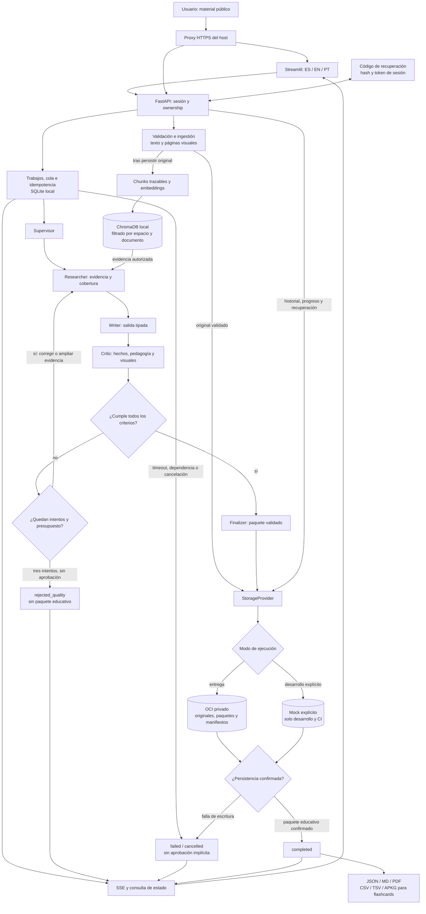

# 🎓 NuevaMente — Documento de Decisiones de Proyecto

> **Proyecto**: NuevaMente — Sistema Inteligente de Adaptación y Generación de Contenido Educativo  
> **Equipo**: Grupo 10 · Equipo 38  
> **Hackathon**: Oracle Next Education (ONE) — Alura Latam  
> **Fecha**: Septiembre 2026  
> **Estado**: Decisiones de diseño acordadas; cumplimiento funcional sujeto a evidencia de ejecución
> **Revisión**: 18 de septiembre de 2026

Este documento define la entrega completa: requisitos mínimos, todos los diferenciales del enunciado y los extras acordados. No constituye un plan de implementación ni acredita funcionalidades implementadas. La solución se orienta a capacitación técnica reutilizable; no presupone una adopción comercial por parte de Oracle.

---

## Tabla de Contenidos

1. [Visión General y Alcance](#1-visión-general-y-alcance)
2. [Stack Tecnológico Principal](#2-stack-tecnológico-principal)
3. [Arquitectura del Sistema](#3-arquitectura-del-sistema)
4. [Pipeline RAG (Retrieval-Augmented Generation)](#4-pipeline-rag-retrieval-augmented-generation)
5. [Orquestación Multi-Agente con LangGraph](#5-orquestación-multi-agente-con-langgraph)
6. [Interfaz de Usuario (Frontend)](#6-interfaz-de-usuario-frontend)
7. [Backend API (FastAPI)](#7-backend-api-fastapi)
8. [Integración OCI Object Storage](#8-integración-oci-object-storage)
9. [Despliegue en OCI Compute](#9-despliegue-en-oci-compute)
10. [Funcionalidades Creativas Adicionales](#10-funcionalidades-creativas-adicionales)
11. [Seguridad y Tratamiento de Datos](#11-seguridad-y-tratamiento-de-datos)
12. [Testing y Calidad de Código](#12-testing-y-calidad-de-código)
13. [Gestión de Proyecto y Git](#13-gestión-de-proyecto-y-git)
14. [Docker y Contenerización](#14-docker-y-contenerización)
15. [Estructura del Repositorio](#15-estructura-del-repositorio)
16. [Formatos Pedagógicos y Schemas Pydantic](#16-formatos-pedagógicos-y-schemas-pydantic)
17. [Internacionalización (i18n)](#17-internacionalización-i18n)
18. [Estrategia de Demo y Escenarios](#18-estrategia-de-demo-y-escenarios)
19. [Mecanismo Anti-Alucinación](#19-mecanismo-anti-alucinación)
20. [Checklist de Cumplimiento de Requisitos](#20-checklist-de-cumplimiento-de-requisitos)

---

## 1. Visión General y Alcance

### 1.1 Problema que Resuelve

La creación y adaptación manual de materiales didácticos a partir de documentaciones técnicas complejas es un proceso que consume semanas de trabajo de especialistas y diseñadores instruccionales. Un mismo manual de infraestructura en la nube necesita enseñarse de formas completamente distintas según la audiencia: un principiante necesita analogías cotidianas, un desarrollador necesita código funcional, un arquitecto necesita trade-offs, y un ejecutivo necesita métricas de negocio.

### 1.2 Solución Propuesta

NuevaMente es un sistema inteligente que:

1. **Ingiere** documentaciones técnicas densas (PDF, Markdown, texto plano)
2. **Indexa** el contenido mediante una pipeline RAG con segmentación estructural y embeddings vectoriales
3. **Transforma** el contenido en materiales educativos personalizados usando un grafo multi-agente orquestado con LangGraph
4. **Verifica** la fidelidad factual del contenido generado contra las fuentes originales usando una implementación de la metodología Faithfulness de Ragas y revisión pedagógica
5. **Persiste** tanto los documentos originales como los artefactos educativos generados en OCI Object Storage (Always Free)
6. **Presenta** los resultados en una interfaz interactiva con diseño de alta calidad

### 1.3 Alcance del MVP

El MVP funcional incluye **todos** los requisitos obligatorios del hackathon más **todos** los recursos opcionales/diferenciales listados en el enunciado:

| Categoría | Elementos Incluidos |
|---|---|
| **Obligatorios (MVP)** | Ingestión PDF/MD/TXT, RAG con chunking + embeddings + Vector Store, Orquestación LLM, Adaptación multi-perfil y multi-formato, Salida JSON + UI interactiva, OCI Object Storage Always Free |
| **Diferenciales** | Despliegue en OCI Compute Always Free, Sistema Multi-Agente con LangGraph, Quiz con evaluación en tiempo real, Soporte Multimodal (diagramas), Exportación Multiformato |

### 1.4 Decisión: Por qué incluir todos los diferenciales

Cada diferencial aporta un valor concreto al proyecto:

- **OCI Compute**: Demuestra dominio completo de la infraestructura Oracle, no solo del almacenamiento. Permite acceder a la aplicación desde cualquier lugar sin dependencia de una máquina local.
- **Multi-Agente LangGraph**: Muestra comprensión profunda de ingeniería de agentes, que es una de las formaciones de refuerzo del programa ONE. La arquitectura Supervisor → Researcher → Writer → Critic replica un flujo editorial real.
- **Quiz en tiempo real**: Transforma la generación de contenido de un proceso pasivo (leer) a uno activo (evaluar y aprender). Esto diferencia la plataforma de un simple "generador de texto".
- **Soporte Multimodal**: Los documentos técnicos reales contienen diagramas de arquitectura, flujos de datos y tablas que son fundamentales para la comprensión. Ignorarlos sería entregar una solución incompleta.
- **Exportación Multiformato**: JSON permite integración; Markdown y PDF facilitan distribución; CSV/TSV y APKG incorporan las flashcards al estudio espaciado.

---

## 2. Stack Tecnológico Principal

### 2.1 Lenguaje y Runtime

| Componente | Decisión | Justificación |
|---|---|---|
| Lenguaje | Python 3.11 | Mantiene la base elegida por el equipo. La compatibilidad debe verificarse con las versiones fijadas, sin afirmar que todo el ecosistema es compatible. |
| Dependencias | pip + venv + requirements por servicio con versiones exactas y dependencias transitivas resueltas | Conserva herramientas conocidas y evita instalaciones distintas entre integrantes. |
| Linter/formatter | ruff | Centraliza formato y reglas estáticas. |

Se comprueban las instalaciones en Windows para desarrollo y Linux ARM64 para la VM elegida.
Los manifiestos de backend y frontend son independientes; CI usa sus rutas reales.
No se añaden dependencias de IA al frontend que solo necesita consumir la API.

### 2.2 Modelos de Generación y Verificación

| Componente | Decisión | Justificación |
|---|---|---|
| Generación | Gemini 2.5 Flash como base configurable | Conserva la elección del equipo y permite texto e interpretación visual. La calidad se acredita con ejemplos y evaluaciones, no con la etiqueta de modelo más reciente. |
| Verificación | Gemini 2.5 Flash en llamadas separadas del redactor | Simplifica el proveedor; la revisión recibe evidencia y rúbrica propias, sin reutilizar la autoevaluación del redactor. |
| SDK | google-genai e integración compatible de langchain-google-genai | Se usa el SDK mantenido y se fijan versiones que funcionen juntas. |

Usar el mismo modelo como redactor y juez puede correlacionar errores.
La evaluación automática se complementa con un conjunto de ejemplos revisados por el equipo.
Cambiar de proveedor o modelo requiere volver a comprobar calidad, formatos, idiomas y cuotas; no es un reemplazo automáticamente equivalente.

Google recomienda google-genai; google-generativeai ya no tiene mantenimiento activo. [SDK oficial](https://ai.google.dev/gemini-api/docs/libraries).

La tarifa consultada ofrece acceso gratuito Standard para el modelo de generación y gemini-embedding-2, sujeto a disponibilidad y límites de la cuenta. No se activan facturación, modos pagos ni cambios automáticos a otro servicio. [Precios oficiales](https://ai.google.dev/gemini-api/docs/pricing).

**Por qué esta elección**:

- Mantiene el proveedor trabajado por el equipo.
- Evita depender de un LLM local pesado dentro de la misma VM de la aplicación.
- No supone que todos los modelos locales necesitan GPU ni que otros proveedores carecen siempre de alternativas gratuitas.
- La indisponibilidad o el agotamiento de cuota se muestra al usuario; nunca habilita un gasto automático.

### 2.3 Embeddings

Se adopta gemini-embedding-2, configurable mediante GEMINI_EMBEDDING_MODEL.
El modelo anterior text-embedding-004 fue retirado el 14 de enero de 2026. [Ciclo de vida oficial](https://ai.google.dev/gemini-api/docs/deprecations).

- Cada chunk obtiene su propio vector; no se agregan todos los chunks en un único embedding.
- Se fija output_dimensionality=768 tanto para documentos como para consultas, para reducir memoria y tamaño del índice.
- Se registra modelo, dimensión y versión de preparación del texto.
- Un cambio de modelo o dimensión crea otra colección y exige reindexar.
- Las consultas y documentos usan la preparación de recuperación correspondiente al modelo.
- Se verifica la recuperación cruzada entre español, inglés y portugués.

La API de Embedding 2 distingue el envío agregado de contenidos de los embeddings individuales; el adaptador debe preservar un vector por chunk. [Documentación de embeddings](https://ai.google.dev/gemini-api/docs/embeddings).

### 2.4 Dependencias Clave

| Área | Dependencias elegidas |
|---|---|
| IA | google-genai, langchain-google-genai, langchain-core, langgraph |
| RAG | langchain-community, langchain-text-splitters, langchain-chroma, chromadb |
| Ingestión | pypdf para texto y pypdfium2 para rasterizar páginas |
| Backend | fastapi, uvicorn, pydantic v2 |
| Frontend | streamlit, requests |
| Cloud | oci |
| Exportación | genanki, reportlab; csv de la biblioteca estándar |
| Calidad | ruff, pytest, httpx, pytest-mock |
| Configuración | python-dotenv |

La fidelidad usa una implementación propia de la metodología Faithfulness, descrita en la sección 19.
No se afirma que se ejecuta la biblioteca Ragas si no se la incorpora como dependencia.
Las librerías de extracción y renderizado se validan en ARM64 antes de considerar reproducible el despliegue.

---

## 3. Arquitectura del Sistema

### 3.1 Separación Frontend/Backend

Se mantienen dos servicios de aplicación:

- Streamlit presenta documentos, parámetros, resultados, historial y actividades.
- FastAPI valida contratos, gestiona acceso, ejecuta RAG y agentes, y persiste en OCI.

El frontend consume HTTP y no accede directamente al bucket, al índice ni a las claves del proveedor.
Esta separación permite trabajo independiente con contratos compartidos y pruebas sin la interfaz.
Los agentes del producto son nodos del grafo LangGraph; Supervisor y Finalizer pueden ser deterministas.
No se necesita una llamada LLM por cada nodo.

Un proxy HTTPS del host publica la UI y la API.
El índice Chroma y el registro operativo local pertenecen exclusivamente al backend.
Se usa un único proceso escritor del backend en esta entrega; no se promete escalado horizontal sobre un índice local compartido.

### 3.2 Flujo de Datos Completo

1. El backend crea un espacio anónimo con un código de recuperación.
2. El usuario carga un documento público PDF/MD/TXT y confirma que puede procesarlo.
3. Se valida el archivo y se guarda el original en OCI antes de declararlo disponible.
4. Se extraen texto y páginas visuales con límites de recursos.
5. Se crean chunks trazables y embeddings individuales en ChromaDB.
6. El documento pasa de processing a ready, o a failed con una explicación.
7. El usuario elige perfil, formato, nicho, detalle e idioma de salida.
8. POST /api/generate crea una generación y devuelve su identificador.
9. Supervisor fija los parámetros; Researcher reúne evidencia por temas.
10. Writer genera una salida tipada y Critic revisa respaldo y calidad pedagógica.
11. Hay hasta tres ciclos Writer–Critic; la evidencia puede ampliarse dentro del presupuesto.
12. Solo una salida aprobada pasa a Finalizer.
13. El JSON validado se guarda en OCI; recién entonces el trabajo pasa a completed.
14. La UI obtiene el resultado y habilita actividades y exportaciones.
15. Un rechazo de calidad, una falla técnica o una falla de persistencia tienen estados distintos.

**Por qué**: un resultado redactado, uno aprobado y uno guardado son hechos diferentes.
La UI no debe afirmar éxito completo si OCI no confirmó la escritura.

### 3.3 Progreso mediante SSE

POST /api/generate devuelve 202 con generation_id, status_url y events_url.
GET /api/generations/{id}/events emite eventos SSE de ese trabajo.
GET /api/generations/{id} permite consultar estado y recuperar el JSON terminado sin consumir SSE.

Cada evento contiene id monotónico, generation_id, step, status e iteration cuando aplica.
Los estados de trabajo son queued, running, completed, rejected_quality, failed y cancelled.
Un fallo de OCI se representa como failed con error.code=STORAGE_UNAVAILABLE; no como rejected_quality.

- El stream usa text/event-stream y heartbeat; StreamingResponse requiere el encuadre SSE correcto.
- Streamlit consume el stream desde su servidor con requests; no se asume EventSource nativo sobre POST.
- Una reconexión consulta el trabajo existente y no vuelve a generar.
- Last-Event-ID permite continuar mientras se conserve el registro; si no, se consulta status_url.
- Cerrar el stream no cancela el trabajo; existe una acción explícita para cancelar.
- Después de abrir un stream, los fallos se comunican mediante eventos; ya no se puede cambiar su HTTP inicial.

La UI muestra etapas y estado de espera, sin porcentajes ficticios ni cadenas internas de razonamiento.
Completed solo se emite después de la confirmación de persistencia.

---

## 4. Pipeline RAG (Retrieval-Augmented Generation)

### 4.1 Ingestión de Documentos

| Aspecto | Decisión | Justificación |
|---|---|---|
| Formatos | PDF, Markdown .md/.markdown y TXT UTF-8 | Cubre las tres entradas requeridas. |
| Tamaño por archivo | 20 MB PDF; 5 MB MD/TXT | Limita la entrada antes del procesamiento. |
| Límites iniciales adicionales | 100 páginas PDF, 100.000 tokens extraídos y 20 páginas que requieran interpretación visual | Un archivo pequeño también puede expandirse o consumir demasiadas llamadas. |
| Entrada de texto | Área para pegar texto, persistido como original TXT | Facilita usar el ejemplo del enunciado sin preparar un archivo. |
| Archivos incompatibles | Error explicativo para corrupción, cifrado sin acceso o extracción insuficiente | No se inventa contenido a partir de un archivo ilegible. |

Los límites son decisiones operativas iniciales y configurables, no capacidades garantizadas del proveedor.
Se muestran antes de cargar. Excederlos no habilita truncamiento silencioso.
La UI puede pedir un documento menor; no obliga al usuario a limpiar texto ni dibujar diagramas manualmente.
La ingestión informa qué páginas y secciones pudo procesar.

### 4.2 Multimodalidad y Procedencia

PyPDF extrae texto, pero no resuelve por sí solo OCR ni todos los diagramas vectoriales.
Las páginas con diagramas se rasterizan con pypdfium2 para enviar su representación visual a Gemini.
Esto cubre tanto imágenes incrustadas como dibujos vectoriales y páginas escaneadas legibles dentro de los límites.

Cada descripción conserva document_id, página, región o imagen de referencia y tipo image_description.
Se guarda por separado del texto original: es una interpretación del modelo, no una transcripción certificada.
Un diagrama ambiguo se identifica como tal y no se utiliza para afirmar relaciones inexistentes.

El revisor visual contrasta las afirmaciones derivadas del diagrama con la página original.
El score textual por sí solo no certifica la interpretación de una imagen.
Si la evidencia visual indispensable no puede verificarse, la generación no se aprueba.
Las omisiones de material visual se informan y se permite una nueva carga; nunca se presenta una adaptación incompleta como completa.

### 4.3 Segmentación y Metadatos

| Parámetro | Decisión |
|---|---|
| Tamaño objetivo | 750 tokens con 120 tokens de solapamiento |
| Medición | Tokenizador explícito compatible con los límites del modelo; no confundir caracteres con tokens |
| Cortes | Encabezados, párrafos y límites lógicos de tablas/código |
| Tipo | Segmentación estructural recursiva; no se la presenta como segmentación semántica basada en embeddings |
| Identidad | chunk_id estable por versión del documento y configuración del parser |
| Metadatos | workspace_id, document_id, document_hash, source_name, page, section_title, chunk_index, start_index, source_type, language |

Para MD/TXT se citan sección y líneas; page es nulo cuando no aplica.
Se preservan unidades, negaciones, versiones y relación entre encabezado y cuerpo.
Cuando una tabla o bloque debe dividirse, cada parte conserva el contexto necesario.

### 4.4 Vector Store y Recuperación

Se conserva ChromaDB con persistencia local en volumen del backend.
La elección se justifica por sus metadatos, filtros e integración; FAISS también permite guardar índices.
El original y los artefactos canónicos viven en OCI; Chroma es un índice reconstruible.

| Parámetro | Punto de partida |
|---|---|
| Método | MMR |
| k | 5 resultados por consulta temática |
| fetch_k | 15 candidatos |
| lambda_mult | 0.7 |
| Presupuesto de evidencia | Hasta 12.000 tokens deduplicados por borrador, configurable |

Estos valores se calibran con documentos de prueba; no garantizan cobertura por sí solos.
Para adaptar un documento completo, Researcher usa su índice de secciones, formula consultas por tema y comprueba cobertura.
Si el alcance no cabe en el presupuesto, se solicita una sección concreta o se declara el bloqueo; no se omiten temas sin avisar.

Toda recuperación filtra por workspace_id y document_id autorizado.
Las fuentes demo compartidas se mantienen en una colección de solo lectura separada.
Ninguna búsqueda libre puede recuperar documentos de otro espacio.

### 4.5 Biblioteca Demo y Reutilización

Se mantienen tres documentos públicos o simulados:

1. Redes VCN en OCI, con diagrama y fundamentos suficientes para varios perfiles.
2. Integración de APIs de pagos.
3. Gobernanza de datos de salud, sin historias clínicas ni datos personales reales.

El documento VCN es la fuente común de los tres escenarios obligatorios.
Los otros dos amplían variedad; no sustituyen la comparación sobre una misma fuente.
Preindexar evita repetir ingestión y embeddings; la generación y revisión siguen consumiendo tiempo.

El hash de contenido permite reutilizar una indexación compatible dentro del mismo espacio.
No se deduplican recursos privados entre espacios ni se conserva un índice tras borrar su fuente.

---

## 5. Orquestación Multi-Agente con LangGraph

### 5.1 Grafo y Criterios de Salida

El StateGraph tiene Supervisor, Researcher, Writer, Critic y Finalizer.
Se mantienen funciones separadas para investigación, redacción y revisión.

Supervisor → Researcher → Writer → Critic → Finalizer, únicamente si se aprueba.
Critic puede devolver feedback a Writer o pedir evidencia adicional a Researcher.
El límite de tres intentos y el presupuesto global se aplican a todas las vueltas del grafo.
No hay un ciclo de investigación ilimitado.

### 5.2 Roles

| Nodo | Responsabilidad | Resultado |
|---|---|---|
| Supervisor | Validar parámetros, idioma, permisos y alcance; aplicar plantillas | Restricciones y rúbrica |
| Researcher | Recuperar evidencia por temas y verificar cobertura | Chunks con identificadores y notas de procedencia |
| Writer | Producir el formato tipado, con citas y ejemplos señalados | Borrador estructurado |
| Critic | Revisar afirmaciones, evidencia visual, esquema y calidad pedagógica | Evaluación y feedback accionable |
| Finalizer | Empaquetar contenido ya revisado y persistirlo | Paquete canónico guardado en OCI |

Finalizer no añade explicaciones, conceptos ni prerrequisitos nuevos después de la revisión.
Todo metadato pedagógico se genera antes de Critic y forma parte del contenido evaluado.
El almacenamiento y los identificadores de sistema los completa el backend, nunca el LLM.

### 5.3 Máximo de Tres Intentos y Bloqueo

Un intento es una redacción completa seguida por su revisión.
Son tres intentos totales: el inicial y hasta dos correcciones, no tres reintentos adicionales.

1. Writer redacta a partir de evidencia recuperada.
2. Critic identifica afirmaciones sin respaldo, contradicciones, citas inválidas y defectos pedagógicos.
3. Si hay problemas corregibles y queda presupuesto, devuelve feedback concreto.
4. Researcher puede ampliar evidencia del mismo documento autorizado cuando falta contexto.
5. Writer corrige y Critic evalúa nuevamente el contenido completo.
6. Si se cumplen los criterios de la sección 19, pasa a Finalizer.
7. Si al tercer intento no hay aprobación, termina como rejected_quality.

Un trabajo rejected_quality no devuelve contenido_adaptado ni genera exportaciones educativas.
Devuelve un diagnóstico breve: evidencia insuficiente, contradicción, cobertura incompleta o calidad pedagógica insuficiente.
La UI propone una acción útil, como cargar una versión más completa o seleccionar una sección.
El usuario puede iniciar una nueva solicitud, pero no existe un botón para aprobar automáticamente el borrador rechazado.

**Ejemplo**: si un manual explica subredes pero no da cifras de ahorro, el resumen no puede inventar ROI.
El revisor pide quitar la cifra o expresar que la fuente no la cuantifica.
Si la redacción insiste en inventarla, se bloquea aunque el resto del texto sea correcto.

Un timeout, una cuota agotada o una respuesta inválida del evaluador son fallos técnicos, no evidencia de baja fidelidad.
En esos casos se informa failed con causa recuperable y nunca se asigna score=1 por defecto.
No se rebaja el umbral para conseguir un resultado durante la demo.

### 5.4 Estado Compartido

El estado contiene:

- workspace_id, document_id, generation_id y parámetros normalizados.
- source_hash, idioma de origen e idioma de salida.
- Contexto como chunks tipados con citas, no solo texto concatenado.
- Alcance solicitado y secciones cubiertas.
- Borrador tipado, metadatos pedagógicos y versión de esquema.
- Evaluación factual, visual y pedagógica.
- Afirmaciones fallidas y feedback, sin cadenas privadas de razonamiento.
- Número de intento, llamadas consumidas y deadline.
- Estado del trabajo y causa de terminación.
- Referencias de persistencia confirmadas por el backend.

Los prompts usan role prompting y ejemplos few-shot por formato/perfil.
Los ejemplos ilustran estructura y tono; no aportan hechos externos al documento.

---

## 6. Interfaz de Usuario (Frontend)

### 6.1 Framework: Streamlit

Se eligió Streamlit como framework de UI por las siguientes razones:

- **Personalización CSS**: El design system Linear (paleta oscura, hairline borders, tipografía Inter) requiere inyección de CSS custom que Streamlit soporta con `st.markdown(unsafe_allow_html=True)`.
- **Session state**: Conserva la presentación y el token durante la sesión. Historial y progreso persistentes se recuperan desde el backend.
- **File upload nativo**: `st.file_uploader` facilita seleccionar archivos; el backend valida su formato real y sus límites.
- **Columnas y layout**: `st.sidebar`, `st.columns`, `st.expander` permiten construir un layout profesional sin JavaScript.

### 6.2 Diseño Visual: Linear Dark Design System

La interfaz adopta una estética oscura inspirada en Linear, con jerarquía visual, navegación consistente y foco en la lectura del material.

**Paleta de Colores**:

| Token | Hex | Uso |
|---|---|---|
| `canvas` | `#010102` | Fondo raíz de la aplicación |
| `surface-1` | `#0f1011` | Tarjetas principales, sidebar |
| `surface-2` | `#141516` | Tarjetas anidadas, inputs |
| `hairline` | `#23252a` | Bordes sutiles de 1px |
| `primary` | `#5e6ad2` | Acento lavanda-azul (botones, highlights) |
| `ink` | `#f7f8f8` | Texto principal |
| `ink-muted` | `#d0d6e0` | Texto secundario |
| `semantic-success` | `#27a644` | Score alto, respuesta correcta |
| `semantic-error` | `#ef4444` | Score bajo, respuesta incorrecta |

**Tipografía**:

- Headings: Inter Semi-bold 600, letter-spacing -0.02em
- Body: Inter Regular 400, line-height 1.5
- Code/Métricas: JetBrains Mono 400/600

**Decisión: Por qué un design system custom y no el tema default de Streamlit**:

La personalización da identidad a NuevaMente y distingue contenido, fuentes y acciones. Se priorizan controles nativos accesibles; el CSS no debe ocultar foco, etiquetas o mensajes. La estética se verifica en móvil y con teclado.

### 6.3 Layout: Sidebar + Área Principal

```
┌──────────────┬──────────────────────────────────────────────┐
│              │                                               │
│   SIDEBAR    │              ÁREA PRINCIPAL                   │
│              │                                               │
│ ┌──────────┐ │  ┌─────────────────────────────────────────┐  │
│ │ Logo     │ │  │ Contenido generado (flashcards/quiz/    │  │
│ │ NuevaMte │ │  │ tutorial/resumen/guion) con             │  │
│ └──────────┘ │  │ componentes interactivos                │  │
│              │  │                                         │  │
│ ┌──────────┐ │  │ O bien:                                 │  │
│ │ Subir    │ │  │ - Estado vacío con onboarding           │  │
│ │ Document │ │  │ - Chat RAG interactivo                  │  │
│ └──────────┘ │  │ - Historial de generaciones             │  │
│              │  │ - Quiz interactivo con feedback          │  │
│ ┌──────────┐ │  │                                         │  │
│ │ Perfil   │ │  └─────────────────────────────────────────┘  │
│ │ Destino  │ │                                               │
│ └──────────┘ │  ┌─────────────────────────────────────────┐  │
│              │  │ Barra de progreso de estudio            │  │
│ ┌──────────┐ │  │ (conceptos revisados, quizzes, etc.)    │  │
│ │ Formato  │ │  └─────────────────────────────────────────┘  │
│ │ Salida   │ │                                               │
│ └──────────┘ │                                               │
│              │                                               │
│ ┌──────────┐ │                                               │
│ │ Nicho    │ │                                               │
│ └──────────┘ │                                               │
│              │                                               │
│ ┌──────────┐ │                                               │
│ │ Nivel    │ │                                               │
│ │ Detalle  │ │                                               │
│ └──────────┘ │                                               │
│              │                                               │
│ [GENERAR]    │                                               │
│              │                                               │
│ ┌──────────┐ │                                               │
│ │ Historial│ │                                               │
│ └──────────┘ │                                               │
└──────────────┴──────────────────────────────────────────────┘
```

**Justificación del layout sidebar**:

- En escritorio los parámetros permanecen accesibles; en pantallas pequeñas la sidebar es desplegable.
- El área principal queda libre para el contenido, que es la estrella del producto.
- La sidebar esconde el historial en un expander para no sobrecargar visualmente.

### 6.4 Componentes UI Especializados

Se usan widgets nativos para acciones y estado, con templates HTML/CSS escapados para presentación:

1. **Flashcard**: Pregunta visible y botón nativo «Mostrar respuesta», con estado identificable para registrar la revisión. La apariencia de tarjeta no depende de un evento HTML que Streamlit no registre.
2. **Quiz Card**: Preguntas con opciones radio, feedback inmediato con banner verde/rojo y justificación pedagógica.
3. **Tutorial Step**: Pasos numerados con badges de acento, bloques de código con estilo JetBrains Mono y verificación esperada.
4. **Executive Summary**: Layout de dos columnas (Impacto en Negocio + Implicaciones Arquitectónicas) con badges informativas.
5. **Script Scene**: Escenas numeradas con duración, narración del instructor en itálica y puntos clave de diapositiva.
6. **Persistencia**: Indicador «Guardado» solo tras confirmación OCI; bucket y objeto quedan en detalles técnicos.
7. **Fuentes**: Panel que muestra el fragmento o diagrama original.
8. **Recuperación**: Entrada del código y recordatorio de guardarlo sin exponerlo de forma permanente.

La sidebar incluye selector de idioma de UI y selector independiente de idioma del contenido.
El onboarding ofrece subir, pegar texto, probar un documento demo o recuperar un espacio.

### 6.5 Estados de la UI

| Estado | Presentación |
|---|---|
| Vacío | Bienvenida, documentos demo, carga y recuperación |
| En cola | Posición y opción de cancelar |
| Procesando | Etapa e intento, sin porcentaje ficticio |
| Rechazado por calidad | Motivo y opciones para mejorar la fuente o el alcance |
| Fallo técnico | Causa recuperable y acción pertinente |
| Cancelado | Confirmación y conservación de documentos ya guardados |
| Completado | Contenido revisado y persistido, actividades y descargas |

Reintentar persistencia no vuelve a generar.
Cambiar controles no modifica el contenido guardado que se está viendo: sus parámetros aparecen en la cabecera.

### 6.6 Accesibilidad

El objetivo es WCAG AA: contraste de texto normal al menos 4.5:1 y de texto grande al menos 3:1.
Los controles y estados no dependen únicamente de color; tienen etiquetas e iconos con texto.
Los bordes decorativos sutiles no sirven como único límite de un control.
Se mantiene foco visible, orden de tabulación, zoom y lectura a 320 px sin desbordes.
Las animaciones son discretas y respetan reducción de movimiento.
Las fuentes se sirven localmente cuando sea viable para evitar depender de otra red en la demo.

---

## 7. Backend API (FastAPI)

### 7.1 Contratos Principales

| Método y ruta | Contrato |
|---|---|
| POST /api/workspaces | Crear espacio; entregar código de recuperación una sola vez y token de sesión |
| POST /api/sessions/recover | Canjear código por una sesión del mismo espacio |
| DELETE /api/sessions/current | Cerrar y revocar la sesión actual |
| POST /api/workspaces/current/recovery-code | Rotar código y revocar sesiones previas, emitiendo una nueva |
| DELETE /api/workspaces/current | Solicitar borrado del espacio y sus recursos |
| POST /api/documents/upload | Cargar archivo; 202 con document_id y estado processing |
| GET /api/documents | Listar documentos propios con paginación |
| GET /api/documents/{id} | Estado de ingestión, metadatos y cobertura |
| DELETE /api/documents/{id} | Solicitar borrado de fuente y derivados |
| GET /api/documents/{id}/sources/{chunk_id} | Fragmento/página original autorizado |
| POST /api/generate | Crear trabajo; 202 con generation_id y URLs de consulta |
| GET /api/generations | Listar trabajos y resultados propios con paginación |
| GET /api/generations/{id} | Estado y, cuando completed, paquete educativo |
| GET /api/generations/{id}/events | Progreso SSE autenticado |
| POST /api/generations/{id}/cancel | Solicitar cancelación |
| POST /api/generations/{id}/persist | Reintentar únicamente persistencia de un resultado aprobado retenido |
| POST /api/chat | Pregunta con document_id, perfil e idioma |
| POST /api/glossaries | Crear glosario para documento, perfil e idioma |
| GET /api/glossaries/{id} | Recuperar glosario ya generado y verificado |
| POST /api/quizzes/{generation_id}/answers | Registrar respuesta y devolver feedback inmediato |
| POST /api/progress/events | Registrar eventos de estudio idempotentes |
| GET /api/progress | Progreso del espacio |
| GET /api/exports/{generation_id}?format=json\|md\|pdf\|csv\|tsv\|apkg | Descargar exportación compatible de contenido aprobado |
| GET /api/health | Disponibilidad básica, sin secretos ni llamadas LLM |

No se añade /v1 al prefijo en esta entrega; se fija schema_version=1.0 en los paquetes.
OpenAPI y los contratos compartidos documentan nombres y estados.
Las rutas son uniformes para el frontend y consumidores externos autorizados.
Los cambios incompatibles requieren una revisión explícita de contrato, no sustituciones silenciosas.

### 7.2 Validación y Trabajos

Las entradas y salidas usan Pydantic v2 con enums, límites, validadores semánticos y rechazo de campos desconocidos.
El paquete usa una unión discriminada para los cinco formatos; contenido_adaptado no es un dict arbitrario.
La generación solo acepta documentos ready y autorizados.
La respuesta inválida de un LLM no se convierte en material descargable.

Se usa SQLite local en el volumen del backend para registro operativo de sesiones, cola, idempotencia y eventos.
OCI conserva originales, paquetes educativos, manifiestos de espacio y progreso recuperable.
SQLite no reemplaza la persistencia OCI exigida.
Se evita un servidor adicional de base de datos para esta entrega de una sola VM.

Las escrituras de manifiestos/progreso usan control de versión para evitar perder actualizaciones entre pestañas.
Tras un reinicio normal se reconstruye el estado desde disco; los trabajos interrumpidos se marcan como fallidos.
Si se pierde el disco, los originales, resultados y manifiestos en OCI permiten reconstrucción; las sesiones activas deben recuperarse con el código.

### 7.3 Errores e Idempotencia

Todas las respuestas de error comparten error.code, error.message, error.details y request_id.
Los mensajes se traducen según idioma de UI; los códigos de máquina permanecen estables.

| HTTP | Significado |
|---|---|
| 400 | Petición mal formada |
| 401 | Código/token inválido o sesión vencida |
| 404 | Recurso inexistente o ajeno |
| 409 | Estado incompatible o clave idempotente reutilizada con otro cuerpo |
| 413 | Archivo o contenido demasiado grande |
| 422 | Parámetros o formato de exportación incompatibles |
| 429 | Límite de uso o cola completa |
| 500 | Error interno sin detalles sensibles |
| 503 | Dependencia o almacenamiento no disponible |

Un trabajo consultado correctamente puede devolver HTTP 200 y status=rejected_quality: el error está en el resultado del trabajo, no en la consulta.
La solicitud de una exportación de un trabajo no aprobado devuelve 409.

Upload, generación, recuperación de persistencia y eventos de progreso aceptan Idempotency-Key.
La clave se mantiene para reintentos del mismo intento de usuario y se registra atómicamente junto con espacio y hash de petición.
Un duplicado en curso devuelve el mismo identificador; no crea otra generación.
Un mismo identificador con contenido diferente devuelve 409.
Se conservan registros durante la retención del recurso, y las cancelaciones/borrados dejan tombstones durante ese plazo.
No se promete ejecución exactamente una vez del proveedor ante una respuesta de resultado desconocido; sí se impide duplicar el trabajo publicado.

### 7.4 Acceso Anónimo con Código de Recuperación

Se acuerda un espacio personal sin nombre, correo ni contraseña elegida por el usuario.
El backend genera workspace_id y un código aleatorio criptográfico de al menos 128 bits de entropía, agrupado para copiarlo.
El UUID identifica el espacio; el código acredita acceso y no aparece en rutas ni nombres de objetos.

- El código se muestra una vez con opción de copiar y descargar una nota de recuperación. La creación entrega el mismo resultado solo al solicitante original; una respuesta perdida obliga a crear otro espacio vacío, sin exponer el código almacenado porque no se conserva en claro.
- El usuario debe guardarlo: quien lo posea puede acceder al espacio.
- El servidor conserva solo su hash; nunca el código en claro, logs, analítica o prompts.
- POST /api/sessions/recover lo valida y emite un token de sesión opaco separado.
- Los tokens se transmiten en Authorization: Bearer entre Streamlit y FastAPI.
- Streamlit conserva el token en su estado del servidor; al perder la sesión se solicita el código.
- Las sesiones usan tokens aleatorios de al menos 256 bits, duran como máximo 24 horas y se pueden revocar.
- El código sirve mientras exista el espacio o hasta su rotación.
- No hay recuperación por correo si se pierde el código.
- Rotarlo invalida el anterior y revoca las sesiones asociadas.

La recuperación persiste en un manifiesto privado de OCI con hash, workspace_id, expiración y versión.
La base operativa mantiene los hashes de tokens y el estado de revocación.
Toda lectura/escritura comprueba ownership desde la sesión validada, nunca desde un workspace_id arbitrario del cliente.
Se limitan creación y recuperación por origen confiable y globalmente; un X-Forwarded-For aportado por el cliente no decide el límite.

**Por qué**: permite retomar el aprendizaje sin registro, con un mecanismo real de acceso.
No es identidad corporativa ni ofrece roles, SSO o administración organizacional.

### 7.5 Cuotas, Cola y Límites

Las cuotas Gemini se verifican en la cuenta y se configuran por modelo para RPM, TPM y RPD.
No se fijan cifras universales de 15 RPM o un millón de TPM. [Límites oficiales](https://ai.google.dev/gemini-api/docs/rate-limits).

| Control inicial de la aplicación | Decisión |
|---|---|
| Trabajo intensivo activo | Uno global, compartido por ingestión, generación, chat y glosario |
| Cola de espera | Hasta cinco trabajos; posición visible y cancelación |
| Trabajo por espacio | Uno activo o en cola |
| Recuperación de código | Cinco intentos fallidos por minuto por origen y límite global |
| Llamadas de revisión/redacción | Hasta 20 solicitudes LLM por generación, incluidos reintentos |
| Deadline de generación | 300 segundos desde ejecución, sin contar espera |
| Timeout de llamada | Hasta 60 segundos, sin superar el deadline global |
| Espera en cola | Hasta 300 segundos antes de informar expiración |
| Reintentos transitorios | Hasta dos, con backoff, jitter y respeto de Retry-After |

Estos valores se calibran con la cuenta real; no constituyen una promesa de latencia.
Las cuotas se comparten entre usuarios y nodos, incluido el evaluador.
La ingestión reserva su presupuesto de embeddings e interpretación antes de comenzar.
La cuota diaria agotada detiene nuevas llamadas; no se insiste cada pocos segundos.
La corrección de quizzes ya generados es determinista y no consume otra llamada LLM.
La UI conserva el estado previo y explica si el límite es de espera, cuota o dependencia.

No se incorpora Redis, Celery ni una arquitectura distribuida para la cola de una sola VM.

---

## 8. Integración OCI Object Storage

### 8.1 Bucket y Fuente de Verdad

| Aspecto | Decisión |
|---|---|
| Bucket | nuevamente-contenidos-educativos |
| Acceso | Privado |
| Clase | Standard dentro de la asignación gratuita real de la cuenta |
| SDK | oci para Python |
| Región | Home region verificada de la tenancy |
| Permisos | Mínimos sobre el bucket y compartimento del proyecto |

El bucket se provisiona deliberadamente; la aplicación no crea recursos pagos o buckets alternativos ante un error.
Originales y JSON educativos aprobados se almacenan obligatoriamente en OCI.
El nombre original es metadata; las claves de objetos usan identificadores generados para impedir colisiones y rutas manipuladas.

### 8.2 Modo Local y Modo de Entrega

MOCK_OCI=1 habilita almacenamiento local únicamente en desarrollo y CI.
La UI muestra «Almacenamiento local de desarrollo».
El paquete local no declara status_upload=completado en OCI.

Con MOCK_OCI=0, faltar credenciales o recibir un error de OCI devuelve un fallo visible.
No hay cambio automático al mock.
La prueba final incluye una escritura y lectura reales de originales y paquetes.
Una ejecución en mock no acredita el requisito del hackathon.

**Por qué**: el aislamiento de desarrollo evita dependencias innecesarias, pero la entrega debe demostrar persistencia real.

### 8.3 Organización y Consistencia

Los prefijos del bucket son:

- workspaces/{workspace_id}/manifest.json: hash de recuperación, expiración y versión.
- source_documents/{workspace_id}/{document_id}/original: archivo original.
- source_documents/{workspace_id}/{document_id}/manifest.json: nombre, hash, procedencia y estado.
- outputs/{workspace_id}/{generation_id}/content.json: paquete educativo aprobado.
- exports/{workspace_id}/{generation_id}/{format}: archivos derivados.
- progress/{workspace_id}/state.json: eventos agregados y versión.
- demo/: fuentes y resultados preparados, con acceso de lectura controlado.

Se conserva el mismo objeto_id al reintentar una escritura.
El paquete canónico contiene estado educativo aprobado y referencia de su objeto OCI.
La confirmación de transporte status_upload=completado la añade el backend a la respuesta tras guardar y verificar el objeto.
No se pretende que un archivo confirme en su interior el éxito futuro de su propia escritura.

Si falla la persistencia, el trabajo no pasa a completed.
El resultado aprobado puede quedar retenido temporalmente para reintentar el upload sin otra llamada LLM.
Tras el deadline o pérdida de ese temporal, se informa la necesidad de iniciar una nueva generación.
Los borradores rechazados no se publican como paquetes ni se listan como material de estudio.

### 8.4 Gobernanza de Costo Cero

La gratuidad depende del tipo de cuenta, región, recursos existentes y consumo agregado.
La documentación distingue 20 GB combinados para cuentas Always Free sin prueba activa de asignaciones por clase en cuentas pagas/en prueba, además de 50.000 solicitudes mensuales de Object Storage. No se extrapola un límite sin identificar la cuenta. [Recursos oficiales](https://docs.oracle.com/en-us/iaas/Content/FreeTier/freetier_topic-Always_Free_Resources.htm).

Presupuestos propios iniciales, inferiores a las asignaciones verificadas:

- Hasta 1 GB total de objetos del proyecto, incluidos originales, exportaciones y temporales.
- Hasta 5.000 solicitudes de almacenamiento mensuales, contando lecturas, listados y borrados.
- Hasta cinco documentos y veinte generaciones conservadas por espacio.
- Reservar capacidad antes de aceptar un archivo o exportación.
- Alertar al 80% y rechazar nuevas escrituras al límite del presupuesto.
- Desactivar versionado ilimitado, replicación y transiciones automáticas de clase.
- Contabilizar volúmenes de arranque/datos, tráfico y otros recursos de la tenancy por separado.

Los presupuestos pueden reducirse si la cuenta ya consume recursos.
Una alerta de facturación no corta el gasto: se requieren límites de aplicación y cuotas de infraestructura disponibles.
No se depende de créditos temporales para demostrar Always Free.

### 8.5 Retención y Borrado

El espacio y sus artefactos vencen tras 30 días de inactividad.
La fecha de expiración se muestra junto con el código de recuperación.
Descargar una exportación permite conservar el material fuera de la aplicación.

Borrar un documento retira original, índice, derivados, chat y progreso vinculados.
Borrar el espacio revoca inmediatamente acceso y agenda limpieza física de sus objetos.
El acceso queda bloqueado aunque OCI falle durante el borrado; la limpieza pendiente se reintenta y se muestra su estado.
Los temporales se eliminan al terminar o cancelar; un resultado aprobado pendiente de upload se conserva como máximo 24 horas.
La política y los plazos son explícitos: «persistente» significa recuperable durante esta retención, no almacenamiento indefinido.

---

## 9. Despliegue en OCI Compute

### 9.1 Instancia y Disponibilidad

Se elige VM.Standard.A1.Flex Linux ARM64 en la home region.
La documentación consultada indica 1.500 OCPU-horas y 9.000 GB-horas al mes, equivalentes a 2 OCPU y 12 GB continuos; se valida la asignación efectiva antes de aprovisionar. [Always Free Compute](https://docs.oracle.com/en-us/iaas/Content/FreeTier/freetier_topic-Always_Free_Resources.htm).

La alternativa E2.1.Micro no se considera equivalente sin medir memoria y latencia del stack completo.
Si no hay capacidad gratuita, se registra el bloqueo; no se cambia automáticamente a una VM paga.
La falta de disponibilidad no permite marcar cumplido el diferencial de despliegue.
La selección del sistema operativo se fija en Ubuntu 24.04 LTS para evitar dos recetas de despliegue divergentes.

### 9.2 Red y Operación

- Docker Compose aloja backend y frontend.
- Caddy en el host actúa como proxy HTTPS y soporta la conexión de Streamlit.
- Solo HTTPS es público para la aplicación; HTTP se limita a redirección/validación de certificado cuando corresponda.
- Puertos 8000 y 8501 se vinculan a loopback, no a internet.
- SSH se restringe a las direcciones de administración.
- SSE desactiva buffering en el proxy y usa heartbeat.
- Los servicios se reinician con Docker y el servicio del host; no se asume recuperación de trabajos en ejecución.
- Las claves OCI permanecen en el backend mediante montaje de solo lectura o identidad de instancia con permisos mínimos.

El acceso público exige una URL con certificado válido y resolución DNS configurada.
No se da por supuesto que el equipo ya tiene dominio ni se compra uno automáticamente.
Una dirección gratuita compatible con la validación de certificados es aceptable.

### 9.3 Reproducibilidad y Recuperación

Las imágenes y dependencias se comprueban en ARM64.
Compose facilita reproducibilidad, pero no garantiza cero downtime al recrear contenedores.
Se acepta una interrupción breve de mantenimiento con mensaje claro y conservación de los datos persistidos.

El volumen backend contiene Chroma y SQLite; el frontend no lo monta.
Los originales y paquetes OCI permiten reconstruir el índice tras pérdida de la VM.
Los modelos, prompts, parser y esquema se versionan para saber qué generó cada artefacto.

---

## 10. Funcionalidades Creativas Adicionales

Los extras se conservan como parte de la entrega completa.
Su valor se mide por ayudar a aprender, comprobar una explicación y retomar el estudio.
No se agregan paneles corporativos o integraciones ajenas a ese recorrido.

### 10.1 Chat RAG Interactivo

El usuario pregunta sobre el documento activo, con perfil e idioma de salida seleccionados.
La respuesta incluye citas consultables y sigue las mismas reglas de respaldo factual.
Si la fuente no responde, el chat lo reconoce y pide precisar o aportar material.
No completa la respuesta con búsquedas web o conocimiento externo no señalado.

El historial conversacional se limita para controlar tokens.
Los hechos de respuestas previas no se convierten en fuente: cada nueva respuesta recupera evidencia del documento.
El chat comparte el presupuesto global de llamadas y permite cancelar la espera.
Es un tutor del material cargado, no un asistente general.

### 10.2 Glosario Adaptado

La ingestión identifica términos candidatos y sus ubicaciones.
Las definiciones se generan cuando se conocen perfil e idioma, no antes de elegirlos.
La clave de reutilización contiene documento/hash, perfil, idioma y versión del prompt.
Cada definición se verifica y cita su fragmento de origen.

Se muestran términos originales y traducción cuando corresponde.
Los identificadores de APIs, comandos y productos no se traducen.
Si un término aparece sin definición suficiente, se declara esa limitación en lugar de inventarla.

### 10.3 Progreso de Estudio

El progreso distingue:

- Conceptos revisados: material abierto o marcado como revisado.
- Flashcards vistas: frente y dorso consultados.
- Respuestas de quiz: intentos, aciertos iniciales y posteriores.
- Tiempo estimado restante: orientación calculada a partir de actividades pendientes.

Ver una tarjeta no prueba que se domina un concepto.
La aplicación no otorga certificaciones ni afirma dominio profesional por completar un quiz.
Las respuestas repetidas se registran sin inflar los aciertos del primer intento.
Los eventos usan identificadores idempotentes para que un rerun de Streamlit no duplique progreso.

El backend es la fuente de verdad; session_state es solo estado de presentación.
El progreso se guarda en OCI y se recupera con el mismo espacio y su código.
Cambiar de idioma no borra el historial; cada actividad referencia la generación concreta.

### 10.4 Historial Recuperable y Comparación

El usuario puede:

- Recuperar sus documentos, generaciones aprobadas y progreso con el código.
- Filtrar por documento, fecha, perfil, formato e idioma.
- Comparar dos adaptaciones del mismo documento/version.
- Volver a descargar el paquete y sus exportaciones.
- Consultar los trabajos fallidos con su explicación, sin exponer sus borradores.

**Por qué**: demuestra personalización real y evita regenerar para recuperar material ya disponible.
La comparación usa un selector simple; no exige otra generación LLM.
La UI informa la retención de 30 días de inactividad.

### 10.5 Documentos y Resultados Demo

Las tres fuentes demo están precargadas e indexadas.
Los resultados guardados se etiquetan como «Ejemplo generado previamente», con fuente, fecha y parámetros.
La demo distingue una nueva ejecución de una recuperación de contenido guardado.
Los documentos demo no incluyen información privada ni datos personales reales.

### 10.6 Exportación Multiformato Completa

Se acuerda incluir PDF en esta entrega, aunque el enunciado presenta los formatos como alternativas.
Las exportaciones reutilizan el contenido canónico aprobado; no llaman al LLM para reescribirlo.

| Formato | Método | Disponibilidad |
|---|---|---|
| JSON | Paquete estructurado | Todos los formatos pedagógicos |
| Markdown | Plantilla derivada del contenido tipado | Todos |
| PDF | ReportLab con fuentes Unicode locales | Todos |
| CSV | UTF-8, campos entrecomillados cuando corresponde | Flashcards |
| TSV | UTF-8 con separadores y escapes documentados | Flashcards |
| APKG | genanki con identificadores estables de mazo/modelo/notas | Flashcards |

CSV/TSV contienen frente, dorso y etiquetas; la importación se demuestra en Anki Desktop.
No se promete importación directa de archivos de texto en AnkiWeb.
Un tutorial no se transforma en tarjetas implícitamente al pedir CSV: se solicita antes una generación de Flashcards.
El selector deshabilita los formatos incompatibles y la API los rechaza con 422.

El PDF contiene título, audiencia, idioma, objetivos, prerrequisitos, contenido y referencias.
Incluye encabezados legibles, márgenes, numeración, saltos y bloques de código sin cortes ilegibles.
Se verifican acentos y caracteres portugueses.
Las respuestas del quiz se presentan en una sección de soluciones separada.
Las tarjetas imprimibles distinguen frente y dorso.
No se incluyen secretos, tokens ni claves del espacio en ninguna exportación.

### 10.7 Ver la Fuente

Cada explicación, paso, respuesta correcta y definición enlaza la evidencia correspondiente.
El panel muestra un fragmento textual, sección y página; para diagramas, la imagen original relevante.
Las citas se validan contra chunks reales del documento autorizado; no son enlaces inventados por el modelo.

Los ejemplos de nicho llevan la etiqueta «Ejemplo ilustrativo».
Las analogías se distinguen de definiciones literales.
El usuario puede contrastar lo que aprende sin interpretar un número de fidelidad.
Esta capacidad también ayuda a revisar y reutilizar material para capacitación técnica.

---

## 11. Seguridad y Tratamiento de Datos

### 11.1 Alcance Público de esta Entrega

Se aceptan documentos públicos o simulados cuyo procesamiento el usuario está autorizado a realizar.
La UI informa que fragmentos e imágenes pueden enviarse al proveedor de IA.
No se presupone que un archivo es público por haber sido subido.
Se excluyen secretos, documentación confidencial y datos personales sensibles.

El selector de nicho Salud sirve para contextualización técnica con ejemplos ficticios, no para historias clínicas reales.
Los paquetes no se presentan como asesoramiento clínico, financiero o legal.
Una eventual adopción institucional requeriría revisar identidad, roles, acuerdos de datos y proveedor; no se declara resuelta por este MVP.

### 11.2 Secretos y Acceso

- Las claves Gemini y OCI solo existen en backend.
- .env, .pem, .key, índices, SQLite y archivos subidos quedan fuera de Git.
- .env.example contiene únicamente placeholders.
- Las credenciales OCI tienen permisos mínimos para el bucket del proyecto.
- Los códigos de recuperación y tokens no se escriben en logs ni se envían al LLM.
- El bucket permanece privado incluso para documentos cuyo contenido es público.
- Las descargas pasan por la API con comprobación de ownership.
- Los orígenes CORS, si se habilitan, se restringen a los necesarios; CORS no reemplaza autenticación.

Se usan HTTPS y sesiones revocables.
Cada recurso se autoriza por el espacio autenticado, incluido SSE, progreso, glosario, páginas originales y exportaciones.

### 11.3 Archivos y Consumo de Recursos

Se validan extensión, tamaño, firma/formato real y parseo.
El MIME declarado por el cliente no es prueba suficiente.
Los nombres subidos se usan como etiquetas, no como rutas del sistema.

La extracción se ejecuta con timeout y límites de memoria/páginas.
No se ejecutan scripts, adjuntos, macros ni comandos de documentos.
No se resuelven automáticamente URLs o imágenes remotas de Markdown.
Los PDFs corruptos, ilegibles o cifrados se rechazan con explicación accionable.
Los temporales tienen rutas controladas y se eliminan según la política de retención.

### 11.4 Prompt Injection y Renderizado

Los documentos y las respuestas LLM son datos no confiables.
Los prompts separan instrucciones de evidencia y prohíben seguir instrucciones incrustadas.
Eso reduce riesgo, pero ni los delimitadores ni Pydantic garantizan evitar prompt injection.

Los nodos no tienen herramientas para ejecutar código arbitrario, leer secretos o acceder a otros espacios.
La salida se valida antes de persistir o presentar.
Los templates HTML/CSS son controlados por la aplicación y escapan cada campo interpolado.
Las URLs renderizadas usan esquemas permitidos; no se habilita HTML arbitrario del documento.

CSV/TSV y Anki se generan con escape adecuado de separadores, HTML y contenido interpretable.
El modo de exportación evita celdas que actúen como fórmulas al abrirse en una planilla.
No se ejecutan los snippets educativos: se presentan para lectura con su contexto.

### 11.5 Observabilidad y Eliminación

Los logs registran request_id, generation_id, etapa, duración y código de error.
No registran cuerpos completos de documentos, tokens, códigos ni prompts con contenido del usuario.
Las métricas separan latencia de cola, generación, revisión y almacenamiento.
La limpieza aplica a fuentes, derivados, índices, cachés y progreso.
El manifiesto de borrado pendiente evita recuperar recursos que el usuario ya retiró.

---

## 12. Testing y Calidad de Código

### 12.1 Evidencia de Funcionamiento

Este documento especifica criterios; no afirma que las pruebas ya existan o hayan pasado.

| Nivel | Evidencia esperada |
|---|---|
| Unitario | Parser, límites, permisos, esquemas, cálculo factual y renderizadores |
| Integración con mocks | Flujo de trabajos y errores reproducibles sin APIs externas |
| Integración real | Original y paquete guardados/leídos en OCI, y llamadas reales al proveedor |
| Interfaz | Carga, recuperación, progreso, quiz, citas y descargas en navegador |
| Evaluación pedagógica | Conjunto de casos revisados por el equipo en ES/EN/PT |

Los tests con mocks no acreditan calidad del LLM ni conectividad real.
La prueba real usa material público y respeta los presupuestos gratuitos.

### 12.2 Criterios Críticos

1. Ingerir PDF, MD y TXT; rechazar corrupción y sobrelímites sin truncar silenciosamente.
2. Recuperar evidencia textual y diagramas con ubicación verificable.
3. Generar los cinco formatos y validar su contrato.
4. Demostrar tres adaptaciones del mismo documento con al menos dos perfiles y dos formatos.
5. Recuperar el mismo historial/progreso tras perder la sesión, usando el código.
6. Impedir acceso cruzado por ID manipulado en documento, búsqueda, SSE o exportación.
7. Comprobar bloqueo al tercer intento, sin aprobación por evaluador vacío o caído.
8. Verificar quiz con una respuesta correcta, distractores plausibles y feedback inmediato.
9. Descargar JSON/MD/PDF y abrir CSV/TSV/APKG de flashcards en el consumidor previsto.
10. Persistir y recuperar original y paquete en OCI real; una falla no cambia a mock.
11. Reconectar SSE y repetir una petición sin duplicar generación ni progreso.
12. Cancelar, reiniciar y borrar sin reaparecer recursos retirados.
13. Comprobar texto, acentos y citas en español, inglés y portugués.
14. Verificar teclado, foco, contraste y uso en pantalla estrecha.

Los fixtures factuales incluyen negaciones, unidades, números inventados, contradicciones, ausencia de contexto y fallos de interpretación visual.
Se mide cobertura de temas y utilidad pedagógica por separado de Faithfulness.
El juez automático se contrasta con anotaciones humanas para detectar falsos aprobados.

### 12.3 CI y Reproducibilidad

GitHub Actions instala las dependencias fijadas de backend y frontend con Python 3.11.
Ejecuta ruff check, ruff format --check y pytest en las rutas reales del repositorio.
Las pruebas ordinarias usan MOCK_OCI=1 y simulación explícita de Gemini.
Las integraciones reales se ejecutan separadamente con credenciales seguras, no en PRs externos no confiables.

El formato usa 120 caracteres de ancho objetivo y target-version py311.
No se confunde una CI en Linux x86 con prueba de instalación en ARM64.
Las capturas y artefactos de demo permiten revisar calidad visual además del JSON.

### 12.4 Calidad de la Interfaz y Exportaciones

La verificación visual comprueba:

- Navegación por teclado, etiquetas y foco visible.
- Mensajes que no dependan solo del color.
- Sidebar usable en móvil y contenido sin desbordes.
- PDF con tablas, listas, citas y código legibles.
- Diferencia inequívoca entre material aprobado, ejemplo precargado y trabajo fallido.
- Ausencia de URLs rotas o referencias a páginas inexistentes.

Las métricas se presentan como resultados medidos con tamaño de muestra y configuración, no como promesas de generación instantánea.

---

## 13. Gestión de Proyecto y Git

### 13.1 Convención de Commits

Se usa **Conventional Commits** para mantener un historial de Git profesional y generar changelog automático:

| Prefijo | Uso | Ejemplo |
|---|---|---|
| `feat:` | Nueva funcionalidad | `feat(rag): add PDF multimodal extraction` |
| `fix:` | Corrección de bug | `fix(ui): fix flashcard flip animation` |
| `docs:` | Documentación | `docs: update architecture diagram in README` |
| `chore:` | Tareas de mantenimiento | `chore: update dependencies` |
| `test:` | Agregar o modificar tests | `test(api): add generation endpoint tests` |
| `refactor:` | Reestructuración sin cambio funcional | `refactor(storage): extract provider interface` |
| `style:` | Cambios de formato/linting | `style: apply ruff formatting` |
| `ci:` | Cambios en CI/CD | `ci: add GitHub Actions workflow` |

### 13.2 Estrategia de Branching: Git Flow

```
main ────────────────────────────────────────────
  │                                        ▲
  ├─── develop ───────────────────────────┤
  │      │                          ▲     │
  │      ├─── feature/rag-pipeline ─┘     │
  │      ├─── feature/ui-linear ──────────┘
  │      ├─── feature/oci-storage ────────┘
  │      ├─── feature/langgraph-agents ───┘
  │      └─── feature/recuperacion ───────────────┘
```

**Flujo**:

1. `main` es la rama de producción (desplegada en OCI).
2. `develop` es la rama de integración donde se mergean las features.
3. Cada feature se desarrolla en una rama `feature/<nombre>`.
4. Las features se mergean a `develop` con PR y revisión.
5. Cuando `develop` está estable, se mergea a `main` para desplegar.

**Justificación de Git Flow vs Trunk-based**:

Con 6 personas trabajando en paralelo en diferentes módulos (RAG, agentes, UI, storage, API, recuperación), se conserva develop como integración y main como entrega. Las ramas deben ser cortas y sincronizadas: su existencia no elimina conflictos. Los contratos compartidos y PRs pequeños reducen divergencia.

### 13.3 Límites entre Módulos

| Módulo | Contrato compartido |
|---|---|
| RAG | Documento, chunk, evidencia y filtros de acceso |
| LangGraph | Estado, borrador tipado, evaluación y resultado |
| FastAPI | Peticiones, errores, autorización y trabajos |
| Streamlit | Contratos API, etiquetas traducidas y eventos |
| OCI | StorageProvider, manifiestos y confirmaciones |
| Calidad y documentación | Fixtures y criterios de aceptación comunes |

Estos límites permiten colaboración del equipo sin definir aquí fases, cronogramas ni asignaciones.
Ningún módulo es completamente independiente: contratos y ejemplos compartidos evitan supuestos incompatibles.
La arquitectura propuesta no implica que los archivos o funcionalidades ya existan.

---

## 14. Docker y Contenerización

### 14.1 Servicios y Volúmenes

Se mantienen dos contenedores de aplicación y un proxy HTTPS en el host.
Solo backend monta el volumen de datos.
El frontend se comunica con backend por la red interna de Compose.

```yaml
# Esquema conceptual, no configuración final de producción
services:
  backend:
    build: ./backend
    ports:
      - "127.0.0.1:8000:8000"
    volumes:
      - backend_data:/app/.data
      - ./documents:/app/documents:ro
    env_file:
      - .env
    restart: unless-stopped

  frontend:
    build: ./frontend
    ports:
      - "127.0.0.1:8501:8501"
    environment:
      API_URL: http://backend:8000
    depends_on:
      - backend
    restart: unless-stopped

volumes:
  backend_data:
```

El montaje de credenciales OCI se define según identidad de instancia o archivo de configuración, con acceso solo de lectura.
Un archivo .env no contiene ni monta por sí mismo una clave privada OCI.
depends_on no garantiza que la API esté lista; el cliente comprueba salud y maneja indisponibilidad.

### 14.2 Procesos y Recuperación

ChromaDB y SQLite se ejecutan en el backend con un único proceso escritor.
Los trabajos intensivos se ejecutan fuera del event loop para mantener API y SSE disponibles.
No se agregan varios workers Uvicorn sobre el mismo estado sin rediseñar coordinación e índices.
El volumen sobrevive a recreación de contenedores; no protege frente a pérdida del disco.
OCI conserva las fuentes de reconstrucción.

### 14.3 Imágenes y Dependencias

- Base Python 3.11 slim fijada a una versión/digest verificado para ARM64.
- Dependencias separadas por servicio y resueltas con versiones exactas.
- Usuario no-root y permisos de escritura limitados a datos/temporales.
- Fuentes Unicode y dependencias de renderizado incluidas para PDF.
- Ninguna clave, documento subido ni base local incorporada en la imagen.

Actualizar Compose puede causar una interrupción breve.
La aplicación conserva historial y resultados; los trabajos interrumpidos se identifican como fallidos y no como completados.

---

## 15. Estructura del Repositorio

Estructura objetivo de responsabilidades; no inventario de archivos ya implementados.

```
G10-Equipo38-NuevaMente/
├── .github/
│   └── workflows/
│       └── ci.yml                     # GitHub Actions CI
├── backend/                           # Servicio FastAPI
│   ├── Dockerfile
│   ├── requirements.txt
│   ├── app/
│   │   ├── __init__.py
│   │   ├── main.py                    # Punto de entrada FastAPI
│   │   ├── config.py                  # Configuración y env vars
│   │   ├── api/
│   │   │   ├── __init__.py
│   │   │   ├── routes/
│   │   │   │   ├── documents.py       # Endpoints de documentos
│   │   │   │   ├── generate.py        # Trabajos de generación y progreso SSE
│   │   │   │   ├── chat.py            # Chat RAG interactivo
│   │   │   │   ├── exports.py         # Exportación (JSON/MD/PDF/CSV/TSV/APKG)
│   │   │   │   ├── workspaces.py      # Creación, recuperación y borrado
│   │   │   │   ├── quizzes.py         # Respuestas y feedback
│   │   │   │   ├── progress.py        # Progreso de estudio
│   │   │   │   └── glossary.py        # Glosario automático
│   │   │   └── deps.py               # Dependencias compartidas
│   │   ├── core/
│   │   │   ├── rag/
│   │   │   │   ├── parser.py          # Extracción de texto de PDFs/MD/TXT
│   │   │   │   ├── chunker.py         # Segmentación estructural medida en tokens
│   │   │   │   ├── embeddings.py      # Generación de embeddings con Gemini
│   │   │   │   ├── vectorstore.py     # Interfaz ChromaDB
│   │   │   │   └── retriever.py       # Búsqueda MMR
│   │   │   ├── agents/
│   │   │   │   ├── graph.py           # Definición del StateGraph LangGraph
│   │   │   │   ├── supervisor.py      # Nodo Supervisor
│   │   │   │   ├── researcher.py      # Nodo Researcher
│   │   │   │   ├── writer.py          # Nodo Writer
│   │   │   │   ├── critic.py          # Nodo Critic
│   │   │   │   ├── finalizer.py       # Nodo Finalizer
│   │   │   │   └── prompts.py         # Prompts estructurados por perfil/formato
│   │   │   ├── faithfulness/
│   │   │   │   └── faithfulness.py    # Implementación propia de la metodología
│   │   │   └── exports/
│   │   │       ├── anki.py            # Generador de mazos Anki (genanki + CSV/TSV)
│   │   │       ├── markdown.py        # Renderizado Markdown didáctico
│   │   │       ├── pdf.py             # PDF didáctico con ReportLab
│   │   │       └── router.py          # Router de formatos de exportación
│   │   ├── storage/
│   │   │   ├── oci_storage.py         # OCI y modo mock explícito
│   │   │   └── provider.py            # Interfaz abstracta StorageProvider
│   │   ├── schemas/
│   │   │   ├── enums.py               # RecipientProfile, PedagogicalFormat, etc.
│   │   │   ├── requests.py            # Schemas de entrada (requests)
│   │   │   ├── responses.py           # Schemas de salida (responses)
│   │   │   └── pedagogical.py         # Flashcard, Quiz, Tutorial, etc.
│   │   ├── jobs/                     # Cola, estados, eventos e idempotencia
│   │   │   └── manager.py
│   │   └── session/
│   │       └── manager.py             # Acceso anónimo con recuperación
│   └── tests/
│       ├── conftest.py
│       ├── test_parser.py
│       ├── test_chunker.py
│       ├── test_vectorstore.py
│       ├── test_faithfulness.py
│       ├── test_storage.py
│       ├── test_api_documents.py
│       ├── test_api_generate.py
│       └── test_e2e_pipeline.py
├── frontend/                          # Servicio Streamlit
│   ├── Dockerfile
│   ├── requirements.txt
│   ├── app.py                         # Punto de entrada Streamlit
│   ├── .streamlit/
│   │   └── config.toml                # Tema Linear
│   ├── components/
│   │   ├── theme.py                   # CSS inyectado del design system
│   │   ├── sidebar.py                 # Panel lateral con parámetros
│   │   ├── flashcard.py               # Componente de flashcards
│   │   ├── quiz.py                    # Componente de quiz interactivo
│   │   ├── tutorial.py                # Componente de tutorial paso a paso
│   │   ├── summary.py                 # Componente de resumen ejecutivo
│   │   ├── script.py                  # Componente de guion de clase
│   │   ├── chat.py                    # Chat RAG interactivo
│   │   ├── progress.py                # Barra de progreso de estudio
│   │   ├── glossary.py                # Panel de glosario
│   │   ├── export_download.py         # Botones de descarga multiformato
│   │   └── history.py                 # Panel de historial
│   ├── i18n/                          # Catálogos ES/EN/PT
│   ├── api_client.py                  # Cliente HTTP para consumir FastAPI
│   └── pages/
│       └── home.py                    # Página principal
├── documents/                         # Documentos demo precargados
│   ├── redes_vcn_oci.pdf
│   ├── integracion_apis_pagos.md
│   └── gobernanza_datos_salud.md
├── docker-compose.yml                 # Orquestación de servicios
├── .env.example                       # Template de variables de entorno
├── .gitignore
├── ruff.toml                          # Configuración de ruff
├── README.md                          # Documentación completa del proyecto
└── docs/
    ├── architecture.md                # Diagrama de arquitectura detallado
    ├── api_reference.md               # Referencia de la API REST
    └── deployment.md                  # Guía de despliegue en OCI
```

---

## 16. Formatos Pedagógicos y Schemas Pydantic

### 16.1 Enumeraciones y Entrada

| Parámetro | Valores |
|---|---|
| perfil_destinatario | Principiante/Transición; Junior/Semi Senior; Líder Técnico/Arquitecto; Gestor/Ejecutivo |
| formato_salida | Tutorial; Flashcards; Quiz; Resumen Ejecutivo; Guion de Clase |
| nicho_sector | Fintech; Salud; E-commerce; General |
| nivel_detalle | Didáctico/Conceptual; Práctico/Orientado a Código; Técnico Profundo/Arquitectura |
| idioma_salida | es, en, pt |
| alcance | Documento completo por defecto; sección explícita cuando el usuario la elige |

POST /api/generate recibe document_id y estos parámetros.
La carga de texto plano admite documento_titulo y documento_contenido; se transforma en un documento TXT con ID.
No se exige enviar de nuevo el documento en cada adaptación.

Los valores de máquina son estables y se separan de las etiquetas traducidas.
El perfil fija vocabulario y conocimientos previos; el detalle fija profundidad dentro de ese perfil.
Una combinación como Ejecutivo + Técnico Profundo explica decisiones y trade-offs en lenguaje accesible.
No se inventan código, métricas o regulaciones para satisfacer una combinación que la fuente no sostiene.

### 16.2 Contenido Tipado por Formato

| Formato | Contenido obligatorio |
|---|---|
| FlashcardDeck | Título y tarjetas con id, frente, dorso, pista opcional, etiquetas y referencias |
| InteractiveQuiz | Título y preguntas con id, enunciado, cuatro opciones con IDs distintos, respuesta correcta, justificación y referencias |
| PracticalTutorial | Título, audiencia, prerrequisitos y pasos con instrucción, resultado esperado, verificación y referencias; código opcional |
| ExecutiveSummary | Título, puntos clave, impacto cualitativo sustentado, implicaciones, acciones y referencias |
| VideoLessonScript | Título, objetivos y escenas con duración, narración, puntos de diapositiva y referencias; pregunta interactiva opcional |

El guion es un documento de clase/video; no se promete generar un archivo audiovisual.
Cada formato incorpora tipo con un Literal propio para discriminar la unión Pydantic.
Se validan listas no vacías, IDs únicos, límites de longitud y duraciones positivas.

En quiz, correct_option_id debe pertenecer a options y debe existir exactamente una respuesta defendible.
La vista inicial del estudiante omite la clave y las justificaciones hasta responder.
El backend compara la opción con el contenido aprobado; la evaluación en tiempo real no necesita otro LLM.
El paquete exportado sí contiene soluciones para reutilización educativa, con separación visual en PDF.

### 16.3 Paquete Unificado: PedagogicalOutput

El JSON público usa nombres en español compatibles conceptualmente con el enunciado.
Los nombres internos de clases pueden estar en inglés sin crear dos contratos de salida.

| Campo | Significado |
|---|---|
| schema_version | Versión del contrato, inicialmente 1.0 |
| generation_id | Identificador generado por el backend |
| status | aprobado en el artefacto educativo canónico |
| metadatos.perfil_aplicado | Perfil normalizado |
| metadatos.formato_generado | Formato |
| metadatos.nicho_sector | Contexto de ejemplos |
| metadatos.nivel_detalle | Profundidad seleccionada |
| metadatos.idioma_origen | Idioma detectado; mixto cuando corresponda |
| metadatos.idioma_salida | es, en o pt |
| metadatos.conceptos_clave | Conceptos principales cubiertos |
| metadatos.prerrequisitos | Conocimientos necesarios; lista vacía si no aplica |
| metadatos.objetivos_aprendizaje | Resultados observables de aprendizaje |
| metadatos.tiempo_estimado_estudio_minutos | Estimación positiva, no tiempo medido |
| metadatos.alcance | Documento o sección y cobertura declarada |
| documento_fuente | ID, título, hash, versión y procedencia disponible |
| contenido_adaptado | Unión discriminada de los cinco modelos |
| evaluacion_calidad | Evaluación factual, visual y pedagógica |
| referencias | Chunks y ubicaciones verificadas |
| created_at | Fecha UTC |
| trazabilidad | Modelos, prompts, parser y configuración de recuperación utilizados |
| almacenamiento_oci | Bucket y objeto_id del paquete canónico |

El score vive únicamente en evaluacion_calidad.anclaje_fuente_score.
No se repite en el nivel raíz ni se define content_json como cadena de JSON.
Markdown y PDF son vistas derivadas; no son una segunda fuente de verdad.
La trazabilidad registra versiones y evidencia, sin prompts completos, secretos ni razonamiento privado.

La respuesta HTTP del trabajo tiene su propio status: queued/running/completed/rejected_quality/failed/cancelled.
Cuando completed, incorpora el paquete y persistencia.status_upload=completado confirmado por backend.
Un error de persistencia nunca produce completed aunque el contenido haya sido aprobado.

### 16.4 Rúbrica Pedagógica y Validación

evaluacion_calidad incluye:

- anclaje_fuente_score entre 0 y 1 cuando la evaluación es válida.
- cantidad_afirmaciones y cantidad_respaldadas.
- estado_evaluacion: aprobada, requiere_revision o no_evaluable.
- claridad_pedagogica y adecuacion_perfil.
- cobertura_objetivos y coherencia_didactica.
- verificacion_visual: no_aplica, aprobada o insuficiente.
- observaciones breves y razones de bloqueo, cuando corresponda.

La aprobación exige claridad comprensible, nivel adecuado, objetivos cubiertos y ausencia de contradicciones pedagógicas.
Un score alto con un tutorial inutilizable no pasa la revisión.
Pydantic asegura estructura y restricciones declaradas; no comprueba la verdad factual ni garantiza seguridad del contenido.
Los tipos se validan antes de Critic y otra vez antes de persistir.

---

## 17. Internacionalización (i18n)

### 17.1 Español, Inglés y Portugués

| Aspecto | Decisión |
|---|---|
| Idiomas de documentos | Español, inglés y portugués; documentos mixtos dentro de esos idiomas |
| UI | Selector Español / English / Português; español predeterminado |
| Contenido | Selector independiente es/en/pt; español predeterminado |
| Portugués | Redacción pt-BR |
| Español | Redacción latinoamericana |
| Inglés | Redacción técnica clara sin regionalismos innecesarios |

Cambiar el idioma de UI no regenera materiales guardados.
Cambiar el idioma de salida crea una adaptación diferente y conserva la anterior.
Se permite, por ejemplo, aprender en portugués a partir de un manual en inglés.

### 17.2 Fidelidad entre Idiomas

El idioma de salida llega a Writer, Critic, glosario, chat, metadatos y exportaciones.
Las citas mantienen el texto original; una traducción aclaratoria se etiqueta como traducción.
No se traducen nombres de productos, comandos, rutas, variables o firmas de API.
La búsqueda multilingüe se comprueba con términos equivalentes y vocabulario técnico original.

La detección de idioma es metadata; nunca sobreescribe la elección explícita del usuario.
La revisión comprueba negaciones, unidades y términos que cambian de significado al traducir.
No se promete soporte fiable de otros idiomas en esta entrega.

### 17.3 Coherencia Visual y de Contrato

Las etiquetas, errores y estados se localizan; los códigos de API permanecen estables.
Las fuentes de UI y PDF incluyen los caracteres necesarios.
Los nombres de enums no dependen del texto visible.
La clave de caché de cualquier contenido incluye idioma, perfil, formato, fuente y versión.

---

## 18. Estrategia de Demo y Escenarios

### 18.1 Tres Adaptaciones del Mismo Documento

La fuente común es un documento público o simulado sobre VCN en OCI con un diagrama legible.
La fuente debe incluir los conceptos, relaciones y pasos que se van a enseñar.
Los tres escenarios usan el mismo document_id y hash de versión.

| Escenario | Perfil | Formato | Nicho | Idioma |
|---|---|---|---|---|
| A | Principiante/Transición | Flashcards | General | Español |
| B | Desarrollador Junior/Semi Senior | Tutorial | E-commerce | Inglés |
| C | Gestor/Ejecutivo | Resumen Ejecutivo | Fintech | Portugués |

Esto demuestra al menos dos perfiles y dos formatos sobre el mismo contenido, además de tres escenarios.
El nicho cambia la contextualización; no añade hechos regulatorios ni cifras de negocio que la fuente no contenga.

### 18.2 Evidencia de Todos los Diferenciales

La demostración también incluye:

- Un quiz del mismo documento con respuesta, error y feedback inmediato.
- Un guion de clase y una adaptación para Líder Técnico/Arquitecto.
- Consulta de una afirmación derivada del diagrama y vista de su página original.
- Descarga y apertura de un PDF didáctico.
- Importación de flashcards CSV/TSV y APKG en Anki Desktop.
- Carga de un original y recuperación del JSON desde OCI real.
- Acceso a la aplicación desplegada en OCI Compute Always Free.
- Recuperación de historial/progreso tras cerrar sesión, usando el código.
- Un caso intencional de evidencia insuficiente que se bloquea correctamente.

No se necesita mostrar todas las combinaciones del producto cartesiano.
Sí se requiere verificar cada formato, perfil e idioma con casos representativos y casos límite.

### 18.3 Ejecución en Vivo y Respaldo

Se realiza al menos una carga/generación nueva con persistencia OCI durante la prueba funcional.
Se conservan ejemplos previamente generados y una grabación como respaldo de presentación.
Los ejemplos guardados muestran fecha, fuente y parámetros, y nunca se presentan como generación en vivo.
Una grabación no sustituye la integración activa exigida para considerar completa la entrega.

Se muestran tiempos medidos, diferencias de adaptación y referencias verificables.
No se promete generación instantánea ni un porcentaje de ahorro sin medición.

---

## 19. Mecanismo Anti-Alucinación

### 19.1 Método y Límites

Se usa una implementación propia de la metodología Faithfulness de Ragas:

1. Extraer afirmaciones factuales atómicas del contenido y sus metadatos.
2. Contrastar cada afirmación con el contexto recuperado.
3. Calcular respaldadas / total de afirmaciones evaluables.

La métrica mide consistencia con la evidencia recuperada; no certifica que la fuente sea verdadera, actual ni completa. [Definición de Faithfulness](https://docs.ragas.io/en/stable/concepts/metrics/available_metrics/faithfulness/).

Cada afirmación tiene identificador estable, veredicto, motivo breve y referencias.
El cálculo usa la lista original de afirmaciones, no solo los veredictos que el juez decidió devolver.
Faltantes, duplicados, valores fuera de rango y denominador cero invalidan la evaluación.
Una salida vacía no recibe 1.0.
La ausencia de afirmaciones evaluables produce score nulo y estado no_evaluable en el diagnóstico; no un paquete aprobado.

### 19.2 Fidelidad, Cobertura y Creatividad

Se separan tres aspectos:

- Fidelidad: los hechos expresados están respaldados.
- Cobertura: el alcance y objetivos solicitados están cubiertos.
- Adecuación pedagógica: la explicación es usable por el destinatario.

Las analogías y escenarios ficticios se etiquetan y no se juzgan como hechos literales del documento.
Las propiedades técnicas dentro de esos ejemplos sí requieren respaldo.
No se inventan resultados financieros, normativas, comandos, parámetros o promesas de seguridad.

En quiz, los distractores deliberadamente falsos no cuentan como afirmaciones educativas verdaderas.
Se comprueban por separado para que exista una sola respuesta correcta y la explicación refute los errores.
En material visual, el revisor vuelve a la imagen original; validar la descripción contra sí misma es insuficiente.
Chat y glosario se someten a estos mismos principios.

### 19.3 Política de Aprobación y Rechazo

| Condición | Acción |
|---|---|
| Score menor que 0.70 | Rehacer con restricciones y evidencia; nunca aprobar |
| Score desde 0.70 y menor que 0.85 | Devolver feedback y revisar si quedan intentos |
| Score desde 0.85 hasta 1.00 | Candidato a aprobación; todavía debe superar todas las comprobaciones |
| Evaluación vacía/incompleta o fallo del juez | No aprobar; fallo técnico o no_evaluable con diagnóstico |
| Tres intentos sin aprobación | rejected_quality sin contenido educativo descargable |
| Deadline/cuota/proveedor impiden terminar | failed con causa técnica, sin falso veredicto factual |

El 0.85 es un mínimo de selección, no permiso para publicar un 15% de errores conocidos.
Toda afirmación marcada como falsa o sin respaldo debe corregirse, eliminarse o convertirse en una limitación explícita antes de volver a evaluar.
Si se cambia el texto, se revisa la versión modificada completa.
Citas inválidas, contradicciones con la fuente, falta de cobertura o revisión visual insuficiente bloquean aunque el promedio sea alto.
Esta política puede llevar a exigir 1.0 en un borrador sin ambigüedades; aun así no constituye garantía absoluta de verdad.

Los tres intentos incluyen las correcciones de formato y calidad.
Los fallos transitorios tienen reintentos técnicos limitados dentro del presupuesto global, no un nuevo ciclo sin límite.
El grafo termina siempre en aprobación, rechazo, cancelación o fallo explícito.

### 19.4 Experiencia del Usuario

La UI principal informa «Contenido revisado con fuentes» cuando corresponde.
Un panel de calidad muestra score, limitaciones, cobertura y referencias con una explicación sencilla.
El número no se presenta como probabilidad de verdad.

Ante bloqueo:

- Se conserva el documento y la selección de parámetros.
- Se informa qué impidió producir contenido confiable.
- Se ofrece aportar una versión más completa o acotar el tema.
- No se muestra el borrador fallido como si fuera material de estudio.
- No se habilitan descargas ni actividades del borrador.

La aplicación registra el diagnóstico y número de intentos para revisión técnica sin exponer razonamientos privados.

---

## 20. Checklist de Cumplimiento de Requisitos

### 20.1 Requisitos Mínimos

Todos están incluidos en el alcance.
«Previsto» significa decidido en este documento; solo una evidencia de ejecución permite marcar «Verificado».
La cantidad de combinaciones admitidas no prueba que funcionen.

| # | Requisito | Estado documental | Evidencia necesaria |
|---|---|---|---|
| 1 | Ingestión PDF/MD/TXT | Previsto | Carga y extracción en cada formato |
| 2 | Chunking, embeddings y búsqueda vectorial | Previsto | Recuperación real de chunks del documento |
| 3 | Orquestación LLM | Previsto | Ejecución del grafo y estados de revisión |
| 4 | Dos perfiles y dos formatos sobre la misma fuente | Previsto | Escenarios A/B/C con mismo ID y hash |
| 5 | JSON estructurado y UI/API | Previsto | Validación de contrato y uso interactivo |
| 6 | OCI Object Storage activo | Previsto | Guardar y leer originales y JSON en OCI real |
| 7 | Tres ejemplos de ejecución | Previsto | Tres adaptaciones documentadas de la misma fuente |
| 8 | README y diagrama de arquitectura | Previsto | Documentación coherente con el sistema ejecutable |

### 20.2 Diferenciales Incluidos en la Entrega

| # | Diferencial | Estado documental | Evidencia necesaria |
|---|---|---|---|
| 1 | OCI Compute Always Free | Previsto | URL operativa y configuración gratuita comprobada |
| 2 | Multiagente LangGraph | Previsto | Investigación, redacción y revisión diferenciadas |
| 3 | Quiz en tiempo real | Previsto | Respuesta y feedback inmediato en UI |
| 4 | Soporte multimodal | Previsto | Interpretación verificable de un diagrama de la fuente |
| 5 | Exportación multiformato | Previsto | JSON, MD, PDF, CSV/TSV y APKG compatibles |

PDF forma parte del compromiso de esta entrega; no se difiere a otra versión.

### 20.3 Extras Acordados

| Funcionalidad | Valor |
|---|---|
| Chat RAG | Resolver dudas con respaldo documental |
| Glosario adaptado | Comprender vocabulario sin salir del material |
| Progreso | Retomar actividades y revisar errores |
| Historial con recuperación | Volver al espacio sin registro |
| Comparación de adaptaciones | Mostrar el efecto de perfil, formato e idioma |
| Biblioteca demo | Facilitar primer uso y evaluación reproducible |
| Español/inglés/portugués | Reutilizar documentación entre audiencias |
| Diseño oscuro accesible | Lectura clara y navegación consistente |
| Progreso SSE | Explicar qué sucede durante el procesamiento |
| Ver la fuente | Comprobar explicaciones y diagramas |
| Bloqueo de resultados no aprobados | Evitar entregar material que la revisión detectó como inadecuado |

### 20.4 Criterio de Entrega Completa

Se considera completa cuando requisitos, diferenciales y extras acordados funcionan juntos y tienen evidencia.
Un mock, una pantalla estática, un JSON escrito manualmente o un resultado previamente guardado no sustituyen el flujo funcional.
Las limitaciones operativas se documentan con claridad sin convertirlas en eliminación de requisitos.

---

## Apéndice A: Configuración de Referencia

Las siguientes variables describen la configuración, sin contener credenciales reales.
Los límites de cuota de proveedores se completan desde la cuenta del equipo.

```bash
# Proveedor de IA
GOOGLE_API_KEY=placeholder
GEMINI_GENERATION_MODEL=gemini-2.5-flash
GEMINI_VERIFICATION_MODEL=gemini-2.5-flash
GEMINI_EMBEDDING_MODEL=gemini-embedding-2
EMBEDDING_DIMENSIONS=768

# OCI real obligatorio para entrega; credenciales mediante archivo o identidad de instancia
OCI_BUCKET_NAME=nuevamente-contenidos-educativos
OCI_COMPARTMENT_ID=placeholder
OCI_REGION=home-region-de-la-tenancy
OCI_CONFIG_FILE=/run/oci/config

# Solo desarrollo/CI pueden activar el mock explícito
MOCK_OCI=0
APP_ENV=production

# Backend y estado local
API_HOST=0.0.0.0
API_PORT=8000
API_URL=http://backend:8000
DATA_DIR=/app/.data

# Decisiones operativas iniciales
WORKSPACE_RETENTION_DAYS=30
SESSION_MAX_HOURS=24
MAX_GENERATION_ATTEMPTS=3
GENERATION_DEADLINE_SECONDS=300
GLOBAL_HEAVY_JOB_CONCURRENCY=1
MAX_QUEUED_JOBS=5
DEFAULT_OUTPUT_LANGUAGE=es
```

API_HOST permite escuchar dentro del contenedor; Compose restringe la publicación a loopback.
Los valores críticos se validan al arrancar.
Configuraciones incompletas de producción impiden ofrecer generación como disponible.
Nunca se usa una región elegida al azar para ocultar un dato de configuración faltante.

---

## Apéndice B: Diagrama de Arquitectura



El modo de almacenamiento se fija al iniciar; la flecha al mock no es un fallback ante fallos.
La confirmación de un original habilita indexación, no un resultado educativo completed.
En desarrollo, la confirmación local conserva su etiqueta mock y no se informa como escritura OCI.
Los diagramas expresan decisiones de diseño; su correspondencia con código se acredita al implementar.

---

## Apéndice C: Decisiones Consolidadas y Condiciones Externas

### C.1 Acuerdos de esta Revisión

- Recuperación mediante código secreto, sin registro por correo.
- Hasta tres intentos y bloqueo de contenido que no apruebe la revisión.
- PDF didáctico incluido junto con el resto de las exportaciones.
- Selector de español, inglés y portugués.
- Material público o simulado como alcance inicial.
- Todos los diferenciales y extras acordados forman parte de esta entrega.
- Citas verificables, comparación de adaptaciones y progreso sin promesas de dominio.
- Separación entre cumplimiento previsto y demostrado.
- No se presupone adopción por Oracle ni uso empresarial ya autorizado.

### C.2 Condiciones que Deben Acreditarse

| Condición externa | Efecto en el producto |
|---|---|
| Disponibilidad de VM Always Free en la home region | Necesaria para demostrar despliegue completo; no habilita gasto automático |
| Cuotas gratuitas reales de Gemini | Determinan admisión de trabajos y latencia; no se sustituyen por cifras genéricas |
| URL pública y certificado válido | Necesarios para acceder con HTTPS |
| Lectura/escritura real en OCI | Necesaria para declarar persistencia funcional |
| Calidad en documentos representativos | Necesaria para sostener utilidad pedagógica y ajustar parámetros |

Estas son condiciones verificables, no fases de implementación ni funcionalidades diferidas.
Si alguna no se cumple, se registra el bloqueo y su impacto; no se marca un requisito como verificado.

### C.3 Fuentes Técnicas Consultadas

Referencias verificadas el 18 de septiembre de 2026; disponibilidad, cuotas y condiciones deben revisarse en la cuenta utilizada:

- [Google: ciclo de vida de modelos](https://ai.google.dev/gemini-api/docs/deprecations).
- [Google: SDK oficial](https://ai.google.dev/gemini-api/docs/libraries).
- [Google: embeddings](https://ai.google.dev/gemini-api/docs/embeddings).
- [Google: precios](https://ai.google.dev/gemini-api/docs/pricing).
- [Google: límites de uso](https://ai.google.dev/gemini-api/docs/rate-limits).
- [Oracle: recursos Always Free](https://docs.oracle.com/en-us/iaas/Content/FreeTier/freetier_topic-Always_Free_Resources.htm).
- [Ragas: Faithfulness](https://docs.ragas.io/en/stable/concepts/metrics/available_metrics/faithfulness/).

---

> **Este documento es un artefacto vivo de decisiones.** Los cambios posteriores deben conservar trazabilidad, justificar su motivo y mantener coherencia entre contratos, interfaz, diagramas y criterios de entrega.
