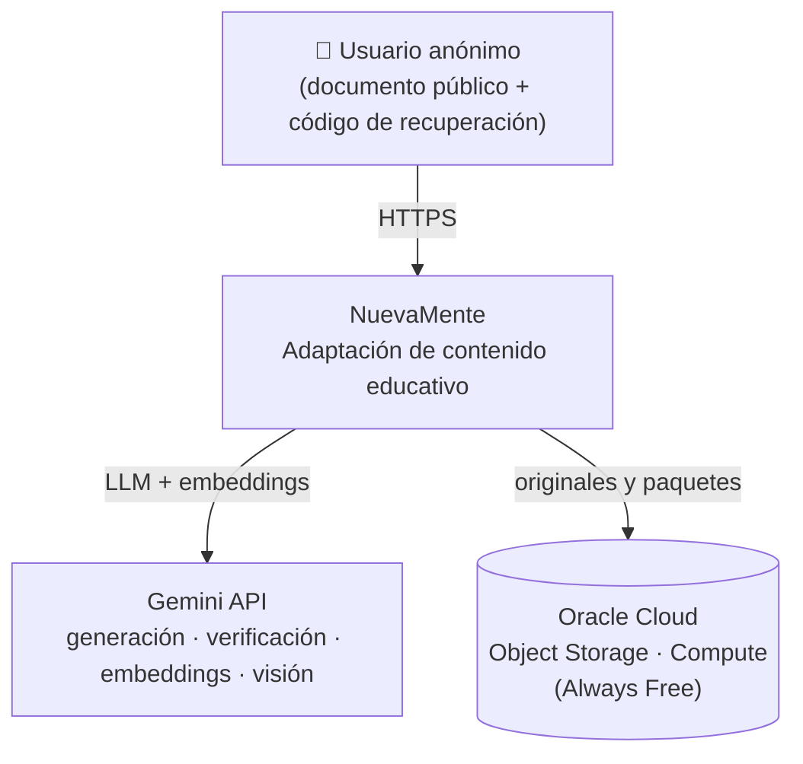
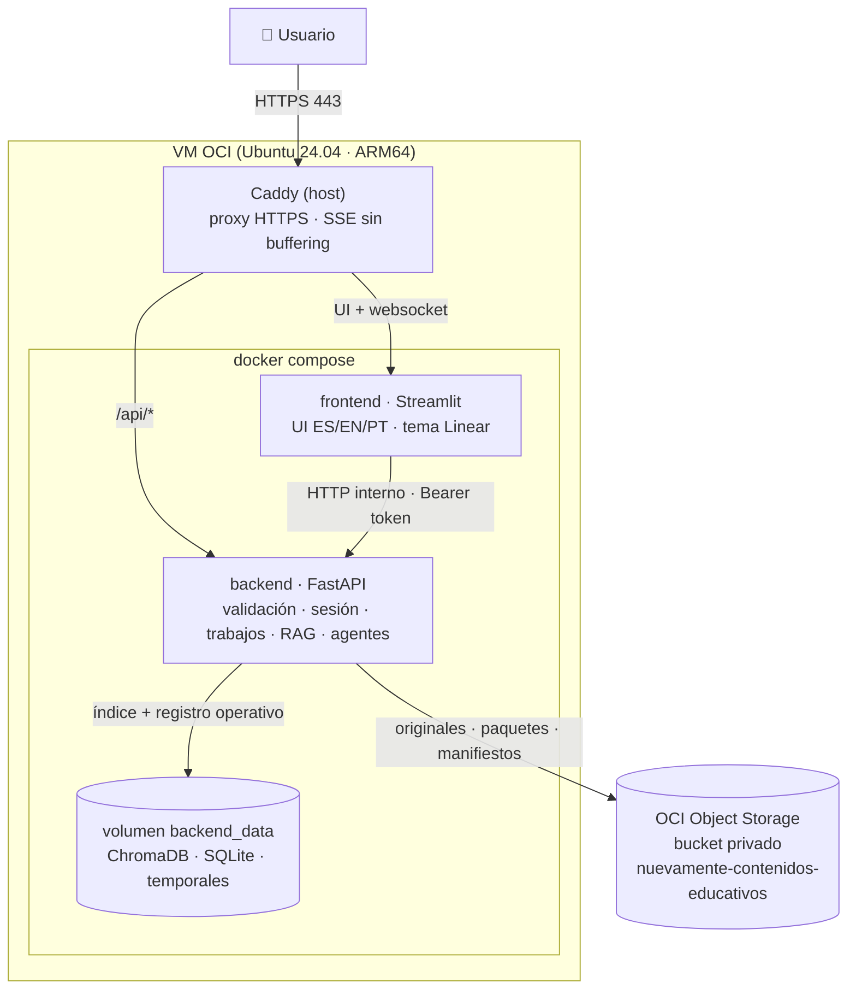
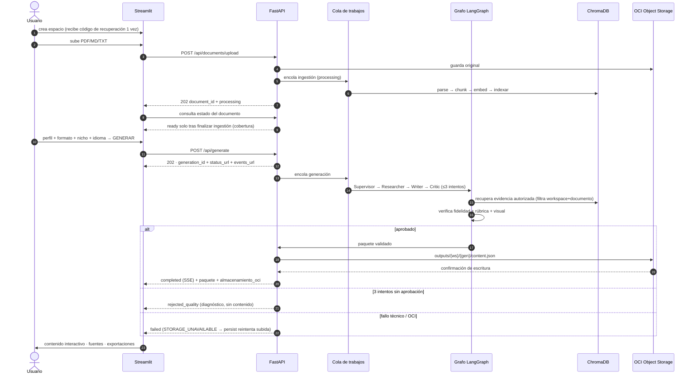
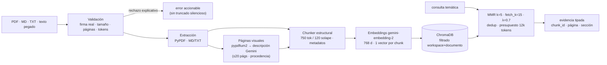
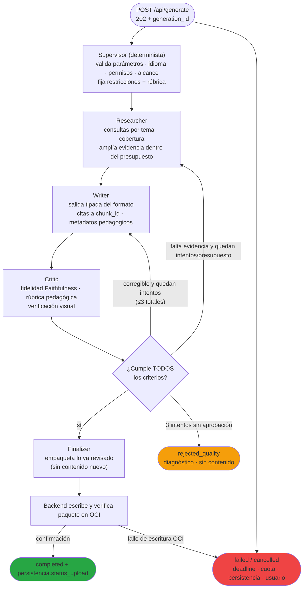
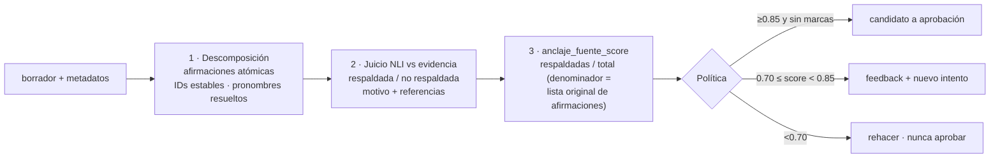
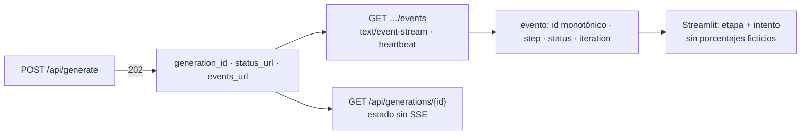
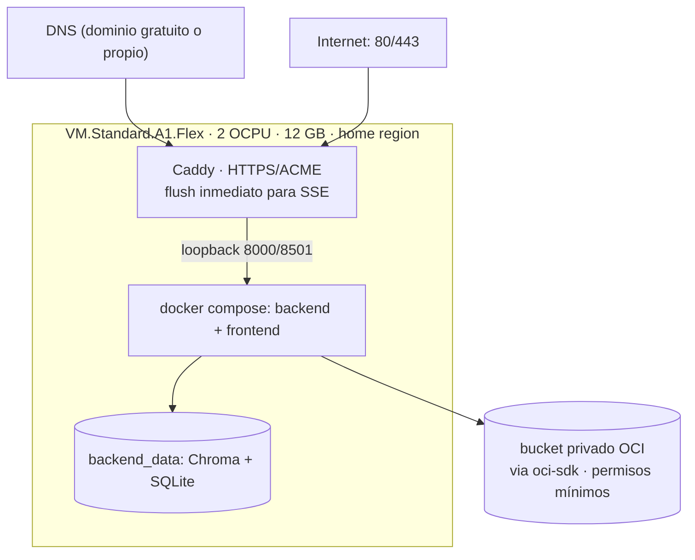

# 🏗️ Arquitectura de NuevaMente

> **Fuente de decisiones**: [`decisiones_proyecto.md`](../decisiones_proyecto.md) — este documento las traduce a diagramas y es la base del diagrama final del README (`Issue 57`).
> **Estado**: diseño aprobado. Cada sección indica el enlace de evidencia al código que se completará al implementar (los issues referenciados pertenecen al [plan de implementación](plan-implementacion.md)).

---

## Tabla de Contenidos

1. [Contexto del sistema](#1-contexto-del-sistema)
2. [Diagrama de contenedores](#2-diagrama-de-contenedores)
3. [Flujo de datos extremo a extremo](#3-flujo-de-datos-extremo-a-extremo)
4. [Pipeline RAG](#4-pipeline-rag)
5. [Grafo multi-agente (LangGraph)](#5-grafo-multi-agente-langgraph)
6. [Verificación de fidelidad](#6-verificación-de-fidelidad)
7. [Persistencia: OCI Object Storage + estado local](#7-persistencia-oci-object-storage--estado-local)
8. [Progreso en vivo (SSE) y trabajos](#8-progreso-en-vivo-sse-y-trabajos)
9. [Despliegue en OCI Compute Always Free](#9-despliegue-en-oci-compute-always-free)
10. [Decisiones arquitectónicas clave](#10-decisiones-arquitectónicas-clave)

---

## 1. Contexto del sistema



Límites del contexto (decisiones §1, §11):

- Entrada: documentos **públicos o simulados** (PDF/MD/TXT o texto pegado). No se procesan datos sensibles ni confidenciales.
- La IA provee texto e interpretación visual; NuevaMente la ancla a las fuentes y nunca publica contenido sin aprobar.
- Toda la infraestructura vive en la capa Always Free de OCI; sin recursos pagos ni fallback de pago.

---

## 2. Diagrama de contenedores



Reglas estructurales (decisiones §3.1, §14):

| Regla | Motivo |
|---|---|
| El frontend **solo** habla HTTP con la API | No accede al bucket, al índice ni a claves del proveedor |
| Solo el backend monta `backend_data` | Chroma y SQLite pertenecen al backend; único proceso escritor |
| Puertos 8000/8501 en loopback | Lo público pasa exclusivamente por el proxy HTTPS |
| La UI nunca afirma éxito completo sin confirmación OCI | Un resultado redactado, aprobado y guardado son hechos distintos |

---

## 3. Flujo de datos extremo a extremo

Secuencia completa del caso de uso principal (decisiones §3.2):



Puntos no negociables del flujo:

1. El original se persiste en OCI **antes** de declarar el documento disponible.
2. `completed` se emite **solo** después de la confirmación de persistencia del paquete.
3. Un rechazo de calidad, una falla técnica y una falla de almacenamiento son estados distintos y visibles.

---

## 4. Pipeline RAG



Parámetros de partida (calibrables, decisiones §4): chunk 750 tokens con 120 de solape medidos con tokenizador explícito; presupuestos de evidencia 12.000 tokens por borrador; metadatos completos por chunk (`document_hash`, `page`, `section_title`, `chunk_index`, `start_index`, `source_type`, `language`).

**Aislamiento**: toda recuperación filtra por `workspace_id` + `document_id` autorizados; la biblioteca demo vive en una colección de solo lectura separada. Ninguna búsqueda libre cruza espacios.

---

## 5. Grafo multi-agente (LangGraph)



Propiedades del grafo (decisiones §5, §19):

- **Tres intentos totales** (inicial + 2 correcciones). Sin ciclo de investigación ilimitado.
- **Presupuesto global**: ≤20 llamadas LLM por generación y deadline de 300 s — agotados → `failed` técnico, nunca falso veredicto factual.
- **Critic con llamadas separadas** del redactor (modelo/rúbrica/evidencia propios).
- **Finalizer determinista**: no agrega conceptos, prerrequisitos ni explicaciones; IDs de sistema y storage los completa el backend.
- El grafo termina **siempre** en un estado terminal explícito.

---

## 6. Verificación de fidelidad

Implementación propia de la metodología Faithfulness de Ragas (decisiones §19.1):



Salvaguardas: lista de juicios incompleta → evaluación inválida (`no_evaluable`); cero afirmaciones evaluables → score nulo (nunca 1.0); fallo del juez → fallo técnico. Distractores de quiz deliberadamente falsos se comprueban aparte; analogías etiquetadas no se juzgan como hechos literales.

Separación de conceptos (§19.2): **fidelidad** (hechos respaldados) ≠ **cobertura** (alcance y objetivos cubiertos) ≠ **adecuación pedagógica** (utilizable por el destinatario). Un score alto con un tutorial inutilizable no pasa la revisión.

---

## 7. Persistencia: OCI Object Storage + estado local

Distribución de responsabilidades (decisiones §7.2, §8):

| Capa | Contenido | Rôle |
|---|---|---|
| **OCI Object Storage** (obligatorio) | originales, paquetes educativos aprobados, manifiestos de espacio, progreso recuperable, exportaciones, demo | fuente de verdad durable para originales, paquetes y manifiestos |
| **SQLite local** (volumen) | sesiones/tokens, cola, idempotencia, eventos, tombstones | registro operativo; se reconstruye tras reinicio normal |
| **ChromaDB local** (volumen) | índice vectorial filtrable | caché de búsqueda; **reconstruible** desde los originales de OCI |

Layout del bucket (§8.3):

```text
nuevamente-contenidos-educativos/
├── workspaces/{workspace_id}/manifest.json
├── source_documents/{workspace_id}/{document_id}/original
├── source_documents/{workspace_id}/{document_id}/manifest.json
├── outputs/{workspace_id}/{generation_id}/content.json
├── exports/{workspace_id}/{generation_id}/{format}
├── progress/{workspace_id}/state.json
└── demo/
```

Reglas de escritura: claves de objeto generadas por el backend (IDs), nombre original solo como metadata; reintentar persistencia conserva el mismo `objeto_id`; `MOCK_OCI=1` solo en desarrollo/CI (etiquetado en UI, sin `status_upload=completado`); un fallo real **nunca** degrada a mock.

Presupuestos propios (§8.4): ≤1 GB total, ≤5.000 solicitudes/mes, 5 documentos y 20 generaciones por espacio, alerta al 80%, retención de 30 días de inactividad.

---

## 8. Progreso en vivo (SSE) y trabajos



Cola (§7.5): 1 trabajo intensivo global (compartido por ingestión, generación, chat y glosario) · cola ≤5 con posición visible y cancelación · 1 trabajo por espacio · deadline 300 s · timeout por llamada 60 s · 2 reintentos transitorios con backoff/jitter. Estados: `queued · running · completed · rejected_quality · failed · cancelled`.

---

## 9. Despliegue en OCI Compute Always Free



Reglas operativas (§9): Ubuntu 24.04 LTS como única receta; SSH restringido a IPs de administración; sin cambio automático a VM paga ante falta de capacidad (se documenta el bloqueo); reinicios de contenedores conservan el volumen, los trabajos en curso quedan `failed` (no `completed`); pérdida de VM → reconstruir índice y datos persistidos desde OCI; invalidar sesiones y marcar trabajos/eventos operativos perdidos como no recuperables, sin afirmar continuidad de ejecución.

---

## 10. Decisiones arquitectónicas clave

Resumen ejecutivo del porqué (detalle y justificación completa en `decisiones_proyecto.md`):

| # | Decisión | Alternativa descartada | Por qué |
|---|---|---|---|
| 1 | Frontend y backend separados (Streamlit + FastAPI) | Monolito Streamlit con lógica embebida | Contratos compartidos, pruebas sin UI, secrets solo en backend |
| 2 | ChromaDB local como índice reconstruible; OCI como fuente de verdad | Vector store en la nube o índice como dato primario | Always Free, reconstrucción desde originales, sin costo extra |
| 3 | Grafo LangGraph con Supervisor y Finalizer deterministas | LLM en cada nodo | Menos llamadas, menos latencia, comportamiento predecible |
| 4 | Crítica con umbrales + bloqueo al 3.er intento | Publicar «el mejor borrador» con advertencia | El material de estudio no puede contener errores detectados |
| 5 | `completed` solo tras confirmación de persistencia | Marcar éxito al generar | La UI no debe prometer guardado que no ocurrió |
| 6 | Acceso anónimo con código criptográfico | Registro por correo / sin recuperación | Recuperación real sin datos personales; alcance del MVP |
| 7 | SQLite + cola en la misma VM | Redis/Celery distribuidos | Una sola VM Always Free; sin servidores extra |
| 8 | Exportaciones derivadas del contenido canónico (sin re-llamar al LLM) | Regenerar por formato | Consistencia, costo cero en llamadas, rapidez |
| 9 | Multimodal vía rasterizado + descripciones separadas del texto | Solo texto de PyPDF | Los diagramas son parte del contenido técnico real |
| 10 | Presupuestos de aplicación por debajo de las cuotas OCI | Confiar en los límites de la capa | Control preventivo con reservas, cuotas verificadas y bloqueo; alertar no corta el gasto |

---

> **Enlaces de evidencia (completar al implementar)**: cada diagrama de este documento deberá enlazar a los módulos que lo implementan (`backend/app/core/rag/`, `backend/app/core/agents/`, `backend/app/storage/`, `frontend/`) cuando el código exista — el issue `Issue 57` es responsable de mantener esta correspondencia al día.
