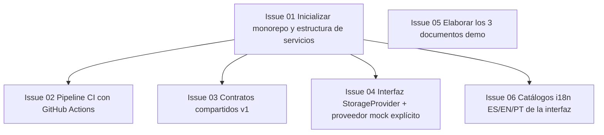

# Fase 0 — Fundaciones y contratos

> **Objetivo de la fase**: repo operativo con CI, contratos v1 congelados, mock de storage y documentos demo. **Hito H0**: los 6 carriles quedan desbloqueados.
> **Duración estimada**: 2–3 días. · [Volver al plan maestro](../plan-implementacion.md)

**Dependencias internas de la fase:**

`Issue 05` no tiene dependencias: puede arrancar el primer minuto del proyecto.

---

### `Issue 01` — Inicializar monorepo y estructura de servicios
**F0** · **INF** · **M** · **Depende de**: — · **Referencia**: decisiones_proyecto.md §15

**Objetivo**: crear la estructura de repositorio objetivo (sección 15) con los dos servicios esqueleto (`backend/`, `frontend/`), vacíos pero importables.

**Tareas**:
- Crear árbol de directorios de `backend/app/` (api, core/rag, core/agents, core/faithfulness, core/exports, storage, schemas, jobs, session) y `frontend/` (components, i18n, pages) con `__init__.py`.
- `backend/requirements.txt` y `frontend/requirements.txt` vacíos pero con comentario de política de versiones exactas.
- `ruff.toml` (120 cols, target py311), `.gitignore` (`.env`, `.pem`, `.key`, `.data/`, índices, SQLite, uploads), `.env.example` con placeholders del Apéndice A.
- Compose preliminar; conservar el README existente y actualizar solo instrucciones ejecutables.
- Crear rama `develop` y proteger `main` (solo PRs).

**Criterios de aceptación**:
- [ ] `git clone` + abrir el repo muestra la estructura completa de la sección 15.
- [ ] `python -c "import app"` funciona en `backend/` con un venv limpio.
- [ ] `.gitignore` cubre todos los artefactos sensibles listados en §11.2.

**Verificación**: revisión de estructura contra §15 + instalar dependencias desde la raíz y ejecutar `python -c "import app"` desde `backend/`..

---

### `Issue 02` — Pipeline CI con GitHub Actions
**F0** · **INF** · **M** · **Depende de**: `Issue 01` · **Referencia**: decisiones_proyecto.md §12.3

**Objetivo**: workflow de CI que instale dependencias fijadas de backend y frontend y ejecute `ruff check`, `ruff format --check` y `pytest` con `MOCK_OCI=1`.

**Tareas**:
- `.github/workflows/ci.yml`: matrix Python 3.11, caches de pip, pasos separados backend/frontend.
- Variables de entorno de CI: `MOCK_OCI=1`, `APP_ENV=ci`, doble de Gemini activado por env.
- Job que falle si `requirements.txt` tiene versiones no fijadas (check simple).
- Badge de CI en el README stub.

- Fijar dependencias de desarrollo (pytest, ruff y plugins). Incluir un smoke test de importación para evitar exit code 5 de pytest sin tests, sin ocultar fallos. Configurar imports para ejecutar pytest desde la raíz.

**Criterios de aceptación**:
- [ ] Un PR que rompe formato o lint queda bloqueado.
- [ ] CI corre en < 5 min con suite vacía/parcial.
- [ ] Ningún secreto real en el workflow (solo placeholders).

**Verificación**: abrir un PR de prueba con un error de lint intencional y verlo fallar; corregir y verlo pasar.

---

### `Issue 03` — Contratos compartidos v1
**F0** · **QAD** (con revisión obligatoria de API + UI + AGT + RAG) · **L** · **Depende de**: `Issue 01` · **Referencia**: decisiones_proyecto.md §7, §16

**Objetivo**: publicar el paquete `backend/app/schemas/` completo y congelado en v1: enums, schemas de entrada/salida, los 5 formatos pedagógicos, `PedagogicalOutput`, modelo de errores y eventos SSE. Es **el** habilitador de paralelismo del proyecto.

**Tareas**:
- `schemas/enums.py`: `RecipientProfile` (4), `PedagogicalFormat` (5), `IndustryNiche` (4), `DetailLevel` (3), `OutputLanguage` (es/en/pt), `JobStatus` (queued/running/completed/rejected_quality/failed/cancelled) — valores de máquina estables, etiquetas traducibles aparte (§16.1).
- `schemas/pedagogical.py`: `FlashcardDeck`, `InteractiveQuiz`, `PracticalTutorial`, `ExecutiveSummary`, `VideoLessonScript` con validaciones de §16.2 (IDs únicos, listas no vacías, `correct_option_id ∈ options`, duraciones positivas, `Literal` discriminante por formato).
- `schemas/responses.py`: `PedagogicalOutput` con los campos exactos de §16.3 (metadatos, documento_fuente, contenido_adaptado como unión discriminada, evaluacion_calidad, referencias, trazabilidad, almacenamiento_oci, schema_version="1.0").
- `schemas/requests.py`: `GenerateRequest` (document_id + parámetros §16.1), `UploadRequest`, `ChatRequest`, `GlossaryRequest`, `ProgressEvent` (idempotente).
- Modelo de errores: envoltorio `error.code/message/details` + `request_id` y tabla de códigos estables (§7.3).
- Esquema de eventos SSE: `id` monotónico, `generation_id`, `step`, `status`, `iteration` (§3.3).
- Documento [`docs/contratos-api.md`](../contratos-api.md) sincronizado con lo implementado.
- Tests de round-trip: cada formato serializa/deserializa y rechaza ejemplos inválidos (opción correcta fuera de la lista, lista vacía, etc.).

- Definir contratos internos de documento/chunk/evidencia, verificación visual y presupuesto de llamadas; vistas canónica/estudiante de quiz y trabajos comunes. Mantener ejemplos válidos por cada formato en contratos-api.md.

**Criterios de aceptación**:
- [ ] Los formatos validan ejemplos adaptados al contrato §16; el JSON ilustrativo del enunciado requiere un mapeo explícito, no es idéntico a este esquema.
- [ ] Un payload inválido es rechazado con error de Pydantic claro (campo, motivo).
- [ ] Aprobado por al menos un representante de API, UI, AGT y RAG (checklist en el PR).
- [ ] Congelado como v1: cambios posteriores requieren PR etiquetado `contract-change` con la misma revisión.

**Verificación**: `pytest backend/tests/test_schemas.py` en verde + revisión multi-carril registrada en el PR.

---

### `Issue 04` — Interfaz `StorageProvider` + proveedor mock explícito
**F0** · **INF** · **M** · **Depende de**: `Issue 01` · **Referencia**: decisiones_proyecto.md §8.2

**Objetivo**: abstracción de almacenamiento con contrato unificado y la implementación local `LocalMockStorageProvider` para desarrollo/CI.

**Tareas**:
- `storage/provider.py`: interfaz `StorageProvider` (upload, get, get_as_text, list, delete) con tipado estricto y errores propios (`StorageUnavailable`).
- `storage/oci_storage.py` (parte mock): `LocalMockStorageProvider` bajo `.data/oci_mock_storage/`, prefijos idénticos a producción (§8.3).
- Factory `get_storage_provider()`: `MOCK_OCI=1` → mock; con `MOCK_OCI=0` y credenciales faltantes → **fallo visible en arranque**, nunca fallback silencioso.
- El mock marca sus respuestas con `mock://…` para que la UI pueda rotular «Almacenamiento local de desarrollo».
- Tests unitarios del mock (put/get/list/delete/prefijos).

- Incluir ETag/versión, creación y actualización condicionales, paginación y error de conflicto. Mock y OCI deben tener idéntica semántica para manifiestos/progreso.

**Criterios de aceptación**:
- [ ] `MOCK_OCI=1` permite el ciclo completo put/get/list/delete sin red.
- [ ] `MOCK_OCI=0` sin credenciales produce error de arranque con mensaje accionable.
- [ ] Ninguna ruta de código convierte un fallo real en mock automáticamente.

**Verificación**: `pytest backend/tests/test_storage.py` con ambas configuraciones.

---

### `Issue 05` — Elaborar los 3 documentos demo
**F0** · **QAD** · **M** · **Depende de**: — · **Referencia**: decisiones_proyecto.md §4.5, §18.1

**Objetivo**: producir los documentos públicos/simulados que alimentan la biblioteca demo y los tres escenarios obligatorios.

**Tareas**:
- `documents/redes_vcn_oci.pdf`: documento sobre VCN en OCI con **un diagrama de arquitectura legible** (requisito para el diferencial multimodal), conceptos: VCN, subredes, gateways, security lists, tablas de ruteo. Generado con ReportLab/LaTeX para control total del contenido; 8–15 páginas.
- `documents/integracion_apis_pagos.md`: guía técnica de integración de APIs de pago (nicho Fintech), con tablas y bloques de código.
- `documents/gobernanza_datos_salud.md`: marco de gobernanza de datos de salud con **ejemplos ficticios** y cero datos personales reales.
- Verificar que el documento VCN contiene todos los conceptos que los 3 escenarios van a enseñar (cruzar con `docs/demo-escenarios.md`).
- Incluir un caso de prueba negativo: una sección deliberadamente insuficiente para evidenciar el bloqueo por calidad en la demo.

**Criterios de aceptación**:
- [ ] El PDF VCN abre correctamente, su diagrama se rasteriza nítido y su texto se extrae con PyPDF sin pérdidas.
- [ ] Los tres documentos son legibles con herramientas independientes; la integración con el parser se verifica en Issue 11, sin bloquear este issue por trabajo futuro.
- [ ] Sin datos personales ni contenido confidencial (revisión por segunda persona).

**Verificación**: extracción manual con snippet de PyPDF + revisión de pares del contenido.

---

### `Issue 06` — Catálogos i18n ES/EN/PT de la interfaz
**F0** · **UI** · **M** · **Depende de**: `Issue 01` · **Referencia**: decisiones_proyecto.md §17

**Objetivo**: catálogos de traducción completos de la UI en español (default), inglés y portugués (pt-BR), independientes del idioma del contenido generado.

**Tareas**:
- `frontend/i18n/`: estructura `{es,en,pt}.py` (o JSON) con todas las claves de UI previstas: navegación, sidebar, estados (§6.5), errores, onboarding, accesibilidad.
- Convención de claves por área (`sidebar.*`, `upload.*`, `generate.*`, `quiz.*`, `errors.*`…) documentada en el módulo.
- Helper `t(key, lang)` con fallback a español y detección de claves faltantes en test.
- Cobertura: los términos de los estados de trabajo (queued, running, rejected_quality…) tienen etiqueta humana por idioma, separada del código de máquina (§17.3).

**Criterios de aceptación**:
- [ ] Un test compara las claves de los 3 catálogos y falla si difieren.
- [ ] Ningún string hardcodeado de UI queda fuera del catálogo (checklist de revisión).
- [ ] Portugués redactado en pt-BR; español latinoamericano.

**Verificación**: `pytest frontend/tests/test_i18n.py` (paridad de claves) + revisión de redacción.
