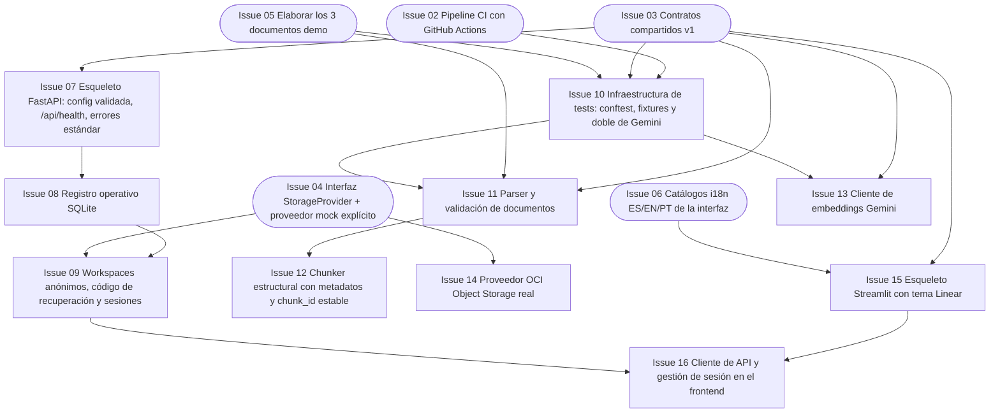

# Fase 1 — Núcleo de datos y acceso

> **Objetivo de la fase**: esqueletos de backend y frontend corriendo; sesiones anónimas con código de recuperación; parser, chunker y embeddings con tests. **Hito H1**.
> **Duración estimada**: 4–5 días. · [Volver al plan maestro](../plan-implementacion.md)

**Dependencias internas de la fase** (nodos punteados = dependencia externa ya mergeada):

---

### `Issue 07` — Esqueleto FastAPI: config validada, `/api/health`, errores estándar, `request_id`
**F1** · **API** · **M** · **Depende de**: `Issue 03` · **Referencia**: decisiones_proyecto.md §7.1, §7.3, Apéndice A

**Objetivo**: aplicación FastAPI arrancable con configuración validada al inicio, manejo de errores uniforme y trazabilidad por request.

**Tareas**:
- `app/main.py` + `app/config.py`: carga de env vars con Pydantic Settings; validación crítica al arranque (producción sin config completa no ofrece generación — Apéndice A).
- `GET /api/health` sin secretos ni llamadas LLM.
- Middleware `request_id` (generado o aceptado del cliente, propagado a logs y respuestas).
- Handlers de excepción con el envoltorio de error de `Issue 03` (error.code/message/details) y mapeo de HTTP de §7.3.
- CORS deshabilitado por defecto; habilitable por env para los orígenes necesarios.
- OpenAPI served en `/docs` como referencia viva.

**Criterios de aceptación**:
- [ ] `/api/health` responde 200 sin credenciales reales en test/desarrollo con mocks explícitos; producción incompleta falla al arrancar.
- [ ] Cualquier excepción no manejada responde 500 con envoltorio de error estándar y `request_id`, sin stacktrace interna.
- [ ] Arrancar con `APP_ENV=production` y config incompleta falla con mensaje accionable.

**Verificación**: `pytest backend/tests/test_api_health.py` + arranque manual con config rota.

---

### `Issue 08` — Registro operativo SQLite
**F1** · **API** · **L** · **Depende de**: `Issue 07` · **Referencia**: decisiones_proyecto.md §7.2, §14.2

**Objetivo**: capa de persistencia operativa local (sesiones, trabajos, idempotencia, eventos) con esquema versionado y reconstrucción tras reinicio.

**Tareas**:
- Esquema SQLite en el volumen del backend: tablas `workspaces`, `sessions`, `documents`, `generations`, `idempotency_keys`, `events`, `pending_deletes`; migraciones simples versionadas.
- Acceso con un único proceso escritor (WAL), sin ORM pesado si no aporta.
- Registro de `Idempotency-Key` con hash de cuerpo y respuesta atómicamente (§7.3): duplicado en curso → mismo identificador; mismo key con cuerpo distinto → 409.
- Al reiniciar: estado se reconstruye desde disco; trabajos `running` interrumpidos quedan `failed` con causa `INTERRUPTED` (§7.2).
- Tombstones de borrado dentro del plazo de retención.

- Idempotencia atómica por workspace + operación + clave; nunca persistir respuestas con códigos/tokens en claro.
- Restaurar espacios, documentos, generaciones y progreso desde manifiestos OCI tras pérdida de volumen; invalidar sesiones, respetar tombstones durables y comprobar recuperación con código sin resucitar recursos.

**Criterios de aceptación**:
- [ ] Reinicio del proceso entre operaciones conserva workspaces/sesiones/trabajos.
- [ ] Misma `Idempotency-Key` + mismo cuerpo → misma respuesta sin duplicar recurso; cuerpo distinto → 409.
- [ ] Un trabajo marcado `running` al matar el proceso queda `failed` al reiniciar.

**Verificación**: `pytest backend/tests/test_jobs_store.py` (incluye test de reinicio simulado).

---

### `Issue 09` — Workspaces anónimos, código de recuperación y sesiones
**F1** · **API** · **L** · **Depende de**: `Issue 08`, `Issue 04` · **Referencia**: decisiones_proyecto.md §7.4, §11.2

**Objetivo**: mecanismo completo de acceso anónimo: creación de espacio, código criptográfico mostrado una vez, recuperación y revocación.

**Tareas**:
- `POST /api/workspaces`: genera `workspace_id` (UUID) + código de recuperación ≥128 bits agrupado para copiar + token de sesión; el código se devuelve **una sola vez** y solo se persiste su hash.
- `POST /api/sessions/recover`: canjea código por token opaco (≥256 bits, expiración ≤24 h); límite 5 intentos fallidos/minuto por origen confiable + límite global (§7.4).
- `DELETE /api/sessions/current` y `POST /api/workspaces/current/recovery-code` (rotación: revoca sesiones previas).
- `DELETE /api/workspaces/current`: bloquea acceso de inmediato y agenda limpieza física (tombstone).
- Manifiesto privado en storage (`workspaces/{id}/manifest.json`) con hash, expiración (30 días de inactividad) y versión.
- Dependencia FastAPI de autenticación: toda ruta protegida resuelve el workspace desde el token, nunca desde un `workspace_id` del cliente.
- Errores: 401 con mensaje claro; sin recuperación por correo.

- Persistir rotación/revocación con control de versión; devolver código y token nuevos. Índice privado hash→workspace reconstruible desde manifiestos, sin recorrer el bucket por intento.
- Limitar creación y recuperación globalmente y por origen confiable. Actualizar actividad/expiración con escrituras agrupadas; espacios vencidos o borrados no se recuperan.

**Criterios de aceptación**:
- [ ] Crear → cerrar sesión → recuperar con código → ver los mismos recursos, funciona.
- [ ] Código inválido 6 veces en un minuto → 429 con bloqueo temporal.
- [ ] Rotar el código invalida el anterior y revoca sesiones.
- [ ] El código en claro no aparece en logs, DB ni storage (solo hash).
- [ ] Un recurso de otro workspace accedido por ID → 404 (no 403, no datos).

**Verificación**: `pytest backend/tests/test_workspaces.py`.

---

### `Issue 10` — Infraestructura de tests: conftest, fixtures y doble de Gemini
**F1** · **QAD** · **M** · **Depende de**: `Issue 02`, `Issue 03`, `Issue 05` · **Referencia**: decisiones_proyecto.md §12

**Objetivo**: base de testing que todos los carriles usan: fixtures de documentos, doble determinista de Gemini y marcas para tests de integración real.

**Tareas**:
- `conftest.py` raíz: env de test (`MOCK_OCI=1`, `APP_ENV=test`), event loop y sesión de API (httpx AsyncClient) reutilizables.
- Doble de Gemini: respuestas scriptables por test (generación, verificación, embeddings vectoriales deterministas) — activado por env en CI; nunca usado en la suite real (`Issue 54`).
- Fixtures: PDF válido/corrupto/cifrado/oversize generados al vuelo, MD y TXT de ejemplo, chunks sintéticos, documentos de `Issue 05`.
- Marcas pytest: `unit`, `integration_mock`, `integration_real` (excluida de CI normal).
- Fixtures factuales de §12.2: negaciones, unidades, números inventados, contradicciones, contexto ausente.

**Criterios de aceptación**:
- [ ] `pytest` en CI corre solo unit + integration_mock, sin red ni credenciales.
- [ ] El doble de embeddings produce vectores estables que Chroma puede indexar (búsqueda funcional en test).
- [ ] Los fixtures factuales están versionados y documentados.

**Verificación**: `pytest -m "not integration_real"` en verde desde CI el primer día.
### `Issue 11` — Parser y validación de documentos
**F1** · **RAG** · **L** · **Depende de**: `Issue 03`, `Issue 05`, `Issue 10` · **Referencia**: decisiones_proyecto.md §4.1, §11.3

**Objetivo**: ingestión robusta de PDF/MD/TXT y de texto pegado, con validación de seguridad y límites operativos.

**Tareas**:
- PDF: firma y parseo real. MD/TXT: validar UTF-8 y ausencia de binario; no tienen firma inequívoca. MIME/extensión solos no son suficientes.
- Límites configurables: 20 MB PDF · 5 MB MD/TXT · 100 páginas · 100.000 tokens extraídos · 20 páginas visuales (§4.1).
- Extracción PDF con PyPDF (texto + metadatos de página); MD/TXT UTF-8 con línea/sección.
- Entrada «pegar texto» → se persiste como original TXT con `documento_titulo` (§4.1).
- Rechazos explicativos: corrupto, cifrado sin acceso, extracción insuficiente; **nunca** truncado silencioso.
- La ingestión reporta qué páginas/secciones procesó y cuáles no (cobertura).
- Timeout y límites de memoria en la extracción; nombres subidos usados solo como etiqueta, nunca como ruta.

- Derivar PDFs escaneados legibles al contrato visual de Issue 30, sin rechazarlos por texto vacío. Antes de conectar visión no declarar ready un documento incompleto.

**Criterios de aceptación**:
- [ ] Los 3 documentos de `Issue 05` se parsean con metadatos de página/sección.
- [ ] PDF cifrado, archivo corrupto y archivo de 25 MB son rechazados con error accionable y código estable.
- [ ] Un PDF de 150 páginas se rechaza por el límite de páginas antes de extraer.
- [ ] Texto pegado se convierte en documento TXT persistible.

**Verificación**: `pytest backend/tests/test_parser.py` con fixtures generados (PDF válido, corrupto, cifrado, oversize).

---

### `Issue 12` — Chunker estructural con metadatos y `chunk_id` estable
**F1** · **RAG** · **M** · **Depende de**: `Issue 11` · **Referencia**: decisiones_proyecto.md §4.3

**Objetivo**: segmentación recursiva 750 tokens / solapamiento 120, medida con tokenizador explícito, preservando unidades semánticas y trazabilidad total.

**Tareas**:
- Splitter con separadores por encabezados → párrafos → límites lógicos de tablas/código; medición en tokens reales (no caracteres).
- Metadatos por chunk: `workspace_id`, `document_id`, `document_hash`, `source_name`, `page` (null en MD/TXT), `section_title`, `chunk_index`, `start_index`, `source_type`, `language`.
- `chunk_id` determinista estable por versión de documento + config de parser (mismos datos → mismos IDs).
- Preservar unidades, negaciones y relación encabezado-cuerpo; tablas divididas conservan contexto de cabecera.

- Aislar chunk_id por espacio y documento/version/configuración para impedir sobrescrituras entre espacios con archivos idénticos. Conservar líneas inicial/final de MD/TXT.
- Adaptar metadatos al formato admitido por Chroma; mantener page=null solo en la representación pública cuando no aplica.

**Criterios de aceptación**:
- [ ] Ningún chunk excede el tamaño objetivo + tolerancia definida.
- [ ] Re-trocear el mismo documento produce IDs idénticos (test determinismo).
- [ ] Chunks de MD citan sección y líneas; chunks de PDF citan página.
- [ ] Una tabla partida en dos conserva sus cabeceras en ambas partes.

**Verificación**: `pytest backend/tests/test_chunker.py`.

---

### `Issue 13` — Cliente de embeddings Gemini
**F1** · **RAG** · **M** · **Depende de**: `Issue 03`, `Issue 10` · **Referencia**: decisiones_proyecto.md §2.3

**Objetivo**: adaptador de `gemini-embedding-2` con 768 dimensiones, un vector por chunk, batching y control de errores.

**Tareas**:
- Wrapper `google-genai` con `output_dimensionality=768` y tarea de preparación (retrieval document / retrieval query) según corresponda.
- Planificar solicitudes individuales conservando un vector por chunk; no asumir que una lista en una llamada produce vectores independientes ni activar Batch pago.
- Reintentos transitorios (2, backoff + jitter + Retry-After), error visible si la cuota se agota.
- Registro de modelo/dimensión/versión de preparación; el nombre de colección Chroma incorpora modelo+dimensión para obligar reindexado si cambian.
- Integración con el doble de Gemini de `Issue 10` para tests sin red.

**Criterios de aceptación**:
- [ ] 100 chunks → exactamente 100 vectores de 768 dimensiones.
- [ ] Cambiar `GEMINI_EMBEDDING_MODEL` genera un nombre de colección distinto (no mezcla índices).
- [ ] Con el doble de test: error simulado de cuota se propaga como error técnico visible (no score=1 ni mock silencioso).

**Verificación**: `pytest backend/tests/test_embeddings.py` con doble.

---

### `Issue 14` — Proveedor OCI Object Storage real
**F1** · **INF** · **M** · **Depende de**: `Issue 04` · **Referencia**: decisiones_proyecto.md §8.1, §8.3

**Objetivo**: implementación productiva del `StorageProvider` contra el bucket Always Free, con prefijos canónicos y reintentos acotados.

**Tareas**:
- `OCIObjectStorageProvider` con `oci-sdk`: config por archivo o identidad de instancia; namespace por consulta; bucket privado `nuevamente-contenidos-educativos` en la home region.
- Prefijos exactos de §8.3: `workspaces/`, `source_documents/{ws}/{doc}/original|manifest.json`, `outputs/`, `exports/`, `progress/`, `demo/`.
- Claves de objeto generadas por el backend (IDs), nombre original solo como metadata — sin colisiones ni rutas manipulables.
- Reintentos idempotentes máx. 3 con backoff; reintentar una escritura **conserva el mismo objeto_id** (§8.3).
- Script de verificación: crear bucket si no existe (aprov. manual documentado), put/get/list sobre prefijo de prueba, y conteo de solicitudes para el presupuesto (§8.4).
- `MOCK_OCI=0` + fallo de OCI → `StorageUnavailable` visible; cero fallback automático a mock.

- Implementar escrituras condicionales y paginación de Issue 04; contabilizar solicitudes SDK incluidos reintentos y reservar presupuesto conservador desde la primera prueba real. Issue 50 completa la auditoría.

**Criterios de aceptación**:
- [ ] Un put + get + list reales contra el bucket funcionan con credenciales mínimas del compartimento.
- [ ] Los prefijos creados coinciden 1:1 con §8.3.
- [ ] Error de red simulado (DNS roto) produce `failed`/`STORAGE_UNAVAILABLE`, no mock.
- [ ] Sin credenciales y `MOCK_OCI=0`: arranque falla con mensaje claro.

**Verificación**: `pytest backend/tests/test_storage_oci.py` (mock de SDK) + ejecución manual del script real una vez configurada la tenancy.

---

### `Issue 15` — Esqueleto Streamlit con tema Linear
**F1** · **UI** · **M** · **Depende de**: `Issue 03`, `Issue 06` · **Referencia**: decisiones_proyecto.md §6.1–§6.3

**Objetivo**: aplicación Streamlit con el design system Linear aplicado (tokens, tipografías, hairlines) y el layout sidebar + área principal en estado vacío.

**Tareas**:
- `.streamlit/config.toml` con tokens del design system (canvas `#010102`, surfaces, primary `#5e6ad2`, ink).
- `components/theme.py`: inyección CSS (Inter + JetBrains Mono auto-hospedadas si es viable — §6.6), cards, hairlines, foco visible, respeto de `prefers-reduced-motion`.
- `app.py` + `pages/home.py`: layout §6.3 — sidebar (logo, selector idioma UI, espacios para carga y parámetros, historial en expander) + área principal con estado vacío/onboarding.
- Integración de `Issue 06`: helper `t()` y selector de idioma que cambia etiquetas sin recargar datos.
- Estado vacío accesible: las 4 entradas del onboarding (subir, pegar texto, demo, recuperar espacio) como botones nativos.
- `frontend/Dockerfile` inicial (arranque básico) para que `Issue 26` tenga base.

**Criterios de aceptación**:
- [ ] `streamlit run frontend/app.py` muestra la app con tema oscuro completo, con controles nativos accesibles y estilo consistente.
- [ ] Cambiar idioma de UI re-traduce la pantalla en caliente.
- [ ] Contraste de texto ≥ 4.5:1 verificado con herramienta (WCAG AA §6.6).
- [ ] Navegable por teclado con foco visible.

**Verificación**: revisión visual en navegador + auditoría rápida de contraste.

---

### `Issue 16` — Cliente de API y gestión de sesión en el frontend
**F1** · **UI** · **M** · **Depende de**: `Issue 15`, `Issue 09` · **Referencia**: decisiones_proyecto.md §6.1, §7.4

**Objetivo**: `api_client.py` tipado contra `docs/contratos-api.md` y el flujo de sesión del usuario en Streamlit.

**Tareas**:
- `api_client.py`: métodos para workspaces/sesiones/docs/generaciones/exports con manejo del envoltorio de error, `request_id` en logs y timeouts; sin acceso directo a storage ni claves.
- Gestión de sesión: token en `st.session_state` (nunca en el cliente), creación de workspace al primer uso, recuperación con código (con recordatorio de guardarlo y aviso de que se muestra una sola vez), cierre de sesión.
- Estados de error amigables y traducidos (catálogo `Issue 06`), distinguindo 401 (pedir código) de fallos técnicos.
- Acciones de copiar/descargar el código, rotación con token nuevo y borrado del espacio con confirmación; nunca exponer códigos en capturas/logs.
- Pantalla de recuperación: entrada del código agrupado + feedback de éxito/fallo/bloqueo por intentos.
- `API_URL` configurable por env para Docker y local.

**Criterios de aceptación**:
- [ ] Crear espacio → ver código → cerrar sesión → recuperar con código → mismo estado, funciona por HTTP real.
- [ ] Los errores del backend se muestran traducidos con código estable visible solo en «detalles técnicos».
- [ ] El token nunca se loguea ni viaja a otra capa que no sea el header `Authorization`.

**Verificación**: flujo manual con backend real levantado + `pytest frontend/tests/test_api_client.py` contra una API simulada.

---

