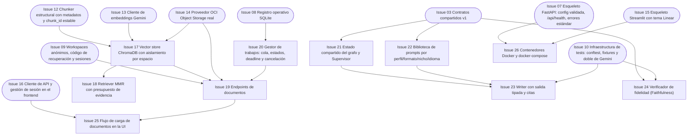

# Fase 2 — Pipeline vertical mínima (walking skeleton)

> **Objetivo de la fase**: indexado vectorial completo, endpoints de documentos, cola de trabajos, Writer simple y Docker. Al cierre funcionan carga, persistencia, indexación y recuperación; la generación pública revisada llega con Issue 31. **Hito H2**.
> **Duración estimada**: 5 días. · [Volver al plan maestro](../plan-implementacion.md)

**Dependencias internas de la fase:**

---

### `Issue 17` — Vector store ChromaDB con aislamiento por espacio
**F2** · **RAG** · **M** · **Depende de**: `Issue 12`, `Issue 13`, `Issue 14` · **Referencia**: decisiones_proyecto.md §4.4, §8.3

**Objetivo**: índice Chroma persistente en el volumen del backend, filtrado por espacio y documento, con reconstrucción desde OCI.

**Tareas**:
- `rag/vectorstore.py`: colección por modelo+dimensión de embedding; persistencia en volumen; escritura por lotes.
- Todo query filtra por `workspace_id` + `document_id` autorizados (sin excepciones — aislamiento §4.4).
- Colección demo de solo lectura separada para fuentes compartidas.
- Operaciones: indexar documento (con embeddings de `Issue 13`), borrar índice de un documento (cuando se borra la fuente), reindexar por hash reutilizable (§4.5).
- Rutina de reconstrucción completa del índice desde los originales de OCI (para pérdida de VM — §9.3).

**Criterios de aceptación**:
- [ ] Indexar documento → buscar → los resultados son solo chunks de ese documento/espacio.
- [ ] Un query con `document_id` ajeno no devuelve nada (test de aislamiento cruzado).
- [ ] Borrar documento elimina sus chunks del índice (conteo antes/después).
- [ ] Reconstrucción desde originales produce índice consultable.

**Verificación**: `pytest backend/tests/test_vectorstore.py`.

---

### `Issue 18` — Retriever MMR con presupuesto de evidencia
**F2** · **RAG** · **M** · **Depende de**: `Issue 17` · **Referencia**: decisiones_proyecto.md §4.4

**Objetivo**: recuperación MMR (k=5, fetch_k=15, λ=0.7) con deduplicación y presupuesto de evidencia de 12.000 tokens por borrador.

**Tareas**:
- `rag/retriever.py`: MMR sobre Chroma con los parámetros de partida (calibrables por env).
- Deduplicación de chunks y recorte por presupuesto de tokens (12k configurable) con aviso cuando se recorta.
- Salida tipada: chunks con `chunk_id`, texto, metadatos de procedencia y score — lista para citar en `PedagogicalOutput.referencias`.
- Preparación de consulta multilingüe (preparación diferenciada y compatible para consultas y documentos).

**Criterios de aceptación**:
- [ ] Una consulta sobre el doc demo VCN recupera chunks pertinentes con diversidad (no 5 copias del mismo párrafo).
- [ ] La evidencia devuelta nunca excede el presupuesto de tokens.
- [ ] Cada chunk recuperado trae metadatos suficientes para renderizar «Ver la fuente» (página/sección).

**Verificación**: `pytest backend/tests/test_retriever.py` + inspección manual de resultados sobre `Issue 05`.

---

### `Issue 19` — Endpoints de documentos
**F2** · **API** · **L** · **Depende de**: `Issue 09`, `Issue 17`, `Issue 14`, `Issue 20` · **Referencia**: decisiones_proyecto.md §7.1, §3.2, §8.3, §11.3

**Objetivo**: ciclo de vida completo del documento: carga validada, persistencia del original en OCI, indexado asíncrono, consulta de estado y borrado en cascada.

**Tareas**:
- `POST /api/documents/upload`: valida firma/límites (de `Issue 11`), **persiste el original en OCI antes de declararlo disponible**, responde 202 con `document_id` y estado `processing` (§3.2 paso 3).
- Ingestión asíncrona (pasa por la cola de `Issue 20`): parse → chunk → embed → indexar → `ready`; cualquier fallo → `failed` con causa accionable.
- `GET /api/documents` (paginado) y `GET /api/documents/{id}` (metadatos, cobertura de páginas/secciones procesadas).
- `GET /api/documents/{id}/sources/{chunk_id}`: fragmento/página original autorizado (base de «Ver la fuente»).
- `DELETE /api/documents/{id}`: retira original OCI, índice, derivados, chat y progreso vinculados (tombstone).
- Reutilización por hash: mismo contenido en el mismo espacio no re-indexa (§4.5).
- Idempotencia de upload con `Idempotency-Key`.

- Catálogo demo de solo lectura mediante listado/detalle y secciones estables. Autorizar fuentes demo compartidas explícitamente, guardando los resultados en cada espacio; no eludir permisos de documentos privados.
- Borrado: bloquear acceso/cancelar trabajos antes de limpiar, y comprobar tombstones antes de publicar. Fallos físicos dejan limpieza pendiente.
- Conectar Issue 30 antes de declarar ready una fuente que necesite interpretación visual.

**Criterios de aceptación**:
- [ ] Subir el PDF VCN → 202 → polling hasta `ready` → los metadatos informan páginas procesadas.
- [ ] El original queda en `source_documents/{ws}/{doc}/original` y el manifest en `…/manifest.json` antes de `ready`.
- [ ] Subir duplicado con misma Idempotency-Key no crea segundo documento.
- [ ] `DELETE` borra original, chunks del índice y derivados; re-subir funciona limpio.
- [ ] Acceso al documento de otro espacio por ID → 404.

**Verificación**: `pytest backend/tests/test_api_documents.py` (mock storage + doble Gemini) + una corrida manual real con OCI.

---

### `Issue 20` — Gestor de trabajos: cola, estados, deadline y cancelación
**F2** · **API** · **L** · **Depende de**: `Issue 08` · **Referencia**: decisiones_proyecto.md §7.5, §14.2

**Objetivo**: ejecutor de trabajos intensivos con las cuotas operativas acordadas: 1 trabajo activo global, cola de 5, 1 por espacio, deadlines y cancelación.

**Tareas**:
- `jobs/manager.py`: cola en SQLite sobre `Issue 08`; estados `queued/running/completed/rejected_quality/failed/cancelled`.
- Controles §7.5: concurrencia global 1, cola ≤5 con posición visible, 1 trabajo por espacio, deadline 300 s de ejecución (sin contar espera), espera máx. 300 s en cola, timeout por llamada 60 s, 2 reintentos transitorios con backoff/jitter/Retry-After.
- Cancelación cooperativa (`POST /api/generations/{id}/cancel`): posible en cola y en ejecución (chequeos de flag entre pasos del grafo).
- Eventos de progreso persistidos (base del SSE de `Issue 31`).
- Ejecución fuera del event loop (worker dedicado) para no congelar la API (§14.2).
- Reinicio: trabajos `running` → `failed/INTERRUPTED` (ya cubierto por `Issue 08`; aquí se consume).

- Centralizar RPM/TPM/RPD por modelo para embeddings, visión, redacción y juez, contando reintentos. Agotamiento diario detiene llamadas.
- Exponer GET /api/jobs/{id}, GET /api/jobs/{id}/events y POST /api/jobs/{id}/cancel para ingestión/chat/glosario; mismo gestor y ownership que generaciones.
- Mantener ocupada la ranura global hasta terminar llamadas en vuelo aunque se cancele; revalidar cancelación/borrado antes de persistir.

**Criterios de aceptación**:
- [ ] Dos generaciones simultáneas desde espacios distintos: una corre, la otra queda en cola con posición consultable.
- [ ] Con un trabajo activo y cinco en espera, una solicitud adicional → 429 con mensaje claro.
- [ ] Cancelar en cola la saca sin ejecutarla; cancelar en ejecución termina el grafo sin publicar contenido.
- [ ] Un trabajo que excede 300 s de ejecución termina `failed/DEADLINE`.
- [ ] La API responde `/health` y a consultas mientras un trabajo corre.

**Verificación**: `pytest backend/tests/test_jobs_manager.py` con trabajo sintético configurable (duración, fallo, cancelación).

---

### `Issue 21` — Estado compartido del grafo y Supervisor
**F2** · **AGT** · **M** · **Depende de**: `Issue 03` · **Referencia**: decisiones_proyecto.md §5.2, §5.4

**Objetivo**: definir el estado tipado que viaja por el grafo LangGraph e implementar el nodo Supervisor **determinista** (sin LLM).

**Tareas**:
- `agents/graph_state.py`: estado con todos los campos de §5.4 (parámetros normalizados, hashes, evidencia tipada con citas, borrador tipado, evaluaciones, intento, llamadas consumidas, deadline, estado del trabajo, referencias de persistencia).
- `agents/supervisor.py`: valida parámetros/idioma/permisos/alcance, aplica plantillas del perfil+formato, fija restricciones y rúbrica de salida; devuelve solo campos de restricción (sin llamadas LLM — §3.1).
- Normalización de idioma de origen (detección como metadata, nunca pisa la elección del usuario — §17.2).

**Criterios de aceptación**:
- [ ] El Supervisor con parámetros inválidos (formato inexistente, documento no `ready`) termina el trabajo `failed` con diagnóstico, sin gastar llamadas LLM.
- [ ] El estado contiene la rúbrica y restricciones que Writer/Critic consumirán (contrato interno versionado).
- [ ] 100% determinista: misma entrada → mismo estado inicial (test snapshot).

**Verificación**: `pytest backend/tests/test_supervisor.py`.

---

### `Issue 22` — Biblioteca de prompts por perfil/formato/nicho/idioma
**F2** · **AGT** · **L** · **Depende de**: `Issue 03` · **Referencia**: decisiones_proyecto.md §5.4, §16, §17, §11.4

**Objetivo**: prompts versionados con role prompting y few-shot para Writer y Critic en las 4×5×4 combinaciones y 3 idiomas de salida.

**Tareas**:
- `agents/prompts.py`: plantillas por rol (Writer/Critic), con secciones separadas de instrucciones vs. evidencia y prohibición explícita de seguir instrucciones embebidas en el documento (§11.4).
- Ejemplos few-shot por formato y perfil: ilustran **estructura y tono únicamente**, sin aportar hechos externos (§5.4).
- Matriz de tono por perfil (§5.2 del enunciado pedagógico: analogías para principiante, código para junior, trade-offs para arquitecto, impacto para ejecutivo) y contextualización por nicho **sin inventar cifras ni regulaciones**.
- Indicaciones de idioma de salida (es/en/pt-BR) con reglas de fidelidad: citas en idioma original, identificadores técnicos sin traducir (§17.2).
- Versionado de prompts (`prompt_version`) para trazabilidad del paquete (§16.3).
- Reglas específicas de quiz: una única respuesta defendible, distractores plausibles marcados como deliberadamente falsos (§19.2).

**Criterios de aceptación**:
- [ ] Existe plantilla cargable para las 80 combinaciones (perfil×formato×nicho) en los 3 idiomas, generadas desde matrices base (sin duplicar 240 archivos).
- [ ] Ningún ejemplo few-shot introduce hechos que el documento no contiene (revisión de pares).
- [ ] `prompt_version` queda registrado en la trazabilidad del paquete.

**Verificación**: test de cobertura de combinaciones + revisión de pares del contenido de prompts.

---

### `Issue 23` — Writer con salida tipada y citas
**F2** · **AGT** · **L** · **Depende de**: `Issue 21`, `Issue 22`, `Issue 10` · **Referencia**: decisiones_proyecto.md §5.2, §16.2

**Objetivo**: nodo que produce el borrador en el formato Pydantic correspondiente, con citas a `chunk_id` reales y metadatos pedagógicos completos.

**Tareas**:
- `agents/writer.py`: llamada estructurada al LLM (generación con schema de salida del formato pedido); parseo estricto con reintento de formateo si el modelo devuelve Markdown suelto.
- Validación de citas: todo `chunk_id` citado debe existir en la evidencia recuperada del estado; citas inválidas → corrección inmediata antes de pasar a Critic.
- Metadatos pedagógicos generados aquí (antes de Critic — §5.2): conceptos clave, prerrequisitos, objetivos, tiempo estimado.
- Manejo del feedback: cuando recibe crítica previa, re-escribe el borrador completo con las restricciones añadidas.
- Ejemplos señalados: los ejemplos de nicho se etiquetan «Ejemplo ilustrativo» y las analogías se distinguen de definiciones literales (§10.7).

- Correcciones de esquema y citas consumen el límite global de tres redacciones y el presupuesto de llamadas; no crear retries internos que permitan más borradores.

**Criterios de aceptación**:
- [ ] Con el doble de Gemini, produce un `FlashcardDeck` válido con citas a chunk_ids presentes en la evidencia.
- [ ] Una cita inventada por el doble se detecta y corrige antes de salir del nodo.
- [ ] Genera los 5 formatos contra schemas de `Issue 03` (test parametrizado).
- [ ] Respuesta LLM malformada no se convierte en borrador: reintento o fallo técnico explícito.

**Verificación**: `pytest backend/tests/test_writer.py` parametrizado por formato.

---

### `Issue 24` — Verificador de fidelidad (Faithfulness)
**F2** · **AGT** · **L** · **Depende de**: `Issue 03`, `Issue 10` · **Referencia**: decisiones_proyecto.md §19.1, §19.2

**Objetivo**: implementación propia de la metodología Faithfulness de Ragas: descomposición en afirmaciones atómicas + juicio NLI + score con salvaguardas.

**Tareas**:
- `faithfulness/faithfulness.py`: paso 1 descomposición (afirmaciones atómicas con pronombres resueltos, IDs estables); paso 2 juicio NLI contra el contexto recuperado (veredicto + motivo breve + referencias).
- Cálculo con **denominador = lista original de afirmaciones** (no las que el juez devuelva); faltantes, duplicados o fuera de rango invalidan la evaluación (§19.1).
- Salvaguardas: salida vacía → score nulo + `no_evaluable` (nunca 1.0); denominador cero → `no_evaluable`; error del juez → fallo técnico, no veredicto factual.
- Manejo pedagógico: distractores del quiz deliberadamente falsos se excluyen de las afirmaciones educativas y se comprueban aparte (§19.2); analogías etiquetadas no se juzgan como hechos literales.
- Uso de fixtures de `Issue 10` (negaciones, unidades, números inventados, contradicciones) como suite mínima.

**Criterios de aceptación**:
- [ ] Texto 100% respaldado por el contexto → score 1.0 con todas las afirmaciones respaldadas.
- [ ] Una cifra inventada entre 10 afirmaciones respaldadas baja el score y marca esa afirmación con motivo.
- [ ] Doble que devuelve lista incompleta de juicios → evaluación inválida (`no_evaluable`), no score parcial.
- [ ] Los casos de fixture pasan con los veredictos esperados.

**Verificación**: `pytest backend/tests/test_faithfulness.py` (suite de fixtures §12.2).

---

### `Issue 25` — Flujo de carga de documentos en la UI
**F2** · **UI** · **M** · **Depende de**: `Issue 16`, `Issue 19` · **Referencia**: decisiones_proyecto.md §6.3, §6.4, §6.5

**Objetivo**: pantalla de ingestión completa: archivo, texto pegado, documentos demo y visualización del estado de procesamiento.

**Tareas**:
- `components/sidebar.py` (bloque carga): `st.file_uploader` con límites visibles **antes** de cargar (§4.1) y validación temprana de extensión/tamaño.
- Alternativa «pegar texto» con título + contenido (se envía como documento TXT).
- Biblioteca demo: tarjetas de los 3 documentos precargados (`Issue 05`) listos para usar.
- Panel de estado: `processing` con etapas reales de ingestión, `ready` con cobertura (páginas procesadas), `failed` con causa accionable y opción de reintentar con otro archivo.
- Indicador de almacenamiento: «Guardado en OCI» solo tras confirmación real; «Almacenamiento local de desarrollo» cuando `MOCK_OCI=1` (§8.2).
- Lista de documentos del espacio con borrado (confirmación con consecuencias visibles).

**Criterios de aceptación**:
- [ ] Subir PDF/MD/TXT y pegar texto terminan en documento `ready` visible.
- [ ] Un PDF de 25 MB es rechazado por la UI antes de subir (feedback inmediato) y por el backend si se fuerza.
- [ ] El estado de procesamiento se actualiza sin recargar manualmente la página completa.
- [ ] Los documentos demo se seleccionan sin carga de archivo.

**Verificación**: flujo manual E2E contra backend real + capturas para revisión visual.

---

### `Issue 26` — Contenedores Docker y docker-compose
**F2** · **INF** · **M** · **Depende de**: `Issue 07`, `Issue 15` · **Referencia**: decisiones_proyecto.md §14

**Objetivo**: imágenes reproducibles de backend y frontend + compose con volumen de datos, validadas para ARM64 desde el día uno.

**Tareas**:
- `backend/Dockerfile` y `frontend/Dockerfile`: base `python:3.11-slim` fijada por digest, usuario no-root, dependencias por capa de requirements exactos.
- `docker-compose.yml`: puertos publicados solo en loopback (`127.0.0.1:8000`, `127.0.0.1:8501`), volumen `backend_data` montado solo en backend, red interna, `env_file`, `restart: unless-stopped`, healthcheck de API.
- `depends_on` + espera activa de salud en el frontend (no confiar en orden de arranque — §14.1).
- Fuentes Unicode para ReportLab y dependencias de render incluidas en la imagen backend (§14.3).
- Construcción verificada en ARM64 (buildx multi-arch o builder QEMU en CI) — riesgo crítico adelantado.
- Documentar el ciclo local: `docker compose up` con `MOCK_OCI=1` levanta todo sin credenciales.

**Criterios de aceptación**:
- [ ] `docker compose up` en máquina limpia sirve API en 8000 y UI en 8501 con mock storage.
- [ ] La imagen backend construye para `linux/arm64` sin errores (registro de build como evidencia).
- [ ] Ningún secreto ni documento subido queda dentro de la imagen (solo volumen).
- [ ] Recrear contenedores conserva el volumen (Chroma + SQLite sobreviven).

**Verificación**: `docker compose up` + `curl /api/health` + build ARM64 registrado.
