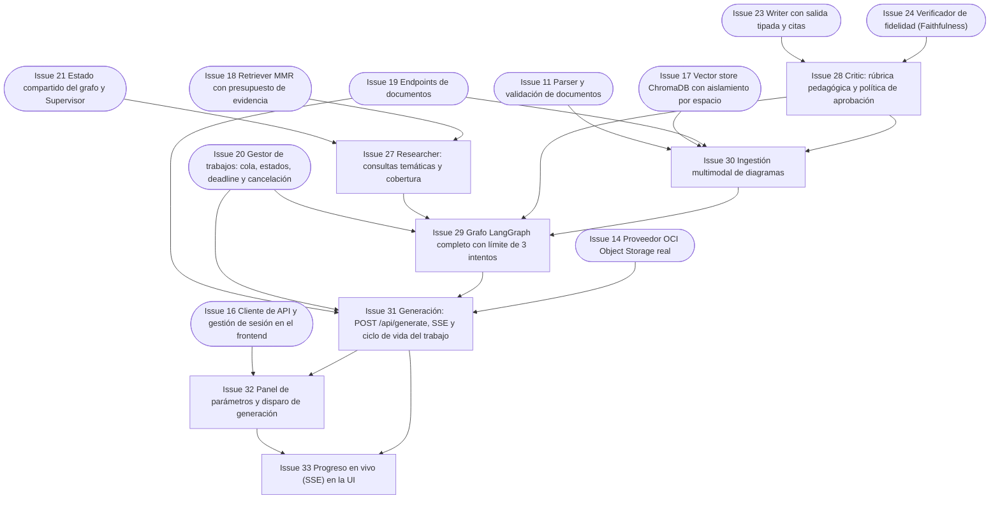

# Fase 3 — Multi-agente, fidelidad y SSE

> **Objetivo de la fase**: grafo LangGraph completo (Supervisor → Researcher → Writer → Critic → Finalizer) con límite de 3 intentos, verificación multimodal, generación por API con progreso SSE y la UI de generación. **Hito H3**.
> **Duración estimada**: 5 días. · [Volver al plan maestro](../plan-implementacion.md)

**Dependencias internas de la fase:**

---

### `Issue 27` — Researcher: consultas temáticas y cobertura
**F3** · **AGT** · **M** · **Depende de**: `Issue 21`, `Issue 18` · **Referencia**: decisiones_proyecto.md §4.4, §5.2

**Objetivo**: nodo que planifica consultas por tema a partir del índice de secciones del documento, recupera evidencia diversa y verifica cobertura del alcance.

**Tareas**:
- Construcción de un índice de secciones del documento (desde metadatos de chunks) y formulación de consultas temáticas según formato/perfil/alcance.
- Recuperación con `Issue 18` por tema; unión deduplicada dentro del presupuesto de evidencia.
- Chequeo de cobertura: secciones del alcance vs. secciones con evidencia; si falta cobertura se amplían consultas dentro del presupuesto; si no cabe, se declara el bloqueo o se pide acotar sección — **nunca omisión silenciosa** (§4.4).
- Evidencia tipada en el estado: chunks con `chunk_id`, texto, procedencia y notas de uso (§5.4).
- Sin instrucciones del documento interpretadas como propias (evidencia = datos, no comandos).

**Criterios de aceptación**:
- [ ] Para el doc VCN con alcance completo, el estado lista evidencia de todas las secciones principales (cobertura reportada).
- [ ] Alcance de una sección específica recupera solo evidencia de esa sección.
- [ ] Presupuesto excedido → diagnóstico claro en el estado (secciones sin caber), no recorte invisible.

**Verificación**: `pytest backend/tests/test_researcher.py` con doble de retrieval.

---

### `Issue 28` — Critic: rúbrica pedagógica y política de aprobación
**F3** · **AGT** · **L** · **Depende de**: `Issue 23`, `Issue 24` · **Referencia**: decisiones_proyecto.md §5.3, §16.4, §19.3

**Objetivo**: nodo revisor que combina fidelidad factual (Faithfulness), rúbrica pedagógica y verificación visual, y decide aprobar / devolver feedback / bloquear según la política de umbrales.

**Tareas**:
- Evaluación completa de §16.4: `anclaje_fuente_score`, cantidad de afirmaciones/respaldadas, `estado_evaluacion`, claridad, adecuación al perfil, cobertura de objetivos, coherencia didáctica, `verificacion_visual`.
- Política §19.3: `<0.70` rehacer sin aprobar · `0.70 ≤ score < 0.85` feedback + revisar si quedan intentos · `≥0.85` candidato sujeto a todas las comprobaciones (corregir/eliminar falsedades; declarar evidencia ausente sin conservar una afirmación falsa bajo una etiqueta, citas válidas, sin contradicciones, cobertura, visual).
- Feedback accionable a Writer: lista de afirmaciones fallidas con motivo y referencia; pedido de evidencia adicional a Researcher cuando falta contexto.
- Fallo del evaluador (timeout/cuota/respuesta inválida) = fallo técnico `failed`, nunca score=1 ni aprobación (§5.3).
- Llamadas separadas del redactor (modelo de verificación propio, evidencia y rúbrica propias — §2.2).

- Definir interfaz y doble del verificador visual; hasta conectar Issue 30, evidencia visual necesaria devuelve insuficiente, nunca aprobación por omisión.

**Criterios de aceptación**:
- [ ] Borrador con una afirmación inventada → veredicto con esa afirmación marcada y feedback de corrección, aunque el score quede ≥0.85 (bloqueo por afirmación, no solo por promedio).
- [ ] Score 0.75 con intentos disponibles → feedback y no aprobación.
- [ ] Doble que falla como juez → trabajo `failed` con causa técnica, sin score.
- [ ] Quiz: distractores comprobados por separado (una sola respuesta defendible; explicación refuta errores).

**Verificación**: `pytest backend/tests/test_critic.py` con dobles que cubren las tres bandas de score + fallo de juez.

---

### `Issue 29` — Grafo LangGraph completo con límite de 3 intentos
**F3** · **AGT** · **L** · **Depende de**: `Issue 20`, `Issue 27`, `Issue 28`, `Issue 30` · **Referencia**: decisiones_proyecto.md §5.1, §5.3, §19.3

**Objetivo**: cablear el `StateGraph` definitivo con los ciclos Writer↔Critic y Researcher, presupuesto de 20 llamadas LLM, deadline y estados terminales.

**Tareas**:
- `agents/graph.py`: Supervisor → Researcher → Writer → Critic → (aprobar → Finalizer | feedback → Writer | falta evidencia → Researcher); tres intentos **totales** (inicial + 2 correcciones — §5.3).
- Presupuesto global: ≤20 llamadas LLM por generación contando reintentos; deadline de 300 s propagado desde `Issue 20`; agotado cualquiera → `failed` con causa.
- `agents/finalizer.py`: empaqueta el contenido **ya revisado** sin agregar explicaciones, conceptos ni prerrequisitos nuevos; los IDs de sistema y storage los completa el backend, no el LLM (§5.2).
- Terminales: `completed` (solo tras persistencia), `rejected_quality` (diagnóstico breve: evidencia insuficiente / contradicción / cobertura incompleta / calidad pedagógica), `failed`, `cancelled`.
- El grafo termina **siempre** en un estado terminal explícito (§19.3); sin ciclos sin salida.
- Emisión de eventos de paso para el gestor de trabajos (paso, intento) — insumo del SSE.

**Criterios de aceptación**:
- [ ] Flujo feliz con doble: aprobación en 1.er intento → paquete `PedagogicalOutput` completo.
- [ ] Doble que fuerza 3 fallos → `rejected_quality` **sin** `contenido_adaptado` ni exportaciones, con diagnóstico.
- [ ] Presupuesto de llamadas agotado a mitad → `failed` técnico, no `rejected_quality`.
- [ ] Finalizer con snapshot test: no agrega contenido pedagógico nuevo; sí permite IDs/metadatos de sistema previstos por el contrato.
- [ ] Cancelación cooperativa entre nodos termina el grafo limpio.

**Verificación**: `pytest backend/tests/test_graph.py` (feliz, bucle, bloqueo, presupuesto, cancelación).

---

### `Issue 30` — Ingestión multimodal de diagramas
**F3** · **RAG** · **L** · **Depende de**: `Issue 11`, `Issue 17`, `Issue 19`, `Issue 28` · **Referencia**: decisiones_proyecto.md §4.2, §19.2

**Objetivo**: interpretación de diagramas y páginas visuales del PDF: rasterizado, descripción por Gemini con procedencia, indexación de descripciones y verificación visual en Critic.

**Tareas**:
- Detección de páginas con contenido visual relevante (imágenes incrustadas, vectoriales, escaneadas legibles) dentro del límite de 20 páginas visuales (§4.1).
- Rasterizado con pypdfium2 a resolución apta para visión; envío a Gemini con prompt de descripción técnica neutra.
- Cada descripción: `document_id`, página, región/imagen de referencia, `source_type=image_description`; se guarda **separada del texto original** como interpretación del modelo (§4.2).
- Diagramas ambiguos marcados como tales; prohibido derivar relaciones no verificables.
- Descripciones embebidas e indexadas en Chroma (filtrables) para que Researcher las recupere y Writer las cite.
- Extensión del Critic: `verificacion_visual` contrasta afirmaciones derivadas de diagramas contra la página original (no la descripción contra sí misma — §19.2); evidencia visual indispensable no verificable → no aprobación.
- Reporte de omisiones visuales: nunca se presenta una adaptación incompleta como completa (§4.2).

**Criterios de aceptación**:
- [ ] El PDF VCN genera ≥1 descripción de diagrama con página de origen referenciable y visible en «Ver la fuente».
- [ ] Una afirmación derivada del diagrama sin respaldo visual es bloqueada por Critic (`verificacion_visual=insuficiente`).
- [ ] Página escaneada legible dentro de límites se procesa; ilegible se informa como omisión.
- [ ] Las descripciones quedan separadas del texto extraído (colección/tipo propio).

**Verificación**: `pytest backend/tests/test_multimodal.py` con PDF fixture con diagrama + corrida real sobre `documents/redes_vcn_oci.pdf`.

---

### `Issue 31` — Generación: `POST /api/generate`, SSE y ciclo de vida del trabajo
**F3** · **API** · **L** · **Depende de**: `Issue 19`, `Issue 20`, `Issue 29`, `Issue 14` · **Referencia**: decisiones_proyecto.md §3.3, §7.1, §7.3, §8.3

**Objetivo**: endpoint principal del enunciado: recibe `document_id` + parámetros, ejecuta el grafo, publica progreso SSE y entrega el paquete educativo persistido en OCI.

**Tareas**:
- `POST /api/generate`: valida documento `ready` y propio, parámetros de §16.1; responde **202** con `generation_id`, `status_url`, `events_url`; acepta `Idempotency-Key` (duplicado en curso → mismo ID; mismo key con otro cuerpo → 409).
- `GET /api/generations/{id}/events`: `text/event-stream` con heartbeats, eventos con `id` monotónico + `generation_id` + `step` + `status` + `iteration`; soporte `Last-Event-ID` mientras exista registro; cerrar el stream **no** cancela el trabajo (§3.3).
- `GET /api/generations/{id}`: estado y, si `completed`, el paquete completo (consulta sin SSE).
- `GET /api/generations` paginado con filtros (documento, perfil, formato, idioma, fecha).
- Finalizer → persistencia del paquete en `outputs/{ws}/{gen}/content.json`; **`completed` solo tras confirmación de escritura** (§8.3); fallo de OCI → `failed/STORAGE_UNAVAILABLE` con resultado aprobado retenido para reintentar subida.
- `POST /api/generations/{id}/persist`: reintenta **solo** persistencia del aprobado retenido (≤24 h), mismo `objeto_id`, sin nuevas llamadas LLM.
- `POST /api/generations/{id}/cancel` (expuesto en la API además del gestor).
- `almacenamiento_oci` canónico solo con bucket/objeto_id; la confirmación se agrega en persistencia.status_upload de la respuesta del trabajo.

- Ofrecer vista estudiante explícita de quiz, sin claves ni justificaciones iniciales; canónico completo mediante exportación autorizada.

**Criterios de aceptación**:
- [ ] El ejemplo del enunciado (VCN + Principiante + Flashcards) produce una respuesta con la forma de §16.3 vía API (con LLM real en la prueba manual).
- [ ] El stream SSE muestra pasos e intentos; una reconexión no duplica el trabajo.
- [ ] Fallo de storage inyectado → `failed` con `STORAGE_UNAVAILABLE`; `persist` lo recupera sin re-generar; `completed` jamás sin confirmación OCI.
- [ ] Consultar el trabajo ajeno por ID → 404.
- [ ] Estado `rejected_quality` se consulta con HTTP 200 + diagnóstico, sin `contenido_adaptado` (§7.3).

**Verificación**: `pytest backend/tests/test_api_generate.py` (SSE framing incluido) + corrida manual real documentada.

---

### `Issue 32` — Panel de parámetros y disparo de generación
**F3** · **UI** · **M** · **Depende de**: `Issue 16`, `Issue 31` · **Referencia**: decisiones_proyecto.md §6.3, §16.1

**Objetivo**: sidebar completa de personalización: perfil, formato, nicho, nivel de detalle, idioma de salida y alcance, con validaciones y disparo del trabajo.

**Tareas**:
- Selectores tipados desde los enums del contrato (valores de máquina estables, etiquetas traducidas — §17.3).
- Selector de idioma de **contenido** independiente del idioma de UI (§17.1) y selector de alcance (documento completo / sección concreta del índice de secciones).
- Botón GENERAR deshabilitado hasta haber documento `ready`; muestra resumen de selección antes de confirmar.
- Manejo de 429 (cola llena) y 409 con mensajes claros; conservación de parámetros ante errores.
- Cabecera del resultado con los parámetros con que se generó (cambiar controles no altera lo mostrado — §6.5).

**Criterios de aceptación**:
- [ ] Se generan los 5 formatos × 4 perfiles desde la UI sin errores de contrato.
- [ ] Idioma de contenido cambia sin regenerar materiales guardados ni perder la selección.
- [ ] Alcance por sección lista las secciones reales del documento cargado.

**Verificación**: flujo manual con doble de Gemini (previsibilidad) + una corrida real.

---

### `Issue 33` — Progreso en vivo (SSE) en la UI
**F3** · **UI** · **M** · **Depende de**: `Issue 32`, `Issue 31` · **Referencia**: decisiones_proyecto.md §3.3, §6.5

**Objetivo**: consumo del stream SSE desde el servidor Streamlit (requests en streaming) mostrando etapa e intento, con cancelación y reconexión.

**Tareas**:
- Cliente SSE en `api_client.py`: lectura streaming con reconexión vía `status_url` y continuación por `Last-Event-ID` cuando exista.
- Render de etapas: en cola (posición + cancelar), procesando (etapa e intento, **sin porcentajes ficticios** — §3.3), y estados terminales con presentación de §6.5.
- `rejected_quality`: motivo y acciones útiles (acotar sección / cargar versión más completa), sin botón de «aprobar igual».
- Fallo técnico: causa recuperable + acción (reintentar persistencia si aplica).
- Indicador «Contenido revisado con fuentes» al completar (§19.4).

**Criterios de aceptación**:
- [ ] Durante una generación real se ven las etapas avanzar e intentar (1/2/3).
- [ ] Cancelar desde la UI detiene el trabajo y muestra estado cancelado conservando documentos.
- [ ] Tras refrescar y perder session_state, recuperar con el código y listar/reconectar al trabajo existente, sin duplicarlo.
- [ ] Un rechazo por calidad muestra diagnóstico sin exponer el borrador fallido.

**Verificación**: prueba manual con trabajo ralentizado (env de test) + `pytest` del cliente SSE con stream simulado.
