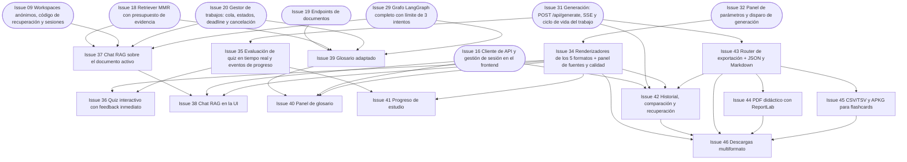

# Fase 4 — Experiencia completa y extras

> **Objetivo de la fase**: todos los diferenciales y extras operativos en la UI: 5 formatos renderizados, quiz en tiempo real, chat RAG, glosario, progreso, historial y exportaciones multiformato. **Hito H4** (*feature complete*).
> **Duración estimada**: 5–6 días. · [Volver al plan maestro](../plan-implementacion.md)

**Dependencias internas de la fase:**

---

### `Issue 34` — Renderizadores de los 5 formatos + panel de fuentes y calidad
**F4** · **UI** · **L** · **Depende de**: `Issue 32` · **Referencia**: decisiones_proyecto.md §6.4, §10.7, §19.4

**Objetivo**: componentes visuales definitivos para cada formato pedagógico según el design system, más los paneles de «Ver la fuente» y de calidad.

**Tareas**:
- `components/flashcard.py`: tarjeta con frente visible y botón nativo «Mostrar respuesta» (el estado de revisión debe ser registrable — no depender de eventos HTML no capturables).
- `components/quiz.py` (vista estudiante): opciones radio; **sin** clave ni justificaciones hasta responder.
- `components/tutorial.py`: pasos numerados con badges, bloques de código JetBrains Mono, resultado esperado y verificación.
- `components/summary.py`: dos columnas (Impacto en Negocio + Implicaciones) con badges informativas.
- `components/script.py`: escenas con duración, narración en itálica, puntos de diapositiva.
- Panel de fuentes: por cada elemento citado, fragmento/sección/página (o imagen original vía `sources/{chunk_id}`); ejemplos de nicho con etiqueta «Ejemplo ilustrativo» (§10.7).
- Panel de calidad (§19.4): score, limitaciones, cobertura y referencias con explicación sencilla; el número **no** se presenta como probabilidad de verdad.
- Estados §6.5 completos y accesibilidad (etiquetas, foco, contraste).

**Criterios de aceptación**:
- [ ] Los 5 formatos renderizan ejemplos reales de cada tipo con fidelidad visual al design system.
- [ ] Cada flashcard/paso/respuesta/definición citada enlaza a su fuente verificable.
- [ ] Un rechazo muestra diagnóstico sin borrador; el score aprobado se explica sin presentarlo como probabilidad de verdad.
- [ ] Navegable por teclado; sin desbordes a 320 px.

**Verificación**: revisión visual con capturas + prueba de teclado; fixtures de Issue 03; evidencia real posterior en Issue 53.

---

### `Issue 35` — Evaluación de quiz en tiempo real y eventos de progreso
**F4** · **API** · **M** · **Depende de**: `Issue 31` · **Referencia**: decisiones_proyecto.md §10.3, §16.2

**Objetivo**: corrección determinista de respuestas de quiz (sin LLM) y registro idempotente de progreso de estudio.

**Tareas**:
- `POST /api/quizzes/{generation_id}/answers`: compara `option_id` contra el contenido aprobado; devuelve correcta/incorrecta + justificación; la vista inicial del estudiante jamás incluye la clave (§16.2).
- `POST /api/progress/events`: eventos idempotentes (ID de evento estable por actividad) — un rerun de Streamlit no duplica progreso (§10.3).
- Tipos de evento: concepto revisado, flashcard vista (frente+dorso), respuesta de quiz (con acierto de primer intento vs. posterior).
- `GET /api/progress`: agregados del espacio: conceptos revisados, flashcards vistas, aciertos/total primeros intentos, tiempo estimado restante.
- Persistencia del estado agregado en `progress/{ws}/state.json` con control de versión (evita perder actualizaciones entre pestañas — §7.2).

- Acierto y primer intento se calculan en backend; no se aceptan del cliente. Responder genera el evento una sola vez; el endpoint genérico de progreso no permite fabricar aciertos.

**Criterios de aceptación**:
- [ ] Responder bien/mal devuelve feedback inmediato con justificación, sin llamada LLM adicional.
- [ ] Reenviar el mismo evento (mismo ID) no duplica contadores.
- [ ] Respuestas repetidas se registran sin inflar aciertos de primer intento.
- [ ] Quiz de otro espacio → 404.

**Verificación**: `pytest backend/tests/test_quiz_progress.py`.

---

### `Issue 36` — Quiz interactivo con feedback inmediato
**F4** · **UI** · **M** · **Depende de**: `Issue 34`, `Issue 35` · **Referencia**: decisiones_proyecto.md §6.4, §10.3

**Objetivo**: experiencia de quiz en tiempo real: selección, envío, banner verde/rojo con justificación y registro del intento. (Diferencial del enunciado.)

**Tareas**:
- Quiz Card por pregunta: radios nativos, envío individual, bloqueo mientras se procesa; un nuevo intento explícito usa otro event_id y conserva el primer intento.
- Banner de feedback verde (`#27a644`) / rojo (`#ef4444`) con justificación pedagógica y fuente citada; nunca solo color (accesibilidad §6.6).
- Progreso dentro del quiz (pregunta i/n) y resumen final con aciertos de primer intento.
- El backend registra el evento al responder; la UI reutiliza event_id al reintentar, sin un segundo registro.

**Criterios de aceptación**:
- [ ] Responder correcta/incorrecta muestra feedback inmediato con justificación y referencia a la fuente.
- [ ] Refrescar a mitad del quiz no corrompe el estado ni duplica eventos.
- [ ] El resumen final distingue aciertos de primer intento de aciertos posteriores.

**Verificación**: flujo manual E2E + verificación de eventos idempotentes en el backend.

---

### `Issue 37` — Chat RAG sobre el documento activo
**F4** · **RAG** · **M** · **Depende de**: `Issue 18`, `Issue 09`, `Issue 20`, `Issue 29` · **Referencia**: decisiones_proyecto.md §10.1

**Objetivo**: tutor conversacional del documento cargado: respuestas con citas, mismas reglas de respaldo factual, sin conocimiento externo.

**Tareas**:
- `POST /api/chat`: recibe `document_id` + pregunta + perfil + idioma de salida; recupera evidencia fresca por pregunta (los hechos de respuestas previas no son fuente — §10.1).
- Respuesta con citas consultables; si la fuente no responde, lo reconoce y pide precisar (nunca completa con web ni conocimiento externo).
- Historial conversacional acotado por tokens; límite de turnos configurable.
- Pasa por verificación de fidelidad (`Issue 24`) con la misma política de respaldo.
- Comparte presupuesto global de llamadas y cola de trabajos; cancelable durante la espera.

- Aplicar política completa de Issue 29 (citas, visual, cobertura e intentos), no solo score. Usar cola común y devolver 202 con job_id/status_url/events_url/cancel_url.

**Criterios de aceptación**:
- [ ] Pregunta sobre VCN responde con cita verificable; pregunta fuera de alcance responde «la fuente no lo cubre».
- [ ] El historial no contamina: una respuesta anterior no se usa como evidencia de la siguiente.
- [ ] Rechaza/corrige afirmaciones sin respaldo igual que la generación principal.

**Verificación**: `pytest backend/tests/test_chat.py` con doble + casos manuales reales.

---

### `Issue 38` — Chat RAG en la UI
**F4** · **UI** · **M** · **Depende de**: `Issue 37`, `Issue 16`, `Issue 34` · **Referencia**: decisiones_proyecto.md §6.3, §10.1

**Objetivo**: panel de chat con historial visible, citas expandibles y estados de espera/cancelación.

**Tareas**:
- `components/chat.py`: hilo de mensajes (usuario/asistente), entrada de pregunta, espera cancelable.
- Citas expandibles por respuesta (mismo componente de fuente de `Issue 34`).
- Indicador de idioma/perfil aplicados; aviso cuando el documento no contiene la respuesta.
- Historial de la sesión visible; reinicio de conversación.

**Criterios de aceptación**:
- [ ] Conversación de 5 turnos con citas funcionales y sin fuga de estado entre documentos al cambiar el activo.
- [ ] Cancelar una respuesta en espera no rompe el hilo.

**Verificación**: flujo manual con backend real.

---

### `Issue 39` — Glosario adaptado
**F4** · **RAG** · **M** · **Depende de**: `Issue 19`, `Issue 18`, `Issue 20`, `Issue 29` · **Referencia**: decisiones_proyecto.md §10.2

**Objetivo**: glosario por documento/perfil/idioma con definiciones verificadas y citadas, reutilizable por caché.

**Tareas**:
- Detección de términos candidatos durante la ingestión (con ubicaciones).
- `POST /api/glossaries`: genera definiciones cuando se conocen perfil e idioma (no antes — §10.2); cada definición pasa verificación con cita a fragmento de origen.
- Clave de reutilización: documento/hash + perfil + idioma + versión de prompt.
- `GET /api/glossaries/{id}`: glosario ya generado y verificado.
- Término original + traducción cuando corresponde; identificadores de APIs/comandos/productos **sin traducir**; término sin definición suficiente → limitación declarada, no invención.

- Usar cola y política completa de revisión; 202 con URLs del trabajo y cancelación, o 200 para caché aprobada. Clave de caché incluye espacio, documento/version, modelo, perfil, idioma y prompt.

**Criterios de aceptación**:
- [ ] Glosario del doc VCN para Principiante/es incluye conceptos clave con citas válidas.
- [ ] Re-solicitar el mismo glosario (misma clave) no consume nuevas llamadas.
- [ ] Un término sin respaldo aparece como «sin definición suficiente en la fuente».

**Verificación**: `pytest backend/tests/test_glossary.py`.

---

### `Issue 40` — Panel de glosario
**F4** · **UI** · **S** · **Depende de**: `Issue 39`, `Issue 16`, `Issue 34` · **Referencia**: decisiones_proyecto.md §6.4, §10.2

**Objetivo**: vista del glosario con búsqueda, términos originales/traducción y fuentes.

**Tareas**:
- Lista/tarjetas de términos con definición, traducción cuando aplica y cita expandible.
- Filtro por búsqueda y orden alfabético.
- Generación bajo demanda con selector de perfil/idioma heredado del sidebar.

**Criterios de aceptación**:
- [ ] Glosario navegable con búsqueda funcional y citas verificables.
- [ ] La generación en curso muestra espera cancelable coherente con el resto de la app.

**Verificación**: flujo manual.

---

### `Issue 41` — Progreso de estudio
**F4** · **UI** · **M** · **Depende de**: `Issue 35`, `Issue 34` · **Referencia**: decisiones_proyecto.md §6.3, §10.3

**Objetivo**: barra/panel de progreso del espacio: conceptos revisados, flashcards vistas, aciertos de quiz y tiempo restante estimado.

**Tareas**:
- `components/progress.py`: métricas agregadas desde `GET /api/progress` (backend = fuente de verdad; `session_state` solo presentación — §10.3).
- Registro de «concepto revisado» al abrir/marcar material; de «flashcard vista» al consultar frente y dorso.
- Tiempo restante estimado a partir de actividades pendientes, con copy que aclare que es orientativo y que **no** otorga certificación ni afirma dominio (§10.3).
- Recuperación del progreso al reingresar con el código.

**Criterios de aceptación**:
- [ ] Ver una flashcard completa (frente y dorso) incrementa el contador una sola vez.
- [ ] Recuperar el espacio con el código restaura el progreso exacto.
- [ ] El copy evita promesas de dominio profesional.

**Verificación**: flujo manual + verificación de contadores en backend.

---

### `Issue 42` — Historial, comparación y recuperación
**F4** · **UI** · **M** · **Depende de**: `Issue 16`, `Issue 31`, `Issue 34`, `Issue 43` · **Referencia**: decisiones_proyecto.md §10.4, §10.5

**Objetivo**: historial completo de generaciones con filtros, re-apertura de resultados aprobados y comparación lado a lado de dos adaptaciones.

**Tareas**:
- Panel de historial (expander del sidebar + vista completa): filtros por documento, fecha, perfil, formato e idioma.
- Trabajos fallidos visibles con su explicación, **sin** exponer borradores (§10.4).
- Comparador: selector simple de dos generaciones del mismo documento/versión presentadas lado a lado — sin nueva generación LLM (§10.4).
- Re-descarga del paquete y sus exportaciones desde el historial.
- Aviso de retención de 30 días de inactividad con fecha de expiración visible.
- Resultados demo etiquetados «Ejemplo generado previamente» con fuente, fecha y parámetros (§10.5).

**Criterios de aceptación**:
- [ ] Comparar escenario A (Principiante/Flashcards/es) vs C (Ejecutivo/Resumen/pt) del mismo documento se ve correctamente lado a lado.
- [ ] Un trabajo `rejected_quality` del historial no ofrece descargas ni muestra contenido.
- [ ] La fecha de expiración del espacio es visible.

**Verificación**: flujo con dos generaciones de prueba; Issue 55 aporta después los ejemplos de presentación.

---

### `Issue 43` — Router de exportación + JSON y Markdown
**F4** · **API** · **M** · **Depende de**: `Issue 31` · **Referencia**: decisiones_proyecto.md §7.1, §10.6

**Objetivo**: `GET /api/exports/{generation_id}?format=…` con validación de compatibilidad y los dos primeros formatos: JSON canónico y Markdown didáctico.

**Tareas**:
- `exports/router.py`: valida formato vs. formato pedagógico; incompatible → 422 (§10.6); solo contenido aprobado (`completed`) → si no, 409 (§7.3).
- JSON: el paquete canónico tal como fue persistido (única fuente de verdad).
- `exports/markdown.py`: plantilla por formato pedagógico derivada del contenido tipado (título, audiencia, objetivos, prerrequisitos, cuerpo con estructura propia de cada formato, referencias).
- Descargas pasan por la API con ownership (§11.2); sin secretos ni tokens en las exportaciones (§10.6).
- Derivados cacheados en `exports/{ws}/{gen}/{format}` en OCI al generar.

**Criterios de aceptación**:
- [ ] Exportar JSON/MD de los 5 formatos aprobados funciona; CSV de un tutorial → 422.
- [ ] Exportar un trabajo no aprobado → 409.
- [ ] El Markdown de un quiz separa enunciados de soluciones.

**Verificación**: `pytest backend/tests/test_exports.py` (compatibilidad, contenido, 409/422).

---

### `Issue 44` — PDF didáctico con ReportLab
**F4** · **API** · **L** · **Depende de**: `Issue 43` · **Referencia**: decisiones_proyecto.md §10.6

**Objetivo**: PDF profesional y legible para los 5 formatos, con fuentes Unicode locales y tratamiento específico por formato.

**Tareas**:
- Plantilla base: título, audiencia, idioma, objetivos, prerrequisitos, contenido, referencias; encabezados, márgenes, numeración y saltos de página.
- Bloques de código sin cortes ilegibles; tablas y listas con estilo del design system (adaptado a papel/lectura).
- Quiz: sección de **soluciones separada** al final (§10.6); flashcards: tarjetas imprimibles distinguiendo frente y dorso.
- Fuentes Unicode embebidas locales (acentos y caracteres portugueses verificados — §10.6).
- Generación determinista del mismo contenido (mismo contenido → misma estructura/texto; no exigir igualdad binaria por timestamps).

**Criterios de aceptación**:
- [ ] PDF de flashcards, quiz y tutorial del doc VCN se abren correctamente y son legibles.
- [ ] Acentos y caracteres pt-BR se renderizan sin tofu.
- [ ] El PDF del quiz no filtra soluciones junto a los enunciados.

**Verificación**: generación + inspección visual de los 5 tipos; abrir en dos visores distintos.

---

### `Issue 45` — CSV/TSV y APKG para flashcards
**F4** · **API** · **M** · **Depende de**: `Issue 43` · **Referencia**: decisiones_proyecto.md §10.6, §11.4

**Objetivo**: exportación de flashcards a CSV, TSV y paquete Anki `.apkg` con IDs estables y escapes seguros.

**Tareas**:
- CSV/TSV UTF-8: frente, dorso y etiquetas; comillas/escapes correctos; cabeceras estilo Anki (`#separator:`, `#html:`, `#tags column:`) cuando aplique.
- `exports/anki.py` con genanki: IDs estables de modelo/mazo/notas derivados del `generation_id` (re-exportar no duplica en Anki).
- Protección anti fórmula: celdas que empiezan con `=`, `+`, `-`, `@` se neutralizan (§11.4); escape de HTML en campos de Anki.
- Verificación de importación en Anki Desktop documentada paso a paso.

**Criterios de aceptación**:
- [ ] CSV y TSV importan en Anki Desktop sin ajustes manuales.
- [ ] El `.apkg` abre en Anki Desktop con el mazo y sus etiquetas.
- [ ] Una tarjeta cuyo frente empieza con `=` no ejecuta fórmula al abrir el CSV en una planilla.
- [ ] Re-exportar e importar dos veces el mismo deck no duplica notas.

**Verificación**: `pytest backend/tests/test_exports_anki.py` + importación real en Anki Desktop (evidencia en video/captura).

---

### `Issue 46` — Descargas multiformato
**F4** · **UI** · **S** · **Depende de**: `Issue 34`, `Issue 42`, `Issue 43`, `Issue 44`, `Issue 45` · **Referencia**: decisiones_proyecto.md §6.4, §10.6

**Objetivo**: botones de descarga por formato compatible desde la vista de resultado y el historial.

**Tareas**:
- Botones nativos de descarga con icono + etiqueta; formatos incompatibles deshabilitados con tooltip explicativo (p. ej. APKG solo en flashcards).
- Indicador de persistencia «Guardado» solo tras confirmación OCI (§6.4); bucket/objeto solo en «detalles técnicos».
- Descarga disponible también desde el historial (`Issue 42`).

**Criterios de aceptación**:
- [ ] Descargar JSON, MD, PDF (todos los formatos) y CSV/TSV/APKG (flashcards) desde la UI.
- [ ] Ningún botón habilitado para combinación incompatible.
- [ ] Los archivos descargados no contienen tokens, códigos ni manifiestos privados; IDs de procedencia del contrato sí son válidos.

**Verificación**: descarga de cada tipo + apertura manual.
