# Fase 5 — Despliegue y endurecimiento

> **Objetivo de la fase**: aplicación pública en OCI Compute Always Free con HTTPS, gobernanza de costos, revisión de seguridad y suites de integración/E2E. **Hito H5**.
> **Duración estimada**: 4–5 días. · [Volver al plan maestro](../plan-implementacion.md)

**Dependencias internas de la fase:**

```mermaid
graph TD
    I05(["Issue 05 Elaborar los 3 documentos demo"])
    I09(["Issue 09 Workspaces anónimos, código de recuperación y sesiones"])
    I14(["Issue 14 Proveedor OCI Object Storage real"])
    I19(["Issue 19 Endpoints de documentos"])
    I25(["Issue 25 Flujo de carga de documentos en la UI"])
    I26(["Issue 26 Contenedores Docker y docker-compose"])
    I30(["Issue 30 Ingestión multimodal de diagramas"])
    I31(["Issue 31 Generación: POST /api/generate, SSE y ciclo de vida del trabajo"])
    I32(["Issue 32 Panel de parámetros y disparo de generación"])
    I33(["Issue 33 Progreso en vivo (SSE) en la UI"])
    I35(["Issue 35 Evaluación de quiz en tiempo real y eventos de progreso"])
    I36(["Issue 36 Quiz interactivo con feedback inmediato"])
    I37(["Issue 37 Chat RAG sobre el documento activo"])
    I38(["Issue 38 Chat RAG en la UI"])
    I39(["Issue 39 Glosario adaptado"])
    I40(["Issue 40 Panel de glosario"])
    I41(["Issue 41 Progreso de estudio"])
    I42(["Issue 42 Historial, comparación y recuperación"])
    I43(["Issue 43 Router de exportación + JSON y Markdown"])
    I44(["Issue 44 PDF didáctico con ReportLab"])
    I45(["Issue 45 CSV/TSV y APKG para flashcards"])
    I46(["Issue 46 Descargas multiformato"])
    I47["Issue 47 Aprovisionar VM A1 Always Free (Ubuntu 24.04)"]
    I48["Issue 48 Proxy HTTPS con Caddy, DNS y SSE sin buffering"]
    I49["Issue 49 Demo preindexada en la VM"]
    I50["Issue 50 Gobernanza de costos y ciclo de vida"]
    I51["Issue 51 Revisión de seguridad y hardening"]
    I52["Issue 52 Tests de integración de API con dependencias simuladas"]
    I53["Issue 53 Suite E2E de criterios críticos"]
    I54["Issue 54 Smoke tests reales contra OCI y Gemini"]
    I26 --> I48
    I47 --> I48
    I31 --> I48
    I48 --> I49
    I05 --> I49
    I19 --> I49
    I30 --> I49
    I32 --> I49
    I14 --> I50
    I09 --> I50
    I19 --> I50
    I31 --> I50
    I35 --> I50
    I43 --> I50
    I31 --> I51
    I33 --> I51
    I37 --> I51
    I39 --> I51
    I44 --> I51
    I45 --> I51
    I48 --> I51
    I50 --> I51
    I31 --> I52
    I35 --> I52
    I37 --> I52
    I39 --> I52
    I45 --> I52
    I25 --> I53
    I30 --> I53
    I33 --> I53
    I36 --> I53
    I38 --> I53
    I40 --> I53
    I41 --> I53
    I42 --> I53
    I46 --> I53
    I49 --> I53
    I50 --> I53
    I51 --> I53
    I52 --> I53
    I54 --> I53
    I14 --> I54
    I31 --> I54
    I44 --> I54
    I45 --> I54
    I48 --> I54
    I50 --> I54
```

---

### `Issue 47` — Aprovisionar VM A1 Always Free (Ubuntu 24.04)
**F5** · **INF** · **M** · **Depende de**: — · **Referencia**: decisiones_proyecto.md §9.1, §9.2

**Objetivo**: instancia `VM.Standard.A1.Flex` (2 OCPU / 12 GB) en la home region con Ubuntu 24.04, Docker y acceso restringido. *(Desde el arranque; la aplicación se despliega en Issue 48.)*

**Tareas**:
- Validar asignación efectiva Always Free de la tenancy antes de aprovisionar (1.500 OCPU-h + 9.000 GB-h/mes ≈ 2 OCPU + 12 GB continuos — §9.1).
- Crear instancia A1 Flex Ubuntu 24.04 LTS; registrar el bloqueo si no hay capacidad (reintentos manuales acotados, sin cambio automático a VM paga).
- Endurecer acceso: SSH solo desde IPs de administración (clave, no contraseña); actualizaciones; `unattended-upgrades`.
- Instalar Docker/Compose y comprobar ARM64; validar imágenes de aplicación en Issue 48 tras Issue 26.
- Volúmenes: `backend_data` en disco de la VM; credenciales OCI montadas solo-lectura o instancia con identidad (§9.2).
- Verificar que ningún puerto de app queda expuesto directamente: solo 80/443 al proxy.

**Criterios de aceptación**:
- [ ] La VM gratuita arranca y Docker/Compose funcionan; la provisión no exige código futuro.
- [ ] SSH restringido verificado desde una IP no autorizada.
- [ ] Evidencia de asignación Always Free registrada (captura de consola con laVM A1 y costos $0).

**Verificación**: provisión documentada y comprobación de ARM64, SSH y Docker.

---

### `Issue 48` — Proxy HTTPS con Caddy, DNS y SSE sin buffering
**F5** · **INF** · **M** · **Depende de**: `Issue 26`, `Issue 47`, `Issue 31` · **Referencia**: decisiones_proyecto.md §9.2

**Objetivo**: publicación segura de UI y API con dominio gratuito (o propio) y certificado válido, con SSE fluido.

**Tareas**:
- Caddy en el host como proxy: HTTPS público, HTTP solo redirección; rutas `/api/*` → backend, resto → Streamlit (websocket incluido).
- Configuración anti-buffering para `text/event-stream` (flush inmediato + heartbeats ya implementados en `Issue 31`).
- DNS: subdominio gratuito compatible con validación ACME (o dominio del equipo); sin compras automáticas (§9.2).
- Puertos 8000/8501 vinculados a loopback únicamente; firewall/NSG acorde.
- Redirección de logs del proxy sin cuerpos ni tokens (§11.5).

**Criterios de aceptación**:
- [ ] `https://<dominio>` sirve la UI con certificado válido y la app es usable desde una red externa.
- [ ] El progreso SSE se ve en vivo **a través del proxy** (test con generación real).
- [ ] Desde una IP no administrativa solo se ven 80/443; SSH se permite exclusivamente a administradores.

**Verificación**: acceso desde dispositivo externo + consulta SSE con Bearer e ID propio, sin registrar credenciales mostrando eventos en tiempo real.

---

### `Issue 49` — Demo preindexada en la VM
**F5** · **INF** · **S** · **Depende de**: `Issue 48`, `Issue 05`, `Issue 19`, `Issue 30`, `Issue 32` · **Referencia**: decisiones_proyecto.md §4.5, §10.5, §18.2

**Objetivo**: biblioteca demo operativa en producción: 3 documentos preindexados en colección de solo lectura; los resultados etiquetados se incorporan en Issue 55.

**Tareas**:
- Preindexar los 3 documentos demo en la colección compartida de solo lectura (`demo/` en storage + colección Chroma separada — §4.4).
- Preparar el catálogo para resultados etiquetados; generarlos/publicarlos corresponde a Issue 55, evitando dependencia circular.
- Verificar que la demo distingue una ejecución nueva de una recuperación de contenido guardado (§18.3).
- Documentar el runbook de recarga de la demo (para reinicios de VM).

**Criterios de aceptación**:
- [ ] Desde la app pública, «probar documento demo» permite generar sin subir nada.
- [ ] El catálogo de fuentes funciona aún sin resultados; el estado vacío no simula ejemplos.

**Verificación**: flujo manual en la URL pública.

---

### `Issue 50` — Gobernanza de costos y ciclo de vida
**F5** · **INF** · **M** · **Depende de**: `Issue 14`, `Issue 09`, `Issue 19`, `Issue 31`, `Issue 35`, `Issue 43` · **Referencia**: decisiones_proyecto.md §8.4, §8.5

**Objetivo**: presupuestos propios, alertas y retención/borrado completos para controlar consumo dentro de la asignación gratuita verificada.

**Tareas**:
- Presupuestos de aplicación: ≤1 GB total de objetos, ≤5.000 solicitudes mensuales, ≤5 documentos y ≤20 generaciones por espacio (§8.4); reservar capacidad antes de aceptar archivo/exportación.
- Alerta al 80% del presupuesto y rechazo de nuevas escrituras al llegar al límite, con mensaje claro en la UI.
- Contador de solicitudes de storage (por tipo) persistido; budget de regla en OCI si la tenancy lo permite.
- Ciclo de vida §8.5: expiración de espacios a 30 días de inactividad (fecha visible en la UI), limpieza de temporales al terminar/cancelar, resultado aprobado retenido ≤24 h, borrado físico agenda-do con reintentos visibles.
- Desactivar versionado/replicación/transiciones de clase en el bucket (verificación).

- Reservar también lecturas/listados/reintentos y margen de limpieza: bloquear nuevas escrituras no debe impedir liberar espacio. Probar renovación por actividad, expiración y borrado sin resurrección tras reconstrucción.

**Criterios de aceptación**:
- [ ] Alcanzado el límite de documentos por espacio, el upload se rechaza con mensaje explicativo.
- [ ] Al 80% del presupuesto aparece la alerta (test con presupuesto reducido).
- [ ] Borrar espacio bloquea acceso inmediato aunque OCI falle la limpieza física (confirmación al usuario y diagnóstico de limpieza por observabilidad administrativa, sin reabrir acceso).
- [ ] Sin versionado de objetos activo en el bucket.

**Verificación**: `pytest backend/tests/test_budgets.py` con presupuestos de test + inspección del bucket.

---

### `Issue 51` — Revisión de seguridad y hardening
**F5** · **INF** · **M** · **Depende de**: `Issue 31`, `Issue 33`, `Issue 37`, `Issue 39`, `Issue 44`, `Issue 45`, `Issue 48`, `Issue 50` · **Referencia**: decisiones_proyecto.md §11 (completa)

**Objetivo**: pasada final de seguridad sobre la aplicación integrada, con hallazgos que afectan la entrega corregidos; documentar un bloqueo no equivale a resolverlo.

**Tareas**:
- Validación de entrada: firma real de archivos, nombres como etiquetas (sin path traversal), límites efectivos con timeout/memoria (§11.3).
- Prompt injection: revisión de prompts (separación instrucciones/evidencia), sin herramientas peligrosas en nodos, salida validada antes de persistir/presentar (§11.4).
- Renderizado: templates controlados por la app con escape de todo campo interpolado; URLs con esquemas permitidos; sin HTML arbitrario del documento.
- Sesiones/tokens: expiración, revocación, ausencia en logs y prompts; rate limits de recuperación verificados (§7.4, §11.2).
- CORS restringido; cabeceras de seguridad en el proxy; secretos solo en backend y fuera de Git (escaneo final del historial).
- Logs sin cuerpos de documentos ni códigos; métricas con request_id/generation_id (§11.5).
- Exportaciones: revisión anti-CSV-injection ya cubierta en `Issue 45` (re-verificación).

**Criterios de aceptación**:
- [ ] Checklist §11 completo con evidencia por ítem (documento de revisión en `docs/`).
- [ ] Escaneo de secretos del historial de Git limpio.
- [ ] Intentos de acceso cruzado entre espacios (documento, SSE, export, progreso) → todos 404 (suite de `Issue 53`).

**Verificación**: documento de revisión + rerun de tests de aislamiento.

---

### `Issue 52` — Tests de integración de API con dependencias simuladas
**F5** · **QAD** · **L** · **Depende de**: `Issue 31`, `Issue 35`, `Issue 37`, `Issue 39`, `Issue 45` · **Referencia**: decisiones_proyecto.md §12.1, §12.2

**Objetivo**: suite de integración que ejercita el flujo completo de trabajos y errores reproducibles sin APIs externas.

**Tareas**:
- Escenarios de ciclo de vida: upload→ready, generate→completed, rejected_quality (doble que fuerza fallo), failed técnico, cancel en cola y en ejecución.
- Idempotencia: keys duplicadas en curso, keys reutilizadas con otro cuerpo (409), eventos de progreso repetidos.
- SSE: encuadre correcto de eventos, heartbeats, `Last-Event-ID`, consulta por `status_url` tras cerrar stream.
- Errores HTTP §7.3: 400/401/404/409/413/422/429/500/503 con envoltorio y `request_id`.
- Aislamiento cruzado entre dos espacios sobre los mismos recursos.
- Reintento de persistencia (`persist`) tras `STORAGE_UNAVAILABLE` simulado.

**Criterios de aceptación**:
- [ ] Cobertura de los estados de trabajo y códigos de error del contrato.
- [ ] Suite corre en CI en < 10 min con dobles.
- [ ] La suite detecta fallos sembrados controladamente, sin exigir encontrar o inventar un bug real.

**Verificación**: `pytest -m integration_mock backend/tests/integration/` en CI.

---

### `Issue 53` — Suite E2E de criterios críticos
**F5** · **QAD** · **L** · **Depende de**: `Issue 25`, `Issue 30`, `Issue 33`, `Issue 36`, `Issue 38`, `Issue 40`, `Issue 41`, `Issue 42`, `Issue 46`, `Issue 49`, `Issue 50`, `Issue 51`, `Issue 52`, `Issue 54` · **Referencia**: decisiones_proyecto.md §12.2 (14 criterios)

**Objetivo**: automatizar lo automatizable y dejar protocolo manual documentado para los 14 criterios críticos de §12.2.

**Tareas**:
- Automatizables: ingestión de los 3 formatos + rechazos, recuperación de evidencia con ubicación, generación de los 5 formatos con contrato válido, aislamiento cruzado, bloqueo al 3.er intento sin aprobación por evaluador vacío/caído, quiz con feedback, exportaciones abribles, idempotencia SSE/re-petición, cancelar/reiniciar/borrar sin reaparición, ES/EN/PT en textos y citas.
- Protocolo manual (checklist con capturas): 3 adaptaciones mismo documento, recuperación de historial con código, teclado/foco/contraste/320 px, PDF legible, diferencia aprobado/precargado/fallido.
- Etiquetado de cada criterio §12.2 con su test o su paso de protocolo.
- Ejecución contra el despliegue público (no solo local).

**Criterios de aceptación**:
- [ ] Los 14 criterios tienen cobertura (test o protocolo) y pasan.
- [ ] La suite automatizada corre en CI con dobles.
- [ ] El protocolo manual tiene evidencia archivada (capturas/video) sobre la URL pública.

**Verificación**: `pytest -m e2e` + protocolo manual firmado por 2 personas.

---

### `Issue 54` — Smoke tests reales contra OCI y Gemini
**F5** · **QAD** · **M** · **Depende de**: `Issue 14`, `Issue 31`, `Issue 44`, `Issue 45`, `Issue 48`, `Issue 50` · **Referencia**: decisiones_proyecto.md §12.1, §18.3, §20.1

**Objetivo**: evidencia de integración activa con servicios reales (requisito 6 del enunciado), fuera del CI público.

**Tareas**:
- Script manual/documentado: (1) subir original real a OCI y leerlo; (2) ejecutar una generación completa con Gemini real; (3) recuperar el paquete JSON desde OCI; (4) exportar y abrir MD/PDF/APKG.
- Registro del consumo de solicitudes de storage generadas (insumo del presupuesto `Issue 50`).
- Fotos/capturas de la cons OCI mostrando los objetos escritos (prefijos §8.3).
- Marcado `integration_real`; nunca en PRs de terceros (§12.3).

**Criterios de aceptación**:
- [ ] Una corrida completa real queda documentada con evidencia (JSON de respuesta + objeto en OCI + captura).
- [ ] El registro de solicitudes consumidas queda asentado.
- [ ] Ninguna credencial en el material de evidencia.

**Verificación**: ejecución presenciada por ≥2 integrantes; artefactos en `docs/evidencia/`.
