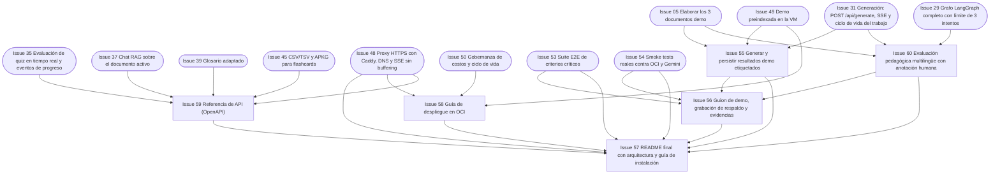

# Fase 6 — Demo y entrega

> **Objetivo de la fase**: resultados demo persistidos, guion ensayado con respaldo, README y evidencias de cumplimiento completos. **Hito H6**.
> **Duración estimada**: 3–4 días (solapa con el final de F5). · [Volver al plan maestro](../plan-implementacion.md)

**Dependencias internas de la fase:**

---

### `Issue 55` — Generar y persistir resultados demo etiquetados
**F6** · **QAD** · **M** · **Depende de**: `Issue 05`, `Issue 31`, `Issue 49` · **Referencia**: decisiones_proyecto.md §18

**Objetivo**: ejecutar y guardar todos los resultados que la demostración necesita, sobre el documento VCN y los otros dos, etiquetados como ejemplos previos.

**Tareas**:
- Ejecutar los 3 escenarios oficiales (§18.1): A) Principiante + Flashcards + General + es · B) Junior + Tutorial + E-commerce + en · C) Ejecutivo + Resumen + Fintech + pt — mismo `document_id` y hash.
- Ejecutar los complementos de §18.2: quiz con respuesta correcta e incorrecta, guion de clase, adaptación para Arquitecto, consulta de afirmación derivada del diagrama con vista de página original.
- Persistir todos los resultados en OCI (etiqueta «Ejemplo generado previamente» con fuente, fecha y parámetros).
- Registrar tiempos medidos de cada ejecución (para mostrar métricas reales — §18.3).
- Guardar el caso intencional de evidencia insuficiente (sección débil de `Issue 05`) que se bloquea correctamente.

**Criterios de aceptación**:
- [ ] Los 3 escenarios + complementos están persistidos y recuperables desde la app con su etiqueta.
- [ ] Todos los paquetes publicados pasaron por aprobación real (ningún JSON escrito a mano); el caso rechazado conserva solo diagnóstico.
- [ ] El caso de rechazo por calidad queda registrado con su diagnóstico.

**Verificación**: listado de generaciones demo en la app pública + objetos en OCI.

---

### `Issue 56` — Guion de demo, grabación de respaldo y evidencias
**F6** · **QAD** · **M** · **Depende de**: `Issue 55`, `Issue 53`, `Issue 54`, `Issue 60` · **Referencia**: decisiones_proyecto.md §18.2, §18.3

**Objetivo**: guion minuto a minuto ensayado, con grabación de respaldo y la evidencia de cada diferencial.

**Tareas**:
- Guion de 10–12 min: presentación → carga/generación **en vivo real** con persistencia OCI → escenarios A/B/C → quiz interactivo → multimodal (diagrama + fuente) → exportaciones (PDF + Anki) → recuperación con código → caso de rechazo intencional → cierre.
- Grabación completa de respaldo (la grabación no sustituye la integración activa ni la prueba funcional nueva — §18.3).
- Ensayo general con cronómetro y registro de desvíos; plan B técnico (si Gemini/VM fallan: resultados precargados + grabación + explicación honesta).
- Checklist de evidencias por diferencial y por requisito mínimo, con enlaces (objetos OCI, capturas, video).

**Criterios de aceptación**:
- [ ] Ensayo completo dentro del tiempo sin errores bloqueantes.
- [ ] Cada ítem del checklist §18.2 tiene su evidencia enlazada.
- [ ] La prueba funcional real está acreditada y el guion prevé ejecución en vivo con contingencia honesta, sin prometer disponibilidad del proveedor.

**Verificación**: ensayo frente al equipo completo con retroalimentación.

---

### `Issue 57` — README final con arquitectura y guía de instalación
**F6** · **QAD** · **M** · **Depende de**: `Issue 48`, `Issue 53`, `Issue 54`, `Issue 55`, `Issue 56`, `Issue 58`, `Issue 59`, `Issue 60` · **Referencia**: decisiones_proyecto.md §15, §20; enunciado (requisito 8)

**Objetivo**: README de repositorio que cumple el requisito 8: arquitectura, diagrama del flujo RAG/Agentes y guía de instalación, coherentes con el sistema ejecutable.

**Tareas**:
- Portada: qué es NuevaMente, qué problema resuelve, capturas de la UI real.
- Diagrama de arquitectura (desde [`docs/arquitectura.md`](../arquitectura.md)) y diagrama del flujo RAG/Agentes.
- Guía de instalación completa: prerrequisitos, env vars (Apéndice A), `MOCK_OCI=1` local sin credenciales, Docker, y modo real con OCI+Gemini.
- Uso: los 3 escenarios de ejemplo con sus JSON de entrada/salida reales.
- Tabla de cumplimiento: 8 requisitos mínimos + 5 diferenciales + extras, cada uno con enlace a su evidencia.
- Créditos del equipo y stack.

**Criterios de aceptación**:
- [ ] Una persona fuera del equipo levanta el proyecto local siguiendo solo el README (prueba real con un voluntario).
- [ ] El diagrama refleja el sistema implementado (sin componentes que no existen).
- [ ] Todos los requisitos del enunciado aparecen con evidencia enlazada.

**Verificación**: instalación limpia por terceros + revisión final del equipo.

---

### `Issue 58` — Guía de despliegue en OCI
**F6** · **INF** · **S** · **Depende de**: `Issue 48`, `Issue 49`, `Issue 50` · **Referencia**: decisiones_proyecto.md §9, §14; diferencial 1

**Objetivo**: runbook reproducible del despliegue completo en la capa Always Free.

**Tareas**:
- Pasos de `Issue 47`/`Issue 48`/`Issue 49` consolidados: aprovisionamiento VM A1, seguridad, Docker, Caddy + DNS, variables de entorno, carga de demo.
- Verificación de la capa Always Free: qué verificar en la consola para confirmar $0 (recursos, límites).
- Recuperación ante pérdida de VM: reconstrucción del índice desde OCI (§9.3) y del estado operativo.
- Mantenimiento: actualización de imágenes con interrupción breve, backups del volumen, monitoreo mínimo.

**Criterios de aceptación**:
- [ ] La guía reproduce el despliegue desde cero (validada quien no lo hizo originalmente).
- [ ] Incluye la verificación de costos $0 y el procedimiento de recuperación.

**Verificación**: reproducción por un integrante que no hizo el despliegue original.

---

### `Issue 59` — Referencia de API (OpenAPI)
**F6** · **API** · **S** · **Depende de**: `Issue 35`, `Issue 37`, `Issue 39`, `Issue 45`, `Issue 48` · **Referencia**: decisiones_proyecto.md §7.1

**Objetivo**: referencia humana de la API completa, exportada y versionada junto al repositorio.

**Tareas**:
- Exportar `openapi.json` desde la app y commitearlo (o generar en CI).
- Página `docs/api_reference.md`: tabla de endpoints con parámetros, códigos de error estables, ejemplos `curl` de los flujos principales (crear espacio, subir, generar, SSE, quiz, exportar).
- Ejemplos de solicitud/respuesta del enunciado verificados contra la implementación real.

**Criterios de aceptación**:
- [ ] El OpenAPI exportado valida en un viewer estándar.
- [ ] Los ejemplos `curl` del documento funcionan tal cual contra el despliegue público.

**Verificación**: ejecución de los ejemplos contra la URL pública.

---

### `Issue 60` — Evaluación pedagógica multilingüe con anotación humana
**F6** · **QAD** (con apoyo AGT) · **L** · **Depende de**: `Issue 29`, `Issue 05`, `Issue 31` · **Referencia**: decisiones_proyecto.md §12.1, §12.2

**Objetivo**: set de casos revisados por humanos en ES/EN/PT que mide utilidad pedagógica y detecta falsos aprobados del juez automático.

**Tareas**:
- Diseñar el set: por cada idioma, casos que cubran los 4 perfiles y ≥3 formatos sobre los documentos demo.
- Anotación humana independiente (2 revisores): claridad, adecuación al perfil, cobertura, utilidad — separada del score de fidelidad (§12.2).
- Contraste juez automático vs. anotación: registrar falsos aprobados y falsos rechazados; corregir prompts/recuperación/juez y reevaluar; no bajar umbrales ni cambiar decisiones sin acuerdo explícito.
- Reporte final con resultados medidos, tamaño de muestra y configuración (sin promesas de calidad absoluta — §12.4).

**Criterios de aceptación**:
- [ ] ≥12 casos anotados por 2 revisores en los 3 idiomas.
- [ ] Todo falso aprobado detectado está corregido y reevaluado con evidencia; un issue abierto no habilita H6.
- [ ] Reporte archivado en `docs/evidencia/` con metodología.

**Verificación**: revisión del reporte por el equipo completo.
