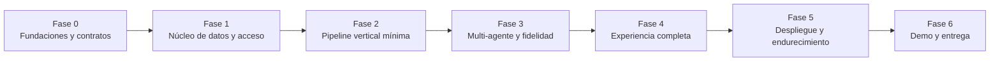

# 📋 Plan de Implementación — NuevaMente

> **Proyecto**: NuevaMente — Sistema Inteligente de Adaptación y Generación de Contenido Educativo
> **Equipo**: Grupo 10 · Equipo 38 — Oracle Next Education (ONE) / Alura Latam
> **Documento fuente**: [`decisiones_proyecto.md`](../decisiones_proyecto.md) (todas las decisiones de diseño ya están tomadas ahí)
> **Estado**: Plan revisado — v1.1 · Septiembre 2026

Este plan traduce el documento de decisiones en **60 issues concretos**, organizados en **7 fases**, distribuidos en **6 carriles de trabajo paralelo**, con dependencias explícitas que permiten que varios integrantes avancen simultáneamente sin bloquearse entre sí.

---

## Tabla de Contenidos

1. [Cómo usar este plan](#1-cómo-usar-este-plan)
2. [Estrategia general](#2-estrategia-general)
3. [Carriles de trabajo paralelo](#3-carriles-de-trabajo-paralelo)
4. [Fases e hitos](#4-fases-e-hitos)
5. [Tablero maestro de issues](#5-tablero-maestro-de-issues)
6. [Oleadas de paralelismo](#6-oleadas-de-paralelismo)
7. [Matriz de trazabilidad: requisitos ↔ issues](#7-matriz-de-trazabilidad-requisitos--issues)
8. [Cronograma y capacidad](#8-cronograma-y-capacidad)
9. [Definition of Done global y plantilla de issue](#9-definition-of-done-global-y-plantilla-de-issue)
10. [Gestión de riesgos](#10-gestión-de-riesgos)

---

## 1. Cómo usar este plan

| Archivo | Contenido |
|---|---|
| [`docs/plan-implementacion.md`](plan-implementacion.md) | **Este archivo** — estrategia, fases, tablero maestro, trazabilidad |
| [`docs/issues/fase-0-fundaciones.md`](issues/fase-0-fundaciones.md) … [`fase-6-demo-entrega.md`](issues/fase-6-demo-entrega.md) | Detalle completo de cada issue, listo para copiar a GitHub Issues |
| [`docs/arquitectura.md`](arquitectura.md) | Arquitectura con diagramas (fuente del README final) |
| [`docs/contratos-api.md`](contratos-api.md) | Contrato API v1 con ejemplos — base para trabajo paralelo frontend/backend |
| [`docs/guia-trabajo-equipo.md`](guia-trabajo-equipo.md) | Git flow, commits, PRs, ceremonias y reglas del equipo |

**Flujo de trabajo del equipo:**

1. Crear los issues en GitHub desde los archivos de `docs/issues/` (título = encabezado del issue, cuerpo = resto).
2. Cada integrante toma issues de **su carril** respetando la columna **Depende de** (un issue no se inicia si sus dependencias no están mergeadas en `develop`).
3. Al completar, marcar los criterios de aceptación y verificar contra **Verificación** del issue.

---

## 2. Estrategia general

Los principios que ordenan este plan (derivados de `decisiones_proyecto.md`):

1. **Contratos primero (`Issue 03`)**: el esqueleto Pydantic (enums, 5 formatos pedagógicos, `PedagogicalOutput`, modelo de errores, eventos SSE) se define y **congela en v1 antes de escribir funcionalidad**. Es la pieza que habilita el máximo paralelismo: backend, frontend, RAG y agentes programan contra el mismo contrato.
2. **Integración incremental**: F2 demuestra carga → persistencia → indexación → recuperación, junto con Writer y Faithfulness probados de forma aislada. La primera generación pública extremo a extremo pertenece a F3 (`Issue 31`), con revisión obligatoria. Un borrador de prueba nunca se publica como aprobado.
3. **Cortes verticales por capability, no por capa**: cada fase entrega valor observable (se puede subir un documento, se puede generar, se puede responder un quiz) en lugar de "todo el backend" y recién después "toda la UI".
4. **Mock explícito, nunca silencioso**: `MOCK_OCI=1` y el doble de Gemini permiten desarrollar y correr CI sin credenciales; la entrega exige evidencia real (`Issue 54`). Un fallo de OCI **nunca** degrada a mock solo (`decisiones_proyecto.md` §8.2).
5. **Lo obligatorio primero, los extras después**: el orden interno de cada fase prioriza los requisitos mínimos del hackathon; los extras (chat, glosario, progreso, comparación) van después del núcleo verificado.
6. **La calidad es parte del flujo**: cada issue incluye sus tests; no existe una "semana de testing al final" (sí existen issues dedicados de integración/E2E en Fase 5).

---

## 3. Carriles de trabajo paralelo

Para un equipo de 6 personas. Cada carril tiene un área de código propia (límites de la sección 13.3 del documento de decisiones), lo que minimiza conflictos de merge.

| Carril | Responsable de | Módulos con los que trabaja |
|---|---|---|
| **API** | Backend FastAPI: contratos HTTP, sesiones, trabajos, cola, SQLite operativo | `backend/app/api/`, `backend/app/jobs/`, `backend/app/session/` |
| **RAG** | Ingestión, parser, chunker, embeddings, ChromaDB, retrieval, multimodal | `backend/app/core/rag/` |
| **AGT** | Grafo LangGraph, prompts, Writer/Critic, fidelidad Faithfulness | `backend/app/core/agents/`, `backend/app/core/faithfulness/` |
| **UI** | Streamlit: tema Linear, componentes, i18n, flujos de usuario | `frontend/` |
| **INF** | OCI Object Storage, Docker, VM A1, Caddy, presupuestos, hardening | `backend/app/storage/`, `docker-compose.yml`, guías de despliegue |
| **QAD** | CI, fixtures, suites de tests, evaluación pedagógica, documentos demo, README y demo final | `.github/`, `backend/tests/`, `documents/`, `docs/`, `README.md` |

Reglas de convivencia entre carriles:

- Los **contratos compartidos** (`Issue 03` y cambios posteriores) requieren revisión de al menos un representante de API, UI, AGT y RAG antes de merge (son el acuerdo entre carriles).
- El carril QAD es transversal: sus issues de fases tempranas crean la infraestructura que los demás usan; en fases tardías concentra la evidencia de entrega.
- Cuando un integrante se libera, puede apoyar otro carril con tareas acotadas y revisión del responsable (§6).

---

## 4. Fases e hitos



| Fase | Objetivo de salida | Hito verificable | Issues |
|---|---|---|---|
| **F0** Fundaciones | Repo, CI, contratos v1 congelados, mock de storage, docs demo | **H0**: CI verde; contrato v1 mergeado; los 6 carriles desbloqueados | 6 |
| **F1** Núcleo de datos y acceso | Esqueletos de app funcionando; sesiones anónimas; parser/chunker/embeddings | **H1**: login anónimo + recuperación funcionan end-to-end contra la API; PDF/MD/TXT se parsean y trocean con tests | 10 |
| **F2** Pipeline vertical mínima | Indexado Chroma; endpoints de documentos; cola de trabajos; Writer simple; Docker | **H2**: cargar, persistir, indexar y recuperar evidencia; Writer probado aisladamente, sin publicación de borradores | 10 |
| **F3** Multi-agente y fidelidad | Grafo LangGraph completo, fidelidad, multimodal, SSE | **H3**: generación completa con revisión, hasta 3 intentos, rechazos por calidad y progreso en vivo | 7 |
| **F4** Experiencia completa | 5 formatos renderizados, quiz en tiempo real, chat, glosario, progreso, historial, exportaciones | **H4**: funcionalidades de aplicación completas en UI; despliegue y validación integral se cierran en H5 | 13 |
| **F5** Despliegue y endurecimiento | VM OCI Always Free + HTTPS, gobernanza de costos, seguridad, suites E2E | **H5**: URL pública operativa; criterios críticos §12.2 verificados | 8 |
| **F6** Demo y entrega | Resultados demo, guion, README, evidencias | **H6**: demo ensayada con grabación de respaldo y checklist de requisitos completo | 6 |

> Las fases se **solapan**: cada carril pasa a la fase siguiente apenas sus dependencias están mergeadas, no cuando termina "toda" la fase (ver sección 6).

---

## 5. Tablero maestro de issues

Tamaños: **S** ≤ medio día · **M** ≈ 1 día · **L** ≈ 1–2 días. El detalle completo (tareas, criterios de aceptación, verificación) está en `docs/issues/fase-*.md`.

**IDs estables**: `Issue 01`–`Issue 60` identifican trabajo, no orden de ejecución. Las dependencias pueden tener números mayores. Se ejecuta el grafo de dependencias, sin renumerar ni saltar prerrequisitos. Tablero, encabezados y diagramas deben coincidir.

### Fase 0 — Fundaciones

| ID | Título | Carril | Tamaño | Depende de |
|---|---|---|---|---|
| `Issue 01` | Inicializar monorepo y estructura de servicios | INF | M | — |
| `Issue 02` | Pipeline CI con GitHub Actions | INF | M | `Issue 01` |
| `Issue 03` | Contratos compartidos v1 (enums, formatos pedagógicos, `PedagogicalOutput`, errores, eventos SSE) | QAD | L | `Issue 01` |
| `Issue 04` | Interfaz `StorageProvider` + proveedor mock explícito | INF | M | `Issue 01` |
| `Issue 05` | Elaborar los 3 documentos demo | QAD | M | — |
| `Issue 06` | Catálogos i18n ES/EN/PT de la interfaz | UI | M | `Issue 01` |

### Fase 1 — Núcleo de datos y acceso

| ID | Título | Carril | Tamaño | Depende de |
|---|---|---|---|---|
| `Issue 07` | Esqueleto FastAPI: config validada, `/api/health`, errores estándar, `request_id` | API | M | `Issue 03` |
| `Issue 08` | Registro operativo SQLite (sesiones, trabajos, idempotencia, eventos) | API | L | `Issue 07` |
| `Issue 09` | Workspaces anónimos, código de recuperación y sesiones | API | L | `Issue 08`, `Issue 04` |
| `Issue 11` | Parser y validación de documentos (PDF/MD/TXT + texto pegado) | RAG | L | `Issue 03`, `Issue 05`, `Issue 10` |
| `Issue 12` | Chunker estructural con metadatos y `chunk_id` estable | RAG | M | `Issue 11` |
| `Issue 13` | Cliente de embeddings Gemini (768 d, batch, reintentos) | RAG | M | `Issue 03`, `Issue 10` |
| `Issue 14` | Proveedor OCI Object Storage real (bucket Always Free, prefijos) | INF | M | `Issue 04` |
| `Issue 15` | Esqueleto Streamlit con tema Linear | UI | M | `Issue 03`, `Issue 06` |
| `Issue 16` | Cliente de API y gestión de sesión en el frontend | UI | M | `Issue 15`, `Issue 09` |
| `Issue 10` | Infraestructura de tests: conftest, fixtures y doble de Gemini | QAD | M | `Issue 02`, `Issue 03`, `Issue 05` |

### Fase 2 — Pipeline vertical mínima

| ID | Título | Carril | Tamaño | Depende de |
|---|---|---|---|---|
| `Issue 17` | Vector store ChromaDB con aislamiento por espacio | RAG | M | `Issue 12`, `Issue 13`, `Issue 14` |
| `Issue 18` | Retriever MMR con presupuesto de evidencia | RAG | M | `Issue 17` |
| `Issue 19` | Endpoints de documentos (upload, estado, listado, fuentes, borrado) | API | L | `Issue 09`, `Issue 17`, `Issue 14`, `Issue 20` |
| `Issue 20` | Gestor de trabajos: cola, estados, deadline y cancelación | API | L | `Issue 08` |
| `Issue 21` | Estado compartido del grafo y Supervisor | AGT | M | `Issue 03` |
| `Issue 22` | Biblioteca de prompts por perfil/formato/nicho/idioma | AGT | L | `Issue 03` |
| `Issue 23` | Writer con salida tipada y citas | AGT | L | `Issue 21`, `Issue 22`, `Issue 10` |
| `Issue 24` | Verificador de fidelidad (Faithfulness) | AGT | L | `Issue 03`, `Issue 10` |
| `Issue 25` | Flujo de carga de documentos en la UI | UI | M | `Issue 16`, `Issue 19` |
| `Issue 26` | Contenedores Docker y docker-compose | INF | M | `Issue 07`, `Issue 15` |

### Fase 3 — Multi-agente y fidelidad

| ID | Título | Carril | Tamaño | Depende de |
|---|---|---|---|---|
| `Issue 27` | Researcher: consultas temáticas y cobertura | AGT | M | `Issue 21`, `Issue 18` |
| `Issue 28` | Critic: rúbrica pedagógica y política de aprobación | AGT | L | `Issue 23`, `Issue 24` |
| `Issue 29` | Grafo LangGraph completo con límite de 3 intentos | AGT | L | `Issue 20`, `Issue 27`, `Issue 28`, `Issue 30` |
| `Issue 30` | Ingestión multimodal de diagramas | RAG | L | `Issue 11`, `Issue 17`, `Issue 19`, `Issue 28` |
| `Issue 31` | Generación: `POST /api/generate`, SSE y ciclo de vida del trabajo | API | L | `Issue 19`, `Issue 20`, `Issue 29`, `Issue 14` |
| `Issue 32` | Panel de parámetros y disparo de generación | UI | M | `Issue 16`, `Issue 31` |
| `Issue 33` | Progreso en vivo (SSE) en la UI | UI | M | `Issue 32`, `Issue 31` |

### Fase 4 — Experiencia completa

| ID | Título | Carril | Tamaño | Depende de |
|---|---|---|---|---|
| `Issue 34` | Renderizadores de los 5 formatos + panel de fuentes y calidad | UI | L | `Issue 32` |
| `Issue 35` | Evaluación de quiz en tiempo real y eventos de progreso | API | M | `Issue 31` |
| `Issue 36` | Quiz interactivo con feedback inmediato | UI | M | `Issue 34`, `Issue 35` |
| `Issue 37` | Chat RAG sobre el documento activo | RAG | M | `Issue 18`, `Issue 09`, `Issue 20`, `Issue 29` |
| `Issue 38` | Chat RAG en la UI | UI | M | `Issue 37`, `Issue 16`, `Issue 34` |
| `Issue 39` | Glosario adaptado | RAG | M | `Issue 19`, `Issue 18`, `Issue 20`, `Issue 29` |
| `Issue 40` | Panel de glosario | UI | S | `Issue 39`, `Issue 16`, `Issue 34` |
| `Issue 41` | Progreso de estudio | UI | M | `Issue 35`, `Issue 34` |
| `Issue 42` | Historial, comparación y recuperación | UI | M | `Issue 16`, `Issue 31`, `Issue 34`, `Issue 43` |
| `Issue 43` | Router de exportación + JSON y Markdown | API | M | `Issue 31` |
| `Issue 44` | PDF didáctico con ReportLab | API | L | `Issue 43` |
| `Issue 45` | CSV/TSV y APKG para flashcards | API | M | `Issue 43` |
| `Issue 46` | Descargas multiformato | UI | S | `Issue 34`, `Issue 42`, `Issue 43`, `Issue 44`, `Issue 45` |

### Fase 5 — Despliegue y endurecimiento

| ID | Título | Carril | Tamaño | Depende de |
|---|---|---|---|---|
| `Issue 47` | Aprovisionar VM A1 Always Free (Ubuntu 24.04) | INF | M | — |
| `Issue 48` | Proxy HTTPS con Caddy, DNS y SSE sin buffering | INF | M | `Issue 26`, `Issue 47`, `Issue 31` |
| `Issue 49` | Demo preindexada en la VM | INF | S | `Issue 48`, `Issue 05`, `Issue 19`, `Issue 30`, `Issue 32` |
| `Issue 50` | Gobernanza de costos y ciclo de vida | INF | M | `Issue 14`, `Issue 09`, `Issue 19`, `Issue 31`, `Issue 35`, `Issue 43` |
| `Issue 51` | Revisión de seguridad y hardening | INF | M | `Issue 31`, `Issue 33`, `Issue 37`, `Issue 39`, `Issue 44`, `Issue 45`, `Issue 48`, `Issue 50` |
| `Issue 52` | Tests de integración de API con dependencias simuladas | QAD | L | `Issue 31`, `Issue 35`, `Issue 37`, `Issue 39`, `Issue 45` |
| `Issue 53` | Suite E2E de criterios críticos | QAD | L | `Issue 25`, `Issue 30`, `Issue 33`, `Issue 36`, `Issue 38`, `Issue 40`, `Issue 41`, `Issue 42`, `Issue 46`, `Issue 49`, `Issue 50`, `Issue 51`, `Issue 52`, `Issue 54` |
| `Issue 54` | Smoke tests reales contra OCI y Gemini | QAD | M | `Issue 14`, `Issue 31`, `Issue 44`, `Issue 45`, `Issue 48`, `Issue 50` |

### Fase 6 — Demo y entrega

| ID | Título | Carril | Tamaño | Depende de |
|---|---|---|---|---|
| `Issue 55` | Generar y persistir resultados demo etiquetados | QAD | M | `Issue 05`, `Issue 31`, `Issue 49` |
| `Issue 56` | Guion de demo, grabación de respaldo y evidencias | QAD | M | `Issue 55`, `Issue 53`, `Issue 54`, `Issue 60` |
| `Issue 57` | README final con arquitectura y guía de instalación | QAD | M | `Issue 48`, `Issue 53`, `Issue 54`, `Issue 55`, `Issue 56`, `Issue 58`, `Issue 59`, `Issue 60` |
| `Issue 58` | Guía de despliegue en OCI | INF | S | `Issue 48`, `Issue 49`, `Issue 50` |
| `Issue 59` | Referencia de API (OpenAPI) | API | S | `Issue 35`, `Issue 37`, `Issue 39`, `Issue 45`, `Issue 48` |
| `Issue 60` | Evaluación pedagógica multilingüe con anotación humana | QAD | L | `Issue 29`, `Issue 05`, `Issue 31` |

---

## 6. Oleadas de paralelismo

El paralelismo ocurre entre integrantes disponibles; dos issues del mismo carril no equivalen a dos personas.
Se puede adelantar diseño y preparar mocks desde el contrato, pero un issue no se cierra sin sus dependencias y criterios completos.

| Oleada | Trabajo que puede avanzar |
|---|---|
| Arranque | Estructura (01), documentos demo (05) y provisión gratuita (47), sin depender del producto |
| Contratos y bases | CI (02), contratos (03), storage (04), catálogos (06); luego esqueletos, fixtures y proveedor OCI |
| Núcleo | Sesiones (09), RAG (11–18), cola (20), estado/prompts/Writer/fidelidad (21–24), UI base y Docker |
| Integración | Documentos (19), Researcher/Critic (27–28), multimodal (30), grafo (29), generación (31) y SSE |
| Experiencia y evaluación | Formatos, extras y exportaciones; evaluación humana (60) desde que exista generación, sin esperar al final |
| Cierre | Integración, seguridad, smoke y E2E; evidencias, guías y ensayo de la entrega completa |

La tabla es orientativa: los prerrequisitos exactos están en §5.
La capacidad OCI se comprueba desde el inicio. La validación ARM64 llega con Docker.
Los presupuestos básicos y controles de acceso se implementan con cada componente; F5 audita su integración, no introduce la seguridad por primera vez.

---

## 7. Matriz de trazabilidad: requisitos ↔ issues

### 7.1 Requisitos mínimos del hackathon (checklist de evaluación)

| # | Requisito | Issues que lo entregan |
|---|---|---|
| 1 | Ingestión PDF/MD/TXT | `Issue 11`, `Issue 19`, `Issue 25` |
| 2 | RAG: chunking + embeddings + búsqueda vectorial | `Issue 12`, `Issue 13`, `Issue 17`, `Issue 18`, `Issue 27` |
| 3 | Orquestación con LLM | `Issue 21`…`Issue 29` |
| 4 | 2 perfiles + 2 formatos sobre la misma fuente | `Issue 22`, `Issue 23`, `Issue 55`, `Issue 56` |
| 5 | JSON estructurado + UI interactiva / API REST | `Issue 03`, `Issue 31`, `Issue 34` |
| 6 | OCI Object Storage Always Free activo | `Issue 04`, `Issue 14`, `Issue 19`, `Issue 31`, `Issue 54` |
| 7 | ≥ 3 ejemplos de ejecución documentados | `Issue 05`, `Issue 55`, `Issue 56` |
| 8 | README + diagrama de arquitectura | `Issue 57` + [`docs/arquitectura.md`](arquitectura.md) |

### 7.2 Recursos opcionales (diferenciales) — todos incluidos

| # | Diferencial | Issues que lo entregan |
|---|---|---|
| 1 | Despliegue completo en OCI Compute | `Issue 26`, `Issue 47`, `Issue 48`, `Issue 49` |
| 2 | Sistema multi-agente con LangGraph | `Issue 21`, `Issue 27`, `Issue 23`, `Issue 28`, `Issue 29` |
| 3 | Quiz con evaluación en tiempo real | `Issue 35`, `Issue 36` |
| 4 | Soporte multimodal (diagramas) | `Issue 30` (+ verificación visual en `Issue 28`) |
| 5 | Exportación multiformato | `Issue 43`, `Issue 44`, `Issue 45`, `Issue 46` |

### 7.3 Extras acordados en `decisiones_proyecto.md` §10 y §20.3

| Extra | Issues |
|---|---|
| Chat RAG interactivo | `Issue 37`, `Issue 38` |
| Glosario adaptado | `Issue 39`, `Issue 40` |
| Progreso de estudio | `Issue 35`, `Issue 41` |
| Historial recuperable y comparación | `Issue 42`, `Issue 09` |
| Biblioteca demo | `Issue 05`, `Issue 49`, `Issue 25` |
| i18n ES/EN/PT (UI y contenido) | `Issue 06`, `Issue 22` |
| Progreso SSE | `Issue 31`, `Issue 33` |
| Ver la fuente (citas verificables) | `Issue 19`, `Issue 34` |
| Bloqueo de contenido no aprobado | `Issue 29`, `Issue 31` |
| Acceso anónimo con código de recuperación | `Issue 09`, `Issue 16` |
| Diseño oscuro accesible (WCAG AA) | `Issue 15`, `Issue 34`, `Issue 53` |

---

## 8. Cronograma y capacidad

No se conoce una fecha límite ni la dedicación diaria confirmada del equipo.
Las duraciones por issue son estimaciones iniciales de esfuerzo, no compromisos de calendario.
Los seis carriles representan responsabilidades, no seis equipos con capacidad ilimitada.

Antes de asignar fechas, sumar esfuerzo por integrante y respetar el camino crítico del grafo.
Reservar tiempo para revisiones, correcciones y pruebas reales.
API y UI concentran muchos issues; repartir tareas acotadas a integrantes liberados, conservando un responsable por contrato.
Dos issues simultáneos de un mismo integrante no duplican su capacidad.
Las duraciones de fase no se suman mecánicamente porque existen solapamientos.

**Alcance cerrado**: glosario, comparación, chat y los demás extras acordados también forman parte de esta entrega.
Un atraso requiere reestimar, redistribuir trabajo o consultar al equipo; no autoriza recortarlos ni declararlos completos.
Se puede simplificar la implementación conservando sus criterios funcionales.

**Puerta H6**: los 60 issues deben estar cerrados con evidencia aplicable, incluidos evaluación humana (60), integración real (54), seguridad (51) y E2E (53).
Un requisito bloqueado mantiene la entrega incompleta; una grabación o mock no lo reemplaza.

---

## 9. Definition of Done global y plantilla de issue

Un issue está **Done** cuando **todo** esto es cierto (además de sus criterios de aceptación propios):

- [ ] Código mergeado en `develop` vía PR revisado por al menos otra persona.
- [ ] `ruff check` y `ruff format --check` pasan; `pytest` de los módulos tocados pasa (CI verde).
- [ ] Verificación apropiada al cambio: tests para comportamiento y revisión de enlaces/consistencia para documentación; no exigir tests nuevos sin comportamiento nuevo.
- [ ] Sin secretos ni datos personales en el diff; `.env.example` actualizado si se agregó una variable.
- [ ] Mensajes de error amigables y localizables donde el issue toca UI/API.
- [ ] Documentación afectada actualizada (contratos, README, guías) si el cambio altera un contrato.

**Plantilla de issue** (idéntica a la usada en `docs/issues/`):

```markdown
### `<ID>` — <Título>
**Fase** · **Carril** · **Tamaño** · **Depende de**: `<IDs>` · **Referencia**: decisiones_proyecto.md §<n>

**Objetivo**: <una o dos líneas>

**Tareas**:
- ...

**Criterios de aceptación**:
- [ ] ...

**Verificación**: <comando o procedimiento concreto>
```

---

## 10. Gestión de riesgos

| Riesgo | Impacto | Mitigación prevista en el plan |
|---|---|---|
| Sin capacidad de VM A1 en la home region | Diferencial de despliegue en riesgo | `Issue 47` se inicia desde el arranque; reintentos manuales acotados; si persiste, se documenta el bloqueo sin pasar a recursos pagos (§9.1) |
| Cuotas de Gemini agotadas durante la demo | Demo en vivo falla | Presupuesto de 20 llamadas por generación (`Issue 20`/`Issue 29`), resultados demo precargados (`Issue 55`) y grabación de respaldo (`Issue 56`); una ejecución en vivo real queda obligatoria (`Issue 54`) |
| Dependencias sin wheels ARM64 | Imágenes Docker no construyen en la VM | `Issue 26` valida la construcción multi-arch temprano antes del cierre de infraestructura |
| Buffering del proxy mata el SSE | Progreso en vivo no se ve | `Issue 48` incluye la configuración de flush de Caddy y su prueba explícita |
| Deriva de contratos entre carriles | Integración rota tarde | `Issue 03` congelado + regla de revisión multi-carril para cambios de contrato + CI que valida schemas |
| Rechazos por calidad en la demo | Escenario incómodo en vivo | La demo usa resultados ya aprobados (`Issue 55`) + un caso intencional de rechazo como parte del guion |
| Pérdida del código de recuperación en la demo | No se puede reingresar al espacio | El guion de demo incluye guardado del código como paso 0; recuperación ensayada en `Issue 53` |

---

> **Mantenimiento del plan**: si un issue descubre una decisión que cambia (contrato, umbral, límite), primero se actualiza `decisiones_proyecto.md`, luego este plan y sus archivos de issues, y después el código. El plan es un artefacto vivo con la misma regla de trazabilidad que el documento de decisiones.
